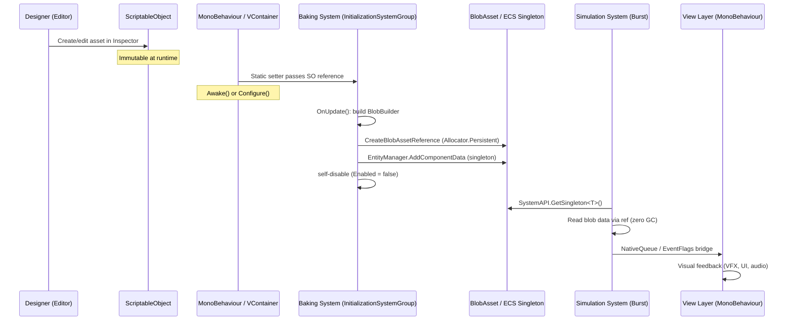
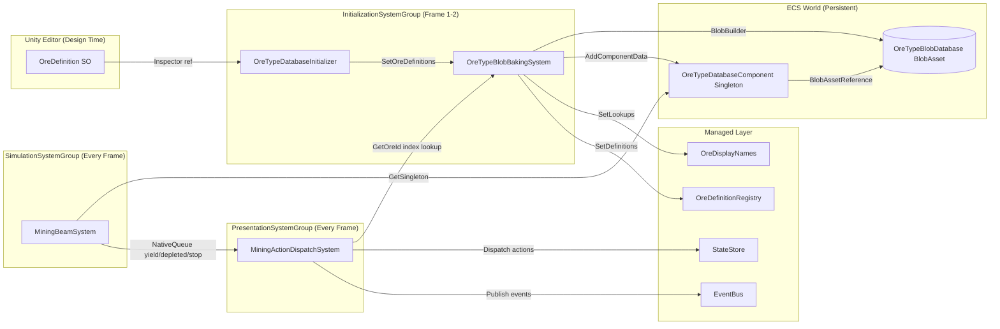
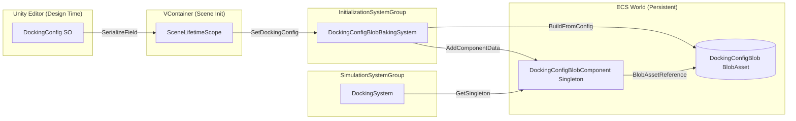
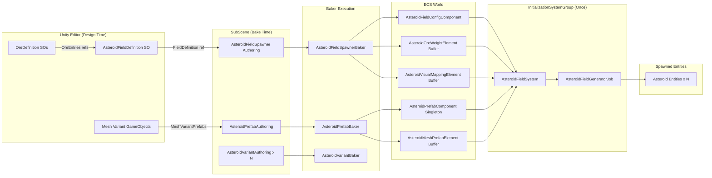

# Data Pipeline

## Purpose

VoidHarvest uses a hybrid DOTS/MonoBehaviour architecture where designer-authored **ScriptableObjects** are the single source of truth for all static game data. At runtime, this data must cross the managed/unmanaged boundary to reach **Burst-compiled ECS Systems** that cannot access managed objects. The **data pipeline** is the mechanism that transforms ScriptableObject configurations into Burst-accessible **BlobAssets** and **ECS components**, making them available to simulation systems without any managed allocations in hot loops.

This document traces the full lifecycle of data from editor authoring through baking to runtime consumption, covering the three concrete pipelines shipped in Phase 0:

1. **Ore Pipeline** -- OreDefinition SO to MiningBeamSystem
2. **Docking Pipeline** -- DockingConfig SO to DockingSystem
3. **Asteroid Field Pipeline** -- AsteroidFieldDefinition SO to AsteroidFieldSystem

## Full Lifecycle Overview

Every data pipeline in VoidHarvest follows the same conceptual flow:

1. **Author** -- A designer creates or edits a ScriptableObject asset in the Unity Editor.
2. **Bridge** -- Managed initialization code (MonoBehaviour `Awake`/`OnEnable` or VContainer `Configure`) passes the SO reference to an ECS baking system via a static setter.
3. **Bake** -- An `InitializationSystemGroup` system reads the pending SO data, constructs a `BlobAssetReference<T>` (or ECS components), and attaches the result to a singleton entity.
4. **Consume** -- Simulation systems (`SimulationSystemGroup`) query the singleton and read the baked data at full Burst speed with zero GC allocations.
5. **Render** -- View-layer MonoBehaviours or bridge systems translate ECS state changes into visual feedback.



## The ScriptableObject to BlobAsset Pattern

All three pipelines share the same structural pattern. Understanding it once makes every pipeline predictable.

### Key Types

| Role | Type | Location |
|------|------|----------|
| **ScriptableObject** | Designer-facing asset with `[CreateAssetMenu]` | `Features/<System>/Data/` |
| **BlobAsset struct** | Plain `struct` with Burst-compatible fields only | `Features/<System>/Data/` |
| **Singleton Component** | `IComponentData` wrapping a `BlobAssetReference<T>` | `Features/<System>/Data/` |
| **Baking System** | `SystemBase` in `InitializationSystemGroup` | `Features/<System>/Systems/` |
| **Consuming System** | `ISystem` (Burst) in `SimulationSystemGroup` | `Features/<System>/Systems/` |

### Pattern Rules

1. **Static setter bridge** -- Because DOTS `SystemBase` instances cannot receive constructor injection, the baking system exposes a `public static void Set*(T config)` method. Managed code calls this during scene initialization. This is a documented Constitution deviation (`// CONSTITUTION DEVIATION: DOTS SystemBase uses static for managed data bridge`).

2. **One-shot baking** -- The baking system checks `_initialized` on every `OnUpdate()`. Once the blob is built and the singleton entity is created, the system sets `Enabled = false` to remove itself from the update loop permanently.

3. **Persistent allocation** -- BlobAssets are allocated with `Allocator.Persistent` and disposed in `OnDestroy()`. The baking system owns the lifetime.

4. **Singleton entity** -- The blob reference is attached to a dedicated singleton entity via `EntityManager.CreateEntity()` + `AddComponentData()`. Consuming systems access it through `SystemAPI.GetSingleton<T>()`.

5. **RequireForUpdate guard** -- Consuming systems call `state.RequireForUpdate<TSingleton>()` in `OnCreate` so they do not run until the blob is ready.

---

## Pipeline 1: Ore Data

### Purpose

Transforms designer-authored ore type definitions into a Burst-accessible database used by the mining beam simulation to compute yield, hardness, and volume per unit.

### Data Flow

```
OreDefinition (SO)
  --> OreTypeDatabaseInitializer (MonoBehaviour, Awake)
    --> OreTypeBlobBakingSystem.SetOreDefinitions(OreDefinition[])
      --> OnUpdate(): BlobBuilder constructs OreTypeBlobDatabase
        --> Singleton entity with OreTypeDatabaseComponent
          --> MiningBeamSystem reads via SystemAPI.GetSingleton
            --> MiningActionDispatchSystem bridges yield to StateStore
```

### Key Types

| Type | File | Role |
|------|------|------|
| `OreDefinition` | `Assets/Features/Mining/Data/OreDefinition.cs` | ScriptableObject with all ore properties (yield, hardness, volume, beam color, refining outputs) |
| `OreTypeBlob` | `Assets/Features/Mining/Data/OreTypeBlob.cs` | Burst-accessible struct with `BaseYieldPerSecond`, `Hardness`, `VolumePerUnit` |
| `OreTypeBlobDatabase` | `Assets/Features/Mining/Data/OreTypeBlob.cs` | Wrapper holding `BlobArray<OreTypeBlob>` |
| `OreTypeDatabaseComponent` | `Assets/Features/Mining/Data/OreTypeBlob.cs` | Singleton `IComponentData` with `BlobAssetReference<OreTypeBlobDatabase>` |
| `OreTypeBlobBakingSystem` | `Assets/Features/Mining/Systems/OreTypeBlobBakingSystem.cs` | Baking system in `InitializationSystemGroup` |
| `OreTypeDatabaseInitializer` | `Assets/Features/Mining/Views/OreTypeDatabaseInitializer.cs` | MonoBehaviour bridge; calls `SetOreDefinitions` in `Awake()` |
| `MiningBeamSystem` | `Assets/Features/Mining/Systems/MiningBeamSystem.cs` | Burst-compiled consumer; reads ore data for yield computation |
| `MiningActionDispatchSystem` | `Assets/Features/Mining/Systems/MiningActionDispatchSystem.cs` | Managed bridge; drains NativeQueues and dispatches to StateStore/EventBus |

### Baking Detail

`OreTypeBlobBakingSystem.SetOreDefinitions()` does two things simultaneously:

1. **Populates managed lookups immediately** -- `_oreIdLookup` (string array mapping index to OreId), `OreDisplayNames` (display name resolution), and `OreDefinitionRegistry` (full SO reference lookup). These are available before the blob is built and are used by managed bridge systems.

2. **Queues definitions for blob construction** -- Stores the array in `_pendingDefinitions`. On the next `OnUpdate()`, the system iterates the array, builds a `BlobBuilder` with a `BlobArray<OreTypeBlob>`, and creates the persistent blob reference.

The blob only stores the three numeric fields needed by Burst code (`BaseYieldPerSecond`, `Hardness`, `VolumePerUnit`). All string data, icons, colors, and refining outputs remain in managed-only registries because they are only accessed by the view layer.

### Runtime Read Path

```csharp
// MiningBeamSystem.OnUpdate (Burst-compiled)
var oreDb = SystemAPI.GetComponent<OreTypeDatabaseComponent>(oreDbEntity);
ref var oreTypes = ref oreDb.Database.Value.OreTypes;

// Index into blob array using asteroid's OreTypeId
ref var oreData = ref oreTypes[oreComp.OreTypeId];
float yield = (beam.MiningPower * oreData.BaseYieldPerSecond * dt)
            / (oreData.Hardness * (1f + depth));
```

### Architecture Diagram



---

## Pipeline 2: Docking Configuration

### Purpose

Transforms designer-tunable docking parameters (ranges, durations, thresholds) into a Burst-accessible blob consumed by the docking state machine.

### Data Flow

```
DockingConfig (SO)
  --> SceneLifetimeScope.Configure() (VContainer)
    --> DockingConfigBlobBakingSystem.SetDockingConfig(DockingConfig)
      --> OnUpdate(): DockingConfigBlob.BuildFromConfig()
        --> Singleton entity with DockingConfigBlobComponent
          --> DockingSystem reads via SystemAPI.GetSingleton
```

### Key Types

| Type | File | Role |
|------|------|------|
| `DockingConfig` | `Assets/Features/Docking/Data/DockingConfig.cs` | ScriptableObject with 9 tuning parameters |
| `DockingConfigBlob` | `Assets/Features/Docking/Data/DockingConfigBlob.cs` | Burst-accessible struct mirroring all 9 parameters |
| `DockingConfigBlobComponent` | `Assets/Features/Docking/Data/DockingConfigBlob.cs` | Singleton `IComponentData` with `BlobAssetReference<DockingConfigBlob>` |
| `DockingConfigBlobBakingSystem` | `Assets/Features/Docking/Systems/DockingConfigBlobBakingSystem.cs` | Baking system in `InitializationSystemGroup` |
| `DockingSystem` | `Assets/Features/Docking/Systems/DockingSystem.cs` | Burst-compiled consumer; reads all config parameters for state machine logic |

### Baking Detail

Unlike the ore pipeline (which uses a MonoBehaviour bridge), the docking pipeline is initialized directly from VContainer's DI container:

```csharp
// SceneLifetimeScope.Configure()
if (dockingConfig != null)
{
    builder.RegisterInstance(dockingConfig);                      // DI registration
    DockingConfigBlobBakingSystem.SetDockingConfig(dockingConfig); // ECS bridge
}
```

The `DockingConfigBlob` struct contains a static factory method `BuildFromConfig(DockingConfig)` that encapsulates the BlobBuilder logic, keeping the baking system minimal. This differs from the ore pipeline where the baking system itself contains the builder logic.

### Blob Fields

All 9 parameters from the ScriptableObject are baked 1:1 into the blob:

| Field | Type | Default | Description |
|-------|------|---------|-------------|
| `MaxDockingRange` | float | 500 | Maximum range to initiate docking (meters) |
| `SnapRange` | float | 30 | Range where snap animation begins (meters) |
| `SnapDuration` | float | 1.5 | Snap animation duration (seconds) |
| `UndockClearanceDistance` | float | 100 | Departure distance from port (meters) |
| `UndockDuration` | float | 2.0 | Undock movement duration (seconds) |
| `ApproachTimeout` | float | 120 | Approach phase safety timeout (seconds) |
| `AlignTimeout` | float | 30 | Alignment phase safety timeout (seconds) |
| `AlignDotThreshold` | float | 0.999 | Dot product for alignment completion |
| `AlignAngVelThreshold` | float | 0.01 | Angular velocity settling threshold (rad/s) |

### Runtime Read Path

```csharp
// DockingSystem.OnUpdate (Burst-compiled)
ref var cfg = ref SystemAPI.GetSingleton<DockingConfigBlobComponent>().Config.Value;
float snapRange = cfg.SnapRange;
float approachTimeout = cfg.ApproachTimeout;
// ... all 9 parameters read from blob
```

### Architecture Diagram



---

## Pipeline 3: Asteroid Field Generation

### Purpose

Transforms designer-authored asteroid field definitions (asteroid count, radius, ore composition, visual mapping) into ECS components consumed by the procedural generation system at scene load.

This pipeline differs from the other two: it uses Unity's standard **Authoring Component + Baker** pattern (SubScene baking) rather than the static-setter pattern. The ScriptableObject data is baked into ECS components and buffer elements rather than BlobAssets.

### Data Flow

```
AsteroidFieldDefinition (SO) + OreDefinition[] (SOs)
  --> AsteroidFieldSpawner (Authoring MonoBehaviour in SubScene)
    --> AsteroidFieldSpawnerBaker.Bake()
      --> AsteroidFieldConfigComponent + AsteroidOreWeightElement buffer + AsteroidVisualMappingElement buffer
        --> AsteroidFieldSystem reads config + spawns entities with RenderMeshUtility

AsteroidPrefabAuthoring (Authoring MonoBehaviour in SubScene)
  --> AsteroidPrefabBaker.Bake()
    --> AsteroidPrefabComponent singleton + AsteroidMeshPrefabElement buffer
      --> AsteroidFieldSystem reads mesh/material data for entity creation
```

### Key Types

| Type | File | Role |
|------|------|------|
| `AsteroidFieldDefinition` | `Assets/Features/Procedural/Data/AsteroidFieldDefinition.cs` | ScriptableObject defining field geometry and ore composition |
| `OreFieldEntry` | `Assets/Features/Procedural/Data/OreFieldEntry.cs` | Struct pairing an `OreDefinition` with spawn weight and visual config |
| `AsteroidFieldSpawner` | `Assets/Features/Procedural/Views/AsteroidFieldSpawner.cs` | Authoring MonoBehaviour referencing `AsteroidFieldDefinition` |
| `AsteroidFieldSpawnerBaker` | `Assets/Features/Procedural/Views/AsteroidFieldSpawner.cs` | Baker producing config component + ore weight + visual mapping buffers |
| `AsteroidFieldConfigComponent` | `Assets/Features/Procedural/Views/AsteroidFieldSpawner.cs` | `IComponentData` with spatial parameters (count, radius, seed, size range) |
| `AsteroidOreWeightElement` | `Assets/Features/Procedural/Views/AsteroidFieldSpawner.cs` | `IBufferElementData` with normalized weight + ore type index |
| `AsteroidVisualMappingElement` | `Assets/Features/Procedural/Views/AsteroidPrefabAuthoring.cs` | `IBufferElementData` with tint color + mesh variant indices |
| `AsteroidPrefabAuthoring` | `Assets/Features/Procedural/Views/AsteroidPrefabAuthoring.cs` | Authoring MonoBehaviour referencing mesh variant GameObjects |
| `AsteroidPrefabBaker` | `Assets/Features/Procedural/Views/AsteroidPrefabAuthoring.cs` | Baker producing prefab singleton + mesh buffer |
| `AsteroidPrefabComponent` | `Assets/Features/Procedural/Views/AsteroidPrefabAuthoring.cs` | Singleton `IComponentData` with default prefab entity |
| `AsteroidMeshPrefabElement` | `Assets/Features/Procedural/Views/AsteroidPrefabAuthoring.cs` | `IBufferElementData` with per-variant prefab entity references |
| `AsteroidVariantAuthoring` | `Assets/Features/Procedural/Views/AsteroidVariantAuthoring.cs` | Authoring for individual mesh variant GameObjects |
| `AsteroidFieldSystem` | `Assets/Features/Procedural/Systems/AsteroidFieldSystem.cs` | One-shot `ISystem` that generates all asteroid entities |
| `AsteroidFieldGeneratorJob` | `Assets/Features/Procedural/Systems/AsteroidFieldGeneratorJob.cs` | Burst-compiled `IJobParallelFor` for position + ore assignment |

### Baking Detail

Unlike Pipelines 1 and 2, this pipeline uses Unity's native SubScene baking. The `AsteroidFieldSpawner` MonoBehaviour is placed on a GameObject inside a SubScene. When Unity bakes the SubScene, it invokes `AsteroidFieldSpawnerBaker.Bake()`, which:

1. Reads the `AsteroidFieldDefinition` SO referenced by the authoring component.
2. Adds an `AsteroidFieldConfigComponent` with spatial parameters (count, radius, seed, size range, rotation range).
3. Adds an `AsteroidVisualMappingSingleton` component with the `MinScaleFraction`.
4. Normalizes ore weights via `AsteroidFieldDefinition.NormalizeWeights()` (a pure static function).
5. Adds a `DynamicBuffer<AsteroidOreWeightElement>` with normalized probability per ore type.
6. Adds a `DynamicBuffer<AsteroidVisualMappingElement>` with tint colors and mesh variant index pairs.

Separately, `AsteroidPrefabBaker` bakes mesh variant references:

- **Multi-prefab mode**: Each `AsteroidVariantAuthoring` GameObject (with MeshFilter + MeshRenderer) becomes a prefab entity. The baker builds a `DynamicBuffer<AsteroidMeshPrefabElement>` on a singleton entity.
- **Single-prefab fallback**: If no variants are assigned, the authoring GO itself becomes the sole prefab entity.

### Runtime Generation

`AsteroidFieldSystem` runs once in `InitializationSystemGroup`:

1. **Wait** -- Guards on `AsteroidPrefabComponent` singleton and `AsteroidFieldConfigComponent` query.
2. **Snapshot** -- Copies all config and buffer data into temporary NativeArrays to avoid structural change conflicts.
3. **Generate positions** -- Schedules `AsteroidFieldGeneratorJob` (Burst, `IJobParallelFor`) which uses seeded RNG for deterministic spherical distribution and weighted ore assignment.
4. **Create entities** -- For each asteroid, creates an entity from scratch using `RenderMeshUtility.AddComponents()` with the appropriate mesh variant, material, tint color, and per-instance `URPMaterialPropertyBaseColor`.
5. **Self-disable** -- Sets `state.Enabled = false` after generation.

The use of `RenderMeshUtility.AddComponents()` instead of `EntityManager.Instantiate()` is a critical architectural decision. SubScene-baked prefab entities do not support per-instance material property overrides because the batch metadata from baking does not register the override for GPU upload. Creating entities from scratch ensures `URPMaterialPropertyBaseColor` works correctly for depletion visuals.

### Architecture Diagram



---

## Comparison of Baking Approaches

The project uses two distinct approaches to get ScriptableObject data into ECS:

| Aspect | Static Setter (Ore, Docking) | SubScene Baker (Asteroid Field) |
|--------|------------------------------|----------------------------------|
| **Trigger** | Managed code calls static method at runtime | Unity bakes SubScene at edit/build time |
| **Storage** | BlobAssetReference on singleton entity | IComponentData + DynamicBuffers on baked entity |
| **Burst Access** | Via `ref` into BlobAsset (zero-copy) | Via component queries (standard ECS) |
| **When to Use** | Global config shared across all scenes; data that maps 1:1 from SO fields to blob fields | Per-scene spatial config; data with variable-length arrays (ore weights, mesh variants) |
| **Constitution Note** | Requires `// CONSTITUTION DEVIATION` comment for static field | Standard Unity DOTS pattern; no deviation needed |
| **Lifetime** | Baking system owns and disposes blob in `OnDestroy()` | Unity manages baked entity lifetime via SubScene |

## Adding a New Data Pipeline

To add a new ScriptableObject-to-ECS pipeline, follow these steps:

1. **Create the ScriptableObject** in `Features/<System>/Data/` with `[CreateAssetMenu]` and `OnValidate()`.
2. **Define the blob struct** (if Burst access needed) with only blittable fields.
3. **Define the singleton component** (`IComponentData`) wrapping the `BlobAssetReference<T>`.
4. **Create the baking system** in `Features/<System>/Systems/`:
   - Inherit `SystemBase`, mark `[UpdateInGroup(typeof(InitializationSystemGroup))]`.
   - Add a `public static void Set*(T config)` method.
   - In `OnUpdate()`: check `_initialized`, build blob, create singleton, self-disable.
   - In `OnDestroy()`: dispose the blob reference.
5. **Wire the bridge** in `SceneLifetimeScope.Configure()` or a dedicated initializer MonoBehaviour.
6. **Guard the consumer** with `state.RequireForUpdate<TSingleton>()` in `OnCreate`.

## Cross-References

- [Mining System](../systems/mining.md) -- Full mining feature documentation including MiningBeamSystem and yield computation
- [Docking System](../systems/docking.md) -- Docking state machine and phase transitions
- [Procedural System](../systems/procedural.md) -- Asteroid field generation and visual mapping
- [State Management](state-management.md) -- How StateStore dispatches actions from ECS bridge systems
- [Architecture Overview](overview.md) -- Hybrid architecture patterns and system boundaries
- [Designer Guide: Adding Ores](../designer-guide/adding-ores.md) -- How to create and configure OreDefinition assets
- [Designer Guide: Adding Stations](../designer-guide/adding-stations.md) -- How to set up station configurations
