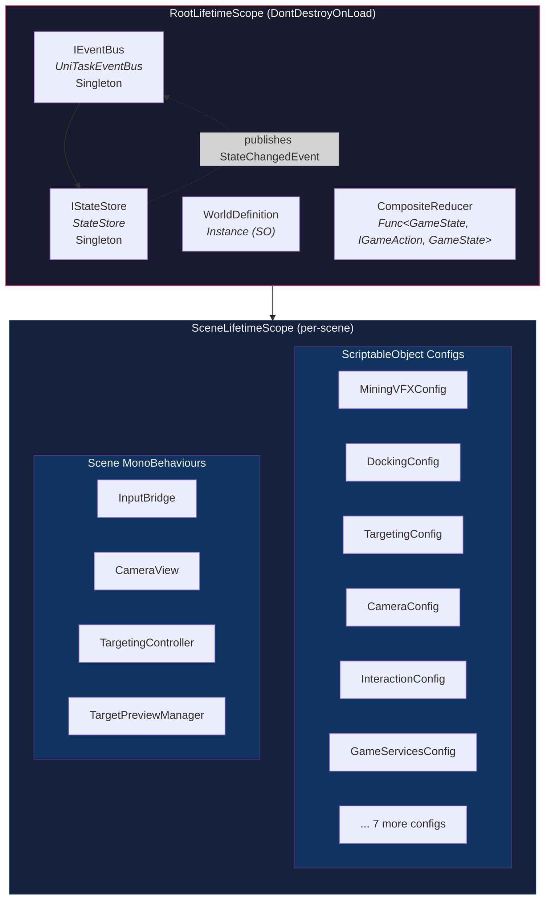
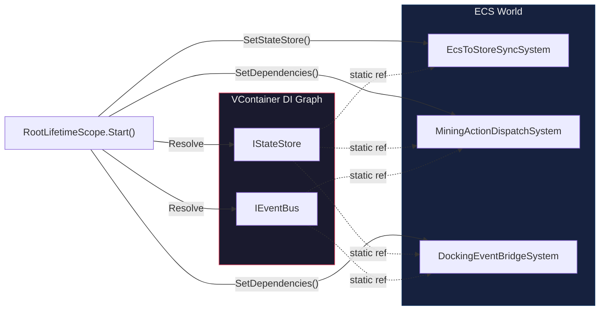
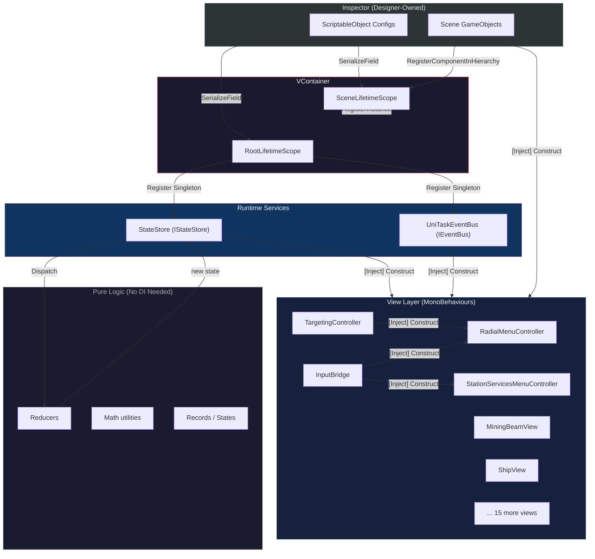

# Dependency Injection

## Purpose

VoidHarvest uses [VContainer](https://vcontainer.unityakzhan.com/) (v1.16.7) for dependency injection to achieve a decoupled, testable architecture. Every cross-system dependency is resolved through explicit constructor or method injection rather than service locators, static singletons, or `FindObjectOfType` lookups. This ensures that:

- **Pure systems** (reducers, math, ECS) have zero coupling to Unity lifecycle or concrete service implementations.
- **View-layer MonoBehaviours** declare their dependencies via `[Inject]` methods, making them replaceable in tests.
- **ScriptableObject configs** flow from the Inspector into the DI graph, keeping designer-tunable data separate from runtime logic.

## Scope Hierarchy

VContainer organises registrations into hierarchical **LifetimeScopes**. Child scopes inherit all registrations from their parent, so scene-level services can depend on root-level singletons without re-registration.



### RootLifetimeScope

**File:** `Assets/Core/RootLifetimeScope.cs`

Lives on a `GameManager` GameObject with `DontDestroyOnLoad`. Registers application-lifetime singletons that persist across scene loads:

| Registration | Type | Lifetime | Notes |
|---|---|---|---|
| `IEventBus` | `UniTaskEventBus` | Singleton | Cross-system event communication |
| `IStateStore` | `StateStore` | Singleton | Immutable state store with composite reducer |
| `WorldDefinition` | Instance (SO) | Singleton | Data-driven world config (Spec 009) |

The composite reducer is assembled here because `RootLifetimeScope` lives in `Assembly-CSharp` and can reference all feature assemblies. It routes actions by interface type to the correct feature reducer.

After the container is built, `Start()` wires ECS bridge systems via static setters (see [ECS Bridge Pattern](#ecs-bridge-pattern) below).

### SceneLifetimeScope

**File:** `Assets/Core/SceneLifetimeScope.cs`

Child of `RootLifetimeScope`. Registers scene-specific services that are destroyed and recreated on scene transitions:

**ScriptableObject configs** (registered via `RegisterInstance`):

| Config | Feature | Purpose |
|---|---|---|
| `MiningVFXConfig` | Mining | Beam visuals, spark particles, shimmer settings |
| `DepletionVFXConfig` | Mining | Asteroid depletion visual effects |
| `OreChunkConfig` | Mining | Ore chunk ejection parameters |
| `MiningAudioConfig` | Mining | Mining sound effect references |
| `DockingConfig` | Docking | Range, snap duration, timeout thresholds |
| `DockingVFXConfig` | Docking | Docking visual effects |
| `DockingAudioConfig` | Docking | Docking sound effect references |
| `GameServicesConfig` | StationServices | Station services configuration map |
| `CameraConfig` | Camera | Orbit limits, zoom range, default values |
| `InteractionConfig` | Input | Double-click window, drag threshold, ranges |
| `TargetingConfig` | Targeting | Reticle sizing, lock UI parameters |
| `TargetingAudioConfig` | Targeting | Lock/unlock sound references |
| `TargetingVFXConfig` | Targeting | Lock bracket visual config |

**Scene MonoBehaviours** (registered via `RegisterComponentInHierarchy`):

| Component | Purpose |
|---|---|
| `InputBridge` | Bridges Unity Input System to ECS and StateStore |
| `CameraView` | Applies camera state to Cinemachine rig |
| `TargetingController` | Orchestrates targeting overlay UI |
| `TargetPreviewManager` | Manages RenderTexture preview cameras for locked targets |

These are scene-placed GameObjects discovered in the hierarchy at container build time, enabling other MonoBehaviours to receive them via `[Inject]` instead of fragile runtime lookups.

## Injection Patterns

### Pattern 1: Method Injection for MonoBehaviours

MonoBehaviours cannot use constructor injection because Unity controls their instantiation. VContainer supports **method injection** via the `[Inject]` attribute on a public method, conventionally named `Construct`:

```csharp
public sealed class InputBridge : MonoBehaviour
{
    private IStateStore _stateStore;
    private IEventBus _eventBus;
    private CameraView _cameraView;

    [Inject]
    public void Construct(
        IStateStore stateStore,
        IEventBus eventBus,
        CameraView cameraView,
        InteractionConfig interactionConfig = null)  // optional dependency
    {
        _stateStore = stateStore;
        _eventBus = eventBus;
        _cameraView = cameraView;
        if (interactionConfig != null)
        {
            _doubleClickWindow = interactionConfig.DoubleClickWindow;
            // ... apply config values
        }
    }
}
```

Key conventions:

- The method is always named **`Construct`** for consistency across the codebase.
- Dependencies are stored in **private fields** -- never exposed publicly.
- **Optional dependencies** use `= null` default parameters. The `Construct` method guards against null before reading config values. This supports backward compatibility when new configs are added (Spec 009 pattern).
- VContainer calls `Construct` **before** `Awake`/`OnEnable`/`Start`, so injected dependencies are available in all Unity lifecycle methods.

### Pattern 2: Constructor Injection for Non-MonoBehaviour Services

Pure C# classes (like `StateStore`) use standard constructor injection:

```csharp
public sealed class StateStore : IStateStore, IDisposable
{
    public StateStore(
        Func<GameState, IGameAction, GameState> reducer,
        GameState initialState,
        IEventBus eventBus)
    {
        _reducer = reducer ?? throw new ArgumentNullException(nameof(reducer));
        _current = initialState ?? throw new ArgumentNullException(nameof(initialState));
        _eventBus = eventBus ?? throw new ArgumentNullException(nameof(eventBus));
    }
}
```

Registered in the scope with:

```csharp
builder.Register<StateStore>(Lifetime.Singleton)
    .WithParameter<Func<GameState, IGameAction, GameState>>(CompositeReducer)
    .WithParameter(initialState)
    .As<IStateStore>();
```

### Pattern 3: ScriptableObject Instance Registration

ScriptableObjects are assigned in the Inspector on the LifetimeScope MonoBehaviour, then registered as instances:

```csharp
[SerializeField] private TargetingConfig targetingConfig;

protected override void Configure(IContainerBuilder builder)
{
    if (targetingConfig != null)
        builder.RegisterInstance(targetingConfig);
}
```

The null guard ensures graceful degradation if a config asset is not assigned in the Inspector. Consumers that treat the config as optional use `= null` default parameters in their `Construct` methods.

### Pattern 4: Hierarchy Component Registration

Scene-placed MonoBehaviours that other components depend on are registered by type discovery:

```csharp
builder.RegisterComponentInHierarchy<InputBridge>();
builder.RegisterComponentInHierarchy<CameraView>();
```

This replaces `FindObjectOfType` calls with compile-time-safe, deterministic resolution. If the component is missing from the scene hierarchy, VContainer throws a clear error at container build time rather than producing silent null references at runtime.

## ECS Bridge Pattern

DOTS/ECS systems (Burst-compiled `ISystem` and managed `SystemBase`) cannot participate in VContainer's DI graph because they are created by the ECS `World`, not by the DI container. VoidHarvest bridges this gap using **static setters** called from `RootLifetimeScope.Start()`:

```csharp
// In RootLifetimeScope.Start()
var stateStore = Container.Resolve<IStateStore>();
var eventBus = Container.Resolve<IEventBus>();

EcsToStoreSyncSystem.SetStateStore(stateStore);
MiningActionDispatchSystem.SetDependencies(stateStore, eventBus);
DockingEventBridgeSystem.SetDependencies(stateStore, eventBus);
```

Each ECS bridge system stores the reference in a `static` field and uses it during `OnUpdate`. This is the one sanctioned deviation from the "no static singletons" rule, documented with a `// CONSTITUTION DEVIATION:` comment. It exists because:

1. Burst-compiled `ISystem` structs cannot hold managed references or receive constructor injection.
2. The bridge systems are singletons by nature (one per ECS World), so the static field accurately models their cardinality.
3. The wiring happens in a single, auditable location (`RootLifetimeScope.Start`).



## Async Subscription Convention

View-layer MonoBehaviours that subscribe to `IEventBus` events follow a strict lifecycle convention established in Spec 008 to prevent leaked listeners and duplicate handlers across enable/disable cycles:

```
OnEnable   -- create CancellationTokenSource, start async subscriptions
OnDisable  -- cancel + dispose CTS, null the field
OnDestroy  -- safety net calling cleanup (guards double-dispose)
```

### Implementation Pattern

```csharp
public sealed class StationServicesMenuController : MonoBehaviour
{
    private CancellationTokenSource _eventCts;

    // 1. OnEnable: create fresh CTS, start subscriptions
    private void OnEnable()
    {
        if (_eventBus != null)
        {
            _eventCts = new CancellationTokenSource();
            ListenForDockingCompleted(_eventCts.Token).Forget();
            ListenForUndockingStarted(_eventCts.Token).Forget();
        }
    }

    // 2. OnDisable: tear down subscriptions
    private void OnDisable()
    {
        _eventCts?.Cancel();
        _eventCts?.Dispose();
        _eventCts = null;
    }

    // 3. OnDestroy: safety net (guards re-enable after destroy edge case)
    private void OnDestroy()
    {
        _eventCts?.Cancel();
        _eventCts?.Dispose();
        _eventCts = null;
    }

    // 4. Subscription method takes CancellationToken parameter
    private async UniTaskVoid ListenForDockingCompleted(CancellationToken ct)
    {
        await foreach (var evt in _eventBus
            .Subscribe<DockingCompletedEvent>()
            .WithCancellation(ct))
        {
            Open(evt.StationId);
        }
    }
}
```

This convention is followed by all EventBus-subscribing MonoBehaviours:
- `RadialMenuController` (HUD)
- `StationServicesMenuController` (StationServices)
- `TargetingAudioController` (Targeting)
- `InputBridge` (Input)

## Dependency Flow Summary

The following diagram shows how dependencies flow from the DI container through the view layer to the state management and event systems:



## Anti-Patterns

The following patterns are **prohibited** by the Constitution and enforced through code review:

| Anti-Pattern | Why It Is Prohibited | Correct Alternative |
|---|---|---|
| `FindObjectOfType<T>()` | Fragile, non-deterministic, O(n) scene search, produces silent nulls | `RegisterComponentInHierarchy<T>()` + `[Inject]` |
| Static singletons for game logic | Untestable, hidden coupling, non-deterministic initialization order | `Register<T>(Lifetime.Singleton)` via VContainer |
| Service locator pattern | Hides dependencies, makes testing difficult, runtime errors instead of compile-time | Explicit `[Inject]` method or constructor injection |
| `new ServiceClass()` in MonoBehaviours | Bypasses DI, prevents mocking in tests | Let VContainer resolve via `Register<T>()` |
| Storing game state in MonoBehaviours | Violates immutable-first principle, makes state changes untrackable | `IStateStore.Dispatch()` through pure reducers |
| Direct field writes across systems | Couples systems, breaks modularity, non-deterministic ordering | `IEventBus.Publish()` for cross-system communication |

The migration from `FindObjectOfType` to DI-resolved dependencies was completed in Spec 008 (US4), replacing five runtime lookups across `InputBridge`, `RadialMenuController`, `StationServicesMenuController`, and `TargetingController`.

## Testing Considerations

VContainer's injection pattern enables straightforward test doubles:

- **Unit tests** of pure reducers and math utilities require no DI setup at all -- they are static pure functions.
- **View-layer tests** can call `Construct()` directly with mock implementations of `IStateStore` and `IEventBus`, bypassing VContainer entirely.
- **Integration tests** can build a test-specific `LifetimeScope` with stub configs and verify the full injection graph resolves correctly.

The `[Inject] public void Construct(...)` pattern means that test code can simply instantiate the MonoBehaviour and call `Construct` with test doubles:

```csharp
var view = new GameObject().AddComponent<MiningBeamView>();
view.Construct(mockStateStore, mockVfxConfig);
```

## Key Files

| File | Path | Description |
|---|---|---|
| `RootLifetimeScope.cs` | `Assets/Core/RootLifetimeScope.cs` | Root DI scope -- singletons, composite reducer, ECS bridge wiring |
| `SceneLifetimeScope.cs` | `Assets/Core/SceneLifetimeScope.cs` | Scene DI scope -- config instances, hierarchy components |
| `IStateStore.cs` | `Assets/Core/State/IStateStore.cs` | State store interface registered as singleton |
| `StateStore.cs` | `Assets/Core/State/StateStore.cs` | Concrete state store with constructor injection |
| `IEventBus.cs` | `Assets/Core/EventBus/IEventBus.cs` | Event bus interface registered as singleton |
| `UniTaskEventBus.cs` | `Assets/Core/EventBus/UniTaskEventBus.cs` | Concrete event bus implementation |

## Cross-References

- [State Management](./state-management.md) -- how `IStateStore` and the reducer pipeline work
- [Event System](./event-system.md) -- how `IEventBus` enables decoupled cross-system communication
- [Data Pipeline](./data-pipeline.md) -- how ScriptableObject configs flow from Inspector to runtime
- [Architecture Overview](./overview.md) -- high-level system architecture and DOTS/MonoBehaviour hybrid design
