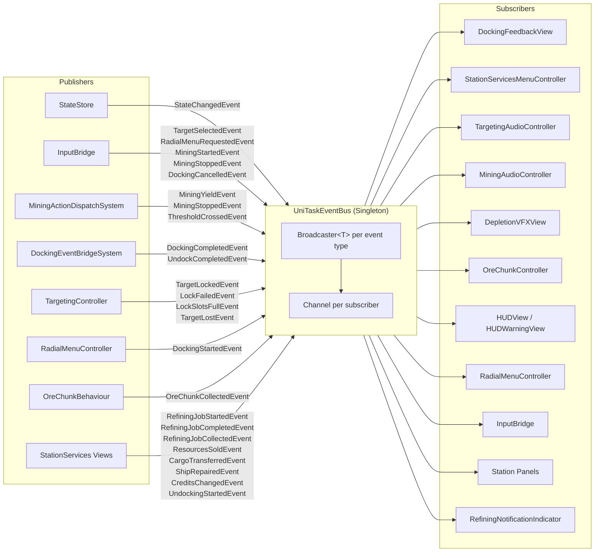
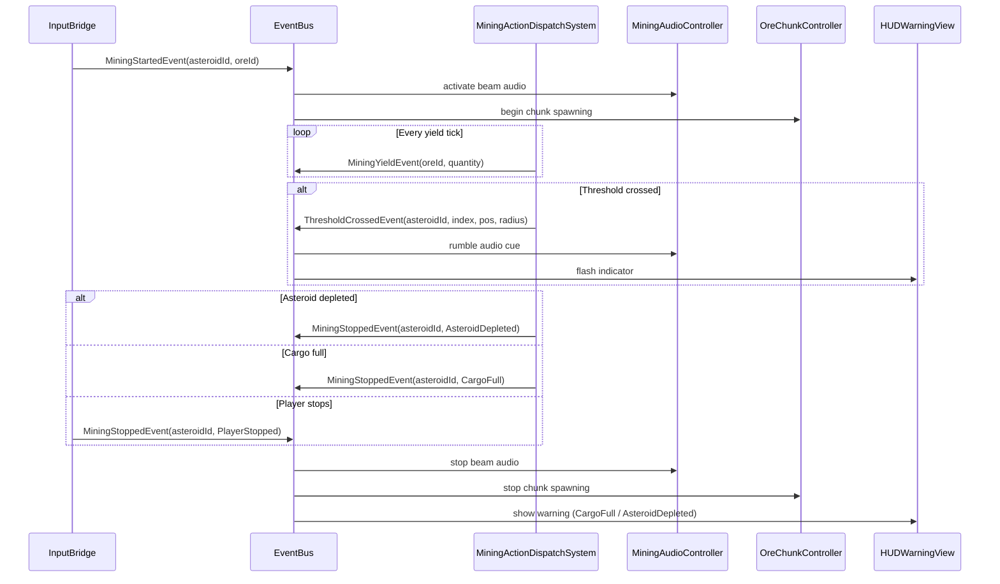
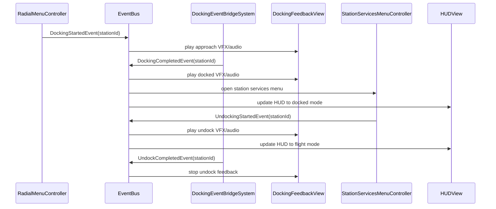
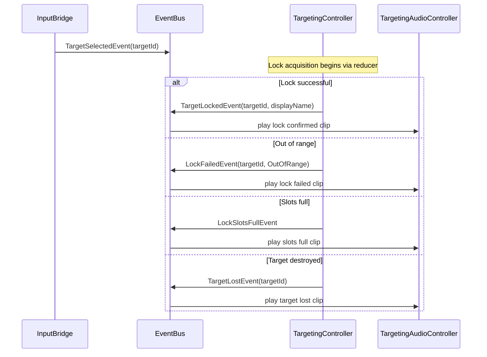
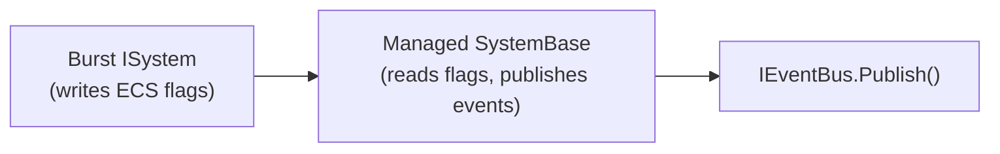

# Event System

## Purpose

The VoidHarvest Event System provides **decoupled, cross-system communication** using a UniTask-reactive EventBus. It enables game systems (mining, docking, targeting, station services, UI) to communicate without direct references to each other, enforcing the [Constitution](../../.specify/memory/constitution.md) mandate for modularity and extensibility.

All events are **immutable readonly structs**, ensuring zero-allocation publishes and value-type safety. The bus follows a fire-and-forget publisher model with async enumerable subscribers, powered by UniTask Channels.

## Architecture Diagram



## Core Infrastructure

### IEventBus Interface

**File:** `Assets/Core/EventBus/IEventBus.cs`
**Namespace:** `VoidHarvest.Core.EventBus`

```csharp
public interface IEventBus
{
    void Publish<T>(in T evt) where T : struct;
    IUniTaskAsyncEnumerable<T> Subscribe<T>() where T : struct;
}
```

- `Publish<T>(in T evt)` -- synchronous, allocation-free for struct events. Delivers immediately to all active subscriber channels.
- `Subscribe<T>()` -- returns an async enumerable that yields events as they are published. Caller must provide cancellation via `CancellationToken`.

### UniTaskEventBus Implementation

**File:** `Assets/Core/EventBus/UniTaskEventBus.cs`
**Namespace:** `VoidHarvest.Core.EventBus`

The concrete implementation uses a `ConcurrentDictionary<Type, Broadcaster<T>>` internally. Each event type gets its own `Broadcaster<T>`, which maintains a list of `ChannelWriter<T>` instances (one per subscriber). On publish, the broadcaster iterates writers in reverse order, removing any that have been completed or disposed.

Each subscriber receives a dedicated `Channel.CreateSingleConsumerUnbounded<T>()`, read via `channel.Reader.ReadAllAsync()`. This ensures:

- **Multiple subscribers** per event type all receive every published event.
- **Backpressure-free** delivery (unbounded channel).
- **Automatic cleanup** when a subscriber's `CancellationToken` fires.

### DI Registration

**File:** `Assets/Core/RootLifetimeScope.cs`

The EventBus is registered as a **singleton** via VContainer:

```csharp
builder.Register<UniTaskEventBus>(Lifetime.Singleton).As<IEventBus>();
```

All publishers and subscribers receive `IEventBus` through constructor injection.

### Assembly

**Assembly:** `VoidHarvest.Core.EventBus`
**References:** `VoidHarvest.Core.Extensions`, `UniTask`, `Unity.Mathematics`

## Event Catalog

VoidHarvest defines **26 event types** across three source locations. All events are `public readonly struct` types with no mutable state.

### Core Events (13 types)

Located in `Assets/Core/EventBus/Events/`.

#### StateChangedEvent\<T\>

Generic event published whenever a state dispatch produces a new state reference.

| Field | Type | Description |
|-------|------|-------------|
| `PreviousState` | `T` (class) | State snapshot before the dispatch |
| `CurrentState` | `T` (class) | State snapshot after the dispatch |

| Publisher(s) | Subscriber(s) |
|-------------|---------------|
| `StateStore` | `InputBridge`, `SellResourcesPanelController`, `RefineOresPanelController`, `CreditBalanceIndicator`, `CargoTransferPanelController`, `BasicRepairPanelController` |

Currently instantiated as `StateChangedEvent<GameState>`. Views subscribe to detect cross-slice state changes (inventory, station services, credits) for UI refresh.

---

#### DockingStartedEvent

Published when the ship begins a docking approach.

| Field | Type | Description |
|-------|------|-------------|
| `StationId` | `int` | ID of the target station |

| Publisher(s) | Subscriber(s) |
|-------------|---------------|
| `RadialMenuController` | `DockingFeedbackView` |

---

#### DockingCompletedEvent

Published when the ship successfully docks at a station.

| Field | Type | Description |
|-------|------|-------------|
| `StationId` | `int` | ID of the docked station |

| Publisher(s) | Subscriber(s) |
|-------------|---------------|
| `DockingEventBridgeSystem` | `DockingFeedbackView`, `StationServicesMenuController`, `HUDView` |

---

#### UndockingStartedEvent

Published when the ship begins undocking from a station.

| Field | Type | Description |
|-------|------|-------------|
| `StationId` | `int` | ID of the station being undocked from |

| Publisher(s) | Subscriber(s) |
|-------------|---------------|
| `StationServicesMenuController` | `DockingFeedbackView`, `StationServicesMenuController`, `HUDView`, `InputBridge` |

---

#### UndockCompletedEvent

Published when the ship completes undocking and returns to free flight.

| Field | Type | Description |
|-------|------|-------------|
| `StationId` | `int` | ID of the station that was undocked from |

| Publisher(s) | Subscriber(s) |
|-------------|---------------|
| `DockingEventBridgeSystem` | `DockingFeedbackView` |

---

#### DockingCancelledEvent

Published when a docking sequence is cancelled mid-approach.

| Field | Type | Description |
|-------|------|-------------|
| *(none)* | -- | Empty payload |

| Publisher(s) | Subscriber(s) |
|-------------|---------------|
| `InputBridge` | `DockingFeedbackView` |

---

#### MiningStartedEvent

Published when a mining beam activates on an asteroid.

| Field | Type | Description |
|-------|------|-------------|
| `AsteroidId` | `int` | Instance ID of the targeted asteroid |
| `OreId` | `string` | Ore type identifier being mined |

| Publisher(s) | Subscriber(s) |
|-------------|---------------|
| `InputBridge` | `OreChunkController`, `MiningAudioController` |

---

#### MiningStoppedEvent

Published when a mining beam deactivates for any reason.

| Field | Type | Description |
|-------|------|-------------|
| `AsteroidId` | `int` | Instance ID of the asteroid that was being mined |
| `Reason` | `StopReason` | Why mining ended (see `StopReason` enum below) |

| Publisher(s) | Subscriber(s) |
|-------------|---------------|
| `MiningActionDispatchSystem`, `InputBridge` | `OreChunkController`, `MiningAudioController`, `HUDWarningView`, `InputBridge` |

**`StopReason` enum** (`Assets/Core/EventBus/Events/StopReason.cs`):
- `PlayerStopped` -- Player manually stopped mining
- `OutOfRange` -- Ship moved beyond beam max range
- `AsteroidDepleted` -- Asteroid mass reached zero
- `CargoFull` -- Inventory volume capacity reached

---

#### MiningYieldEvent

Published when mining produces whole resource units.

| Field | Type | Description |
|-------|------|-------------|
| `OreId` | `string` | Ore type identifier for the yielded resource |
| `Quantity` | `int` | Number of whole units yielded this tick |

| Publisher(s) | Subscriber(s) |
|-------------|---------------|
| `MiningActionDispatchSystem` | *(consumed via state dispatch; no direct subscribers)* |

---

#### OreChunkCollectedEvent

Published when a cosmetic ore chunk reaches the barge collector.

| Field | Type | Description |
|-------|------|-------------|
| `Position` | `float3` | World position where collection occurred |
| `OreId` | `string` | Ore type identifier of the collected chunk |

| Publisher(s) | Subscriber(s) |
|-------------|---------------|
| `OreChunkBehaviour` | `MiningAudioController` |

---

#### RadialMenuRequestedEvent

Published when the player requests a radial context menu on the current target.

| Field | Type | Description |
|-------|------|-------------|
| `TargetId` | `int` | Instance ID of the target for the radial menu |
| `TargetType` | `TargetType` | Type of targeted object (Asteroid, Station, None) |

| Publisher(s) | Subscriber(s) |
|-------------|---------------|
| `InputBridge` | `RadialMenuController` |

---

#### TargetSelectedEvent

Published when the player selects a target (asteroid, station, etc.).

| Field | Type | Description |
|-------|------|-------------|
| `TargetId` | `int` | Instance ID of the selected target; -1 for deselection |

| Publisher(s) | Subscriber(s) |
|-------------|---------------|
| `InputBridge` | *(consumed by TargetingController via direct reference)* |

---

#### ThresholdCrossedEvent

Published when an asteroid crosses a 25% depletion threshold.

| Field | Type | Description |
|-------|------|-------------|
| `AsteroidId` | `int` | Instance ID of the depleting asteroid |
| `ThresholdIndex` | `byte` | Which threshold was crossed (0 = 75%, 1 = 50%, 2 = 25%, 3 = 0%) |
| `Position` | `float3` | World position of the asteroid |
| `AsteroidRadius` | `float` | Radius of the asteroid for VFX scaling |

| Publisher(s) | Subscriber(s) |
|-------------|---------------|
| `MiningActionDispatchSystem` | `DepletionVFXView`, `MiningAudioController`, `HUDView` |

---

### Station Services Events (7 types)

Located in `Assets/Features/StationServices/Data/StationServicesEvents.cs`.
**Namespace:** `VoidHarvest.Features.StationServices.Data`

#### RefiningJobStartedEvent

| Field | Type | Description |
|-------|------|-------------|
| `StationId` | `int` | Station hosting the refining job |
| `JobId` | `string` | Unique identifier for the refining job |

| Publisher(s) | Subscriber(s) |
|-------------|---------------|
| `RefineOresPanelController` | *(notification systems)* |

---

#### RefiningJobCompletedEvent

| Field | Type | Description |
|-------|------|-------------|
| `StationId` | `int` | Station where the job completed |
| `JobId` | `string` | Unique identifier for the completed job |

| Publisher(s) | Subscriber(s) |
|-------------|---------------|
| `RefiningJobTicker` | `RefiningNotificationIndicator` |

---

#### RefiningJobCollectedEvent

| Field | Type | Description |
|-------|------|-------------|
| `StationId` | `int` | Station where outputs were collected |
| `JobId` | `string` | Unique identifier for the collected job |

| Publisher(s) | Subscriber(s) |
|-------------|---------------|
| `RefiningJobSummaryController` | `RefiningNotificationIndicator` |

---

#### ResourcesSoldEvent

| Field | Type | Description |
|-------|------|-------------|
| `ResourceId` | `string` | Identifier of the resource that was sold |
| `Quantity` | `int` | Number of units sold |
| `TotalCredits` | `int` | Credit revenue from the sale |

| Publisher(s) | Subscriber(s) |
|-------------|---------------|
| `SellResourcesPanelController` | *(UI feedback systems)* |

---

#### CargoTransferredEvent

| Field | Type | Description |
|-------|------|-------------|
| `ResourceId` | `string` | Identifier of the transferred resource |
| `Quantity` | `int` | Number of units transferred |
| `ToStation` | `bool` | `true` if transferred ship-to-station, `false` if station-to-ship |

| Publisher(s) | Subscriber(s) |
|-------------|---------------|
| `CargoTransferPanelController` | *(UI feedback systems)* |

---

#### ShipRepairedEvent

| Field | Type | Description |
|-------|------|-------------|
| `Cost` | `int` | Credit cost of the repair |
| `NewIntegrity` | `float` | Hull integrity after repair (0.0 to 1.0) |

| Publisher(s) | Subscriber(s) |
|-------------|---------------|
| `BasicRepairPanelController` | *(UI feedback systems)* |

---

#### CreditsChangedEvent

| Field | Type | Description |
|-------|------|-------------|
| `OldBalance` | `int` | Credit balance before the transaction |
| `NewBalance` | `int` | Credit balance after the transaction |

| Publisher(s) | Subscriber(s) |
|-------------|---------------|
| `BasicRepairPanelController`, `SellResourcesPanelController` | *(UI feedback systems)* |

---

### Targeting Events (6 types)

Located in `Assets/Features/Targeting/Data/TargetingEvents.cs`.
**Namespace:** `VoidHarvest.Features.Targeting.Data`

#### TargetLockedEvent

| Field | Type | Description |
|-------|------|-------------|
| `TargetId` | `int` | Instance ID of the locked target |
| `DisplayName` | `string` | Human-readable name for the target |

| Publisher(s) | Subscriber(s) |
|-------------|---------------|
| `TargetingController` | `TargetingAudioController` |

---

#### TargetUnlockedEvent

| Field | Type | Description |
|-------|------|-------------|
| `TargetId` | `int` | Instance ID of the unlocked target |

| Publisher(s) | Subscriber(s) |
|-------------|---------------|
| `TargetCardView` | *(TargetingController via direct state update)* |

---

#### LockFailedEvent

| Field | Type | Description |
|-------|------|-------------|
| `TargetId` | `int` | Instance ID of the target that failed to lock |
| `Reason` | `LockFailReason` | Why the lock failed (see enum below) |

| Publisher(s) | Subscriber(s) |
|-------------|---------------|
| `TargetingController` | `TargetingAudioController` |

**`LockFailReason` enum** (`Assets/Features/Targeting/Data/LockFailReason.cs`):
- `Deselected` -- Player deselected target during acquisition
- `OutOfRange` -- Target moved beyond max lock range
- `TargetDestroyed` -- Target was destroyed during acquisition

---

#### LockSlotsFullEvent

| Field | Type | Description |
|-------|------|-------------|
| *(none)* | -- | Empty payload |

| Publisher(s) | Subscriber(s) |
|-------------|---------------|
| `TargetingController` | `TargetingAudioController` |

---

#### TargetLostEvent

| Field | Type | Description |
|-------|------|-------------|
| `TargetId` | `int` | Instance ID of the lost target |

| Publisher(s) | Subscriber(s) |
|-------------|---------------|
| `TargetingController` | `TargetingAudioController` |

---

#### AllLocksClearedEvent

| Field | Type | Description |
|-------|------|-------------|
| *(none)* | -- | Empty payload |

| Publisher(s) | Subscriber(s) |
|-------------|---------------|
| *(TargetingController on dock/ship-swap)* | *(TargetingAudioController)* |

---

## Event Flow Diagrams

### Mining Event Flow



### Docking Event Flow



### Targeting Event Flow



## Async Subscription Convention

All EventBus subscribers in MonoBehaviours follow a strict lifecycle pattern established in Spec 008. This prevents memory leaks and ensures subscriptions are properly cleaned up when GameObjects are disabled or destroyed.

### Pattern: OnEnable / OnDisable / OnDestroy

```csharp
public class ExampleView : MonoBehaviour
{
    [Inject] private IEventBus _eventBus;
    private CancellationTokenSource _eventCts;

    private void OnEnable()
    {
        if (_eventBus != null)
        {
            _eventCts = new CancellationTokenSource();
            ListenForSomeEvent(_eventCts.Token).Forget();
        }
    }

    private void OnDisable()
    {
        _eventCts?.Cancel();
        _eventCts?.Dispose();
        _eventCts = null;
    }

    private void OnDestroy()
    {
        // Safety net in case OnDisable was not called
        _eventCts?.Cancel();
        _eventCts?.Dispose();
        _eventCts = null;
    }

    private async UniTaskVoid ListenForSomeEvent(CancellationToken ct)
    {
        await foreach (var evt in _eventBus.Subscribe<SomeEvent>().WithCancellation(ct))
        {
            HandleEvent(evt);
        }
    }
}
```

**Rules:**

1. **OnEnable** -- Create a new `CancellationTokenSource` and start all `async UniTaskVoid` listener methods, passing the token.
2. **OnDisable** -- Cancel the token, dispose the source, set to `null`. This terminates all active `await foreach` loops.
3. **OnDestroy** -- Safety net: repeat the cancel/dispose/null pattern in case `OnDisable` was bypassed.
4. **Never** use `this.GetCancellationTokenOnDestroy()` for EventBus subscriptions that should pause when disabled. Reserve `GetCancellationTokenOnDestroy()` only for views that should remain subscribed for the entire object lifetime (e.g., `MiningAudioController` which is always active).
5. **Always** call `.Forget()` on the `UniTaskVoid` return to suppress unobserved task warnings.

### ECS-to-Managed Bridge Pattern

For events originating in Burst-compiled ECS systems (which cannot directly call managed `IEventBus.Publish`), use a managed `SystemBase` bridge:



**Example:** `DockingEventBridgeSystem` reads `DockingEventFlags` singleton set by the Burst-compiled `DockingSystem`, then publishes `DockingCompletedEvent` / `UndockCompletedEvent` to the managed EventBus.

**Example:** `MiningActionDispatchSystem` drains native queues (`YieldQueue`, `DepletedQueue`, `StopQueue`, `ThresholdQueue`) written by Burst-compiled mining systems, then publishes corresponding managed events.

## Design Constraints

- **Struct-only events.** The `where T : struct` constraint on `IEventBus` ensures zero heap allocation on publish. The only exception is `StateChangedEvent<T>` where `T : class`, which carries two reference-type state snapshots (these are already allocated by the state store).
- **No return values.** Events are fire-and-forget notifications. For request/response patterns, use the state store dispatch cycle instead.
- **No ordering guarantees.** Subscribers may receive events in any order relative to each other within the same frame. Within a single subscriber's channel, events are delivered in publish order.
- **Thread safety.** The `ConcurrentDictionary` and per-broadcaster `lock` ensure safe concurrent publish/subscribe, though in practice all publishes occur on the main thread.

## Key Source Files

| File | Path |
|------|------|
| IEventBus interface | `Assets/Core/EventBus/IEventBus.cs` |
| UniTaskEventBus implementation | `Assets/Core/EventBus/UniTaskEventBus.cs` |
| Core events (13 files) | `Assets/Core/EventBus/Events/` |
| StationServices events | `Assets/Features/StationServices/Data/StationServicesEvents.cs` |
| Targeting events | `Assets/Features/Targeting/Data/TargetingEvents.cs` |
| LockFailReason enum | `Assets/Features/Targeting/Data/LockFailReason.cs` |
| StopReason enum | `Assets/Core/EventBus/Events/StopReason.cs` |
| EventBus tests | `Assets/Core/EventBus/Tests/UniTaskEventBusTests.cs` |
| Assembly definition | `Assets/Core/EventBus/VoidHarvest.Core.EventBus.asmdef` |
| DI registration | `Assets/Core/RootLifetimeScope.cs` |

## Cross-References

- [State Management](./state-management.md) -- `StateChangedEvent<T>` is published by the StateStore on every dispatch
- [State Management](./state-management.md) -- Events often trigger UI refreshes after reducer state transitions
- [Assembly Map](../assembly-map.md) -- `VoidHarvest.Core.EventBus` assembly and its dependents
