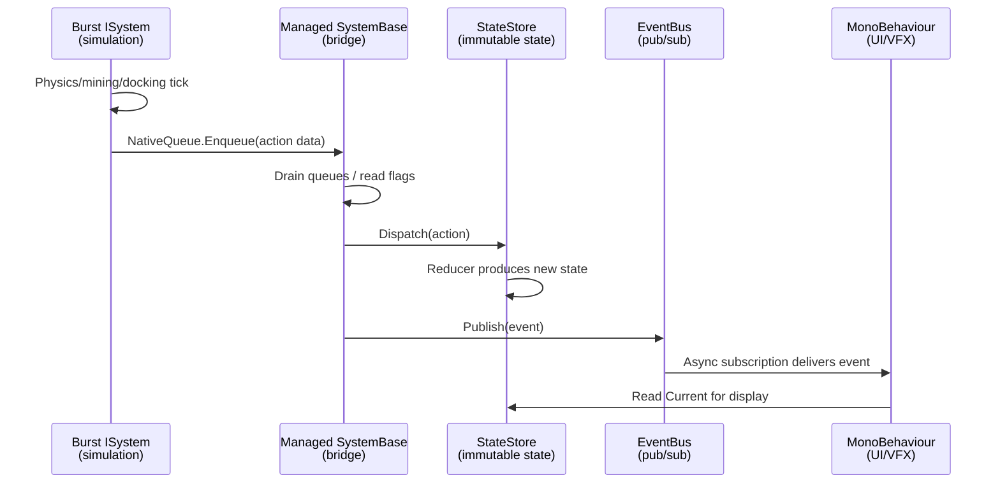
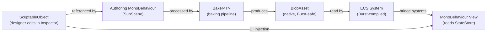

# Architecture Overview

## Purpose

VoidHarvest is a 3D space mining simulator built on Unity 6 (6000.3.10f1) using a **hybrid DOTS/MonoBehaviour architecture**. The project enforces a strict functional and immutable-first paradigm: all game state is managed through pure reducers, all domain data uses immutable record types, and side effects are isolated to Unity lifecycle hooks, I/O, and rendering.

The architecture is divided into two runtime worlds that operate in tandem:

- **DOTS/ECS (Entities, Burst, Jobs)** handles all simulation-heavy logic: ship physics, mining beam calculations, asteroid field generation, docking state machines, and procedural generation. These systems run in Burst-compiled jobs with zero GC allocations in hot paths.
- **GameObject/MonoBehaviour + ScriptableObjects** handles UI, player input bridging, editor tooling, audio/VFX feedback, and lightweight view layers. MonoBehaviours never hold game state; they read from the immutable `StateStore` and render accordingly.

Communication between these two worlds flows through three explicit channels: the centralized `StateStore` (reducer-based immutable state), the `EventBus` (UniTask-based reactive pub/sub), and ECS bridge systems that synchronize data across the managed/unmanaged boundary.

## System-Level Architecture

The following diagram shows all 12 shipped features, the core infrastructure layer, communication paths, and the DOTS/MonoBehaviour boundary.

```mermaid
graph TD
    subgraph Core["Core Infrastructure"]
        StateStore["StateStore<br/>(IStateStore)"]
        EventBus["EventBus<br/>(IEventBus / UniTask)"]
        DI["VContainer DI<br/>(Root + Scene Scopes)"]
        Extensions["Extensions<br/>(Option, ITargetable, TargetType)"]
        Pools["Pools<br/>(ObjectPool&lt;T&gt;)"]
    end

    subgraph DOTS["DOTS / ECS Boundary (Burst-compiled)"]
        ShipPhysics["Ship Physics<br/>(ShipFlightSystem)"]
        MiningBeam["Mining Beam<br/>(MiningBeamSystem)"]
        AsteroidField["Procedural Asteroids<br/>(AsteroidFieldSystem)"]
        DockingSM["Docking State Machine<br/>(DockingSystem)"]
        AsteroidScale["Asteroid Scale/Depletion<br/>(AsteroidScaleSystem)"]
        DockingBlob["DockingConfigBlob<br/>(BlobAsset singleton)"]
        OreBlob["OreTypeBlob<br/>(BlobAsset singleton)"]
    end

    subgraph Bridge["ECS Bridge Systems (managed SystemBase)"]
        EcsSync["EcsToStoreSyncSystem<br/>(Ship ECS -> StateStore)"]
        MiningDispatch["MiningActionDispatchSystem<br/>(Mining ECS -> StateStore + EventBus)"]
        DockingBridge["DockingEventBridgeSystem<br/>(Docking ECS -> StateStore + EventBus)"]
        StoreToEcs["StoreToEcsSyncSystem<br/>(StateStore -> ECS, Phase 1+)"]
    end

    subgraph Managed["MonoBehaviour / View Layer"]
        Camera["Camera<br/>(CameraView + Cinemachine)"]
        Input["Input<br/>(InputBridge + PilotCommand)"]
        HUD["HUD<br/>(Radial Menu, Hotbar, Target Info)"]
        MiningViews["Mining Views<br/>(Beam VFX, Depletion VFX, Audio)"]
        DockingViews["Docking Views<br/>(DockingFeedbackView)"]
        StationUI["Station Services UI<br/>(Refine, Sell, Repair, Transfer)"]
        TargetingUI["Targeting Views<br/>(Reticle, Lock Progress, Cards)"]
        RefiningTicker["RefiningJobTicker<br/>(Timer MonoBehaviour)"]
    end

    subgraph DataLayer["ScriptableObject Data Layer"]
        OreDefinition["OreDefinition"]
        ShipArchetype["ShipArchetypeConfig"]
        AsteroidFieldDef["AsteroidFieldDefinition"]
        StationDef["StationDefinition"]
        WorldDef["WorldDefinition"]
        CameraConfig["CameraConfig"]
        DockingConfig["DockingConfig"]
        InteractionConfig["InteractionConfig"]
        TargetingConfig["TargetingConfig"]
        GameServicesConfig["GameServicesConfig"]
    end

    subgraph Skeleton["Future Phases (skeleton)"]
        Fleet["Fleet<br/>(Phase 1)"]:::skeleton
        TechTree["TechTree<br/>(Phase 1)"]:::skeleton
        Economy["Economy<br/>(Phase 3)"]:::skeleton
        Base["Base Building<br/>(Phase 2)"]:::skeleton
    end

    %% DI wiring
    DI -->|"registers singleton"| StateStore
    DI -->|"registers singleton"| EventBus
    DI -->|"injects configs"| Camera
    DI -->|"injects configs"| Input
    DI -->|"injects configs"| MiningViews
    DI -->|"injects configs"| DockingViews
    DI -->|"injects configs"| StationUI
    DI -->|"injects configs"| TargetingUI

    %% ScriptableObject -> Baking -> ECS
    OreDefinition -->|"baked to"| OreBlob
    AsteroidFieldDef -->|"baked to config"| AsteroidField
    DockingConfig -->|"baked to"| DockingBlob
    WorldDef -->|"builds initial"| StateStore
    ShipArchetype -->|"cargo slots/capacity"| StateStore
    CameraConfig -->|"initial CameraState"| StateStore

    %% ECS simulation data flow
    ShipPhysics --> EcsSync
    MiningBeam --> MiningDispatch
    DockingSM --> DockingBridge
    OreBlob --> MiningBeam
    OreBlob --> AsteroidField
    DockingBlob --> DockingSM

    %% Bridge -> StateStore
    EcsSync -->|"Dispatch(SyncShipPhysicsAction)"| StateStore
    MiningDispatch -->|"Dispatch(MiningTick, AddResource, StopMining)"| StateStore
    DockingBridge -->|"Dispatch(CompleteDocking, Dock/Undock)"| StateStore

    %% Bridge -> EventBus
    MiningDispatch -->|"Publish(MiningYield, MiningStop, Threshold)"| EventBus
    DockingBridge -->|"Publish(DockCompleted, UndockCompleted)"| EventBus

    %% Input -> StateStore
    Input -->|"Dispatch(PilotCommand, SelectTarget, StartMining)"| StateStore

    %% EventBus subscriptions (views)
    EventBus -->|"subscribe"| MiningViews
    EventBus -->|"subscribe"| DockingViews
    EventBus -->|"subscribe"| HUD
    EventBus -->|"subscribe"| StationUI
    EventBus -->|"subscribe"| TargetingUI

    %% StateStore reads (views)
    StateStore -->|"Current (read)"| Camera
    StateStore -->|"Current (read)"| HUD
    StateStore -->|"Current (read)"| StationUI
    StateStore -->|"Current (read)"| TargetingUI
    StateStore -->|"Current (read)"| RefiningTicker

    %% Skeleton stubs in reducer
    StateStore -.->|"stub reducer"| Fleet
    StateStore -.->|"stub reducer"| TechTree
    StateStore -.->|"stub reducer"| Economy
    StateStore -.->|"stub reducer"| Base

    classDef skeleton stroke-dasharray: 5 5, fill:#444, color:#999
```



## Hybrid Architecture

### The Two Worlds

VoidHarvest runs two parallel runtime worlds that must be kept in sync:

| Aspect | DOTS/ECS World | MonoBehaviour World |
|--------|---------------|---------------------|
| **Purpose** | Simulation, physics, procedural generation | UI, input, audio/VFX feedback, camera |
| **Compilation** | Burst-compiled, zero GC in hot paths | Managed C#, GC-safe for infrequent operations |
| **State ownership** | ECS components (transient simulation data) | StateStore (authoritative game state) |
| **Data types** | `NativeArray`, `BlobAsset`, ECS components | `sealed record`, `readonly struct`, `ImmutableArray<T>` |
| **Communication** | NativeQueue for deferred actions | EventBus (UniTask channels), StateStore reads |
| **Scheduling** | SystemGroups (Simulation, Presentation) | Unity lifecycle (Update, OnEnable/OnDisable) |

### The StateStore as Single Source of Truth

The `StateStore` holds the authoritative `GameState` -- a deeply nested immutable record tree. All state transitions happen through dispatched actions that are processed by pure reducer functions:

```
Action --> StateStore.Dispatch() --> CompositeReducer(state, action) --> new GameState
```

The `CompositeReducer` (defined in `RootLifetimeScope`) routes each action to the appropriate feature reducer based on the action's interface type (`IShipAction`, `IMiningAction`, `IDockingAction`, etc.). Cross-cutting actions that span multiple state slices (cargo transfer, repair, docking with lock clearing) are handled at the composite level to ensure atomic multi-slice updates.

After every dispatch, the StateStore:
1. Increments its monotonic `Version` counter.
2. Writes the new state to a UniTask `Channel` for async subscribers.
3. Publishes a `StateChangedEvent<GameState>` on the EventBus if the state reference actually changed.

See [State Management](state-management.md) for the full GameState tree, reducer composition, and action catalog.

### ECS Bridge Systems

Three managed `SystemBase` classes bridge the DOTS/ECS simulation with the managed StateStore and EventBus. These bridges are necessary because Burst-compiled `ISystem` implementations cannot access managed objects directly.



The three bridge systems and their responsibilities:

| Bridge System | Source (ECS) | Target (Managed) | Purpose |
|--------------|-------------|-------------------|---------|
| `EcsToStoreSyncSystem` | `ShipFlightSystem` | StateStore | Projects ship position, velocity, rotation, and flight mode into `ShipState` every frame |
| `MiningActionDispatchSystem` | `MiningBeamSystem`, `AsteroidScaleSystem` | StateStore + EventBus | Drains yield/depleted/stop/threshold queues, accumulates fractional yield, dispatches inventory and mining actions, publishes mining events |
| `DockingEventBridgeSystem` | `DockingSystem` | StateStore + EventBus | Reads `DockingEventFlags` written by the Burst docking system, dispatches dock/undock completion actions, publishes docking events |

A fourth bridge, `StoreToEcsSyncSystem`, exists as a placeholder for Phase 1+ when fleet ship swapping will require pushing StateStore data back into ECS.

All bridge systems use a `// CONSTITUTION DEVIATION:` annotation because DOTS `SystemBase` cannot use constructor injection. Dependencies are wired via static `SetDependencies()` methods called from `RootLifetimeScope.Start()`.

## Communication Patterns

VoidHarvest uses three distinct communication channels, each with a specific role. No system may communicate across feature boundaries through any other mechanism.

### 1. StateStore Dispatch (Action-Based State Mutation)

All game state changes flow through `IStateStore.Dispatch(IGameAction)`. Actions are routed by the `CompositeReducer` based on their interface type:

| Action Interface | Target Reducer | State Slice |
|-----------------|---------------|-------------|
| `ICameraAction` | `CameraReducer` | `GameState.Camera` |
| `IShipAction` | `ShipStateReducer` | `GameState.ActiveShipPhysics` |
| `IMiningAction` | `MiningReducer` | `GameState.Loop.Mining` |
| `IInventoryAction` | `InventoryReducer` | `GameState.Loop.Inventory` |
| `IDockingAction` | `DockingReducer` | `GameState.Loop.Docking` |
| `IStationServicesAction` | `StationServicesReducer` | `GameState.Loop.StationServices` |
| `ITargetingAction` | `TargetingReducer` | `GameState.Loop.Targeting` |
| `IFleetAction` | `FleetReducer` | `GameState.Loop.Fleet` |
| `ITechAction` | `TechTreeReducer` (stub) | `GameState.Loop.TechTree` |
| `IMarketAction` | `MarketReducer` (stub) | `GameState.Loop.Market` |
| `IBaseAction` | `BaseReducer` (stub) | `GameState.Loop.Base` |

Cross-cutting actions (`TransferToStationAction`, `TransferToShipAction`, `RepairShipAction`, `CompleteDockingAction`, `CompleteUndockingAction`) are matched first in the composite reducer and atomically update multiple state slices.

### 2. EventBus (Decoupled Pub/Sub)

The `IEventBus` interface (implemented by `UniTaskEventBus`) provides fire-and-forget event publication with async subscription via UniTask channels. Events are `readonly struct` types to avoid GC allocations on publish.

Events are used for:
- **Feedback triggers** -- VFX, audio, and UI reactions to game events (e.g., `MiningYieldEvent`, `DockingCompletedEvent`).
- **State change notifications** -- `StateChangedEvent<GameState>` enables views to react to any state transition.
- **Cross-feature signals** -- `RadialMenuRequestedEvent`, `TargetSelectedEvent` for loosely-coupled UI coordination.

The async subscription convention (established in Spec 008) requires:
- `OnEnable` -- create `CancellationTokenSource`, start async subscriptions.
- `OnDisable` -- cancel + dispose CTS, null the field.
- `OnDestroy` -- safety net calling cleanup (guards double-dispose).

See [Event System](event-system.md) for the complete event catalog and publisher/subscriber mapping.

### 3. VContainer Dependency Injection

VContainer manages two hierarchical DI scopes:

| Scope | Lifetime | Registrations |
|-------|----------|---------------|
| `RootLifetimeScope` | Application (DontDestroyOnLoad) | `StateStore`, `EventBus`, `WorldDefinition`, `CompositeReducer` |
| `SceneLifetimeScope` | Per-scene | ScriptableObject configs (mining, docking, camera, input, targeting, station services), view-layer MonoBehaviour singletons (`InputBridge`, `CameraView`, `TargetingController`, `TargetPreviewManager`) |

All non-MonoBehaviour systems use pure constructor injection. MonoBehaviours placed in the scene use `[Inject]` attribute resolution via `RegisterComponentInHierarchy<T>()`. Static singletons and service locators are prohibited.

See [Dependency Injection](dependency-injection.md) for scope hierarchy details and registration patterns.

## Feature Organization

Every feature follows a consistent internal structure:

```
Assets/Features/<FeatureName>/
    Data/       -- ScriptableObjects, sealed records, readonly structs, ECS components
    Systems/    -- Pure reducers, static math helpers, Burst-compiled ECS systems
    Views/      -- MonoBehaviours, UI controllers, VFX/audio feedback
    Tests/      -- NUnit unit tests (EditMode) and integration tests (PlayMode)
```

Each feature has its own assembly definition (`VoidHarvest.Features.<Name>.asmdef`) with explicit dependency declarations. Features may only reference Core assemblies and specific sibling features -- never circular dependencies.

### Shipped Features (Phase 0)

| Feature | Assembly | Layer | Description |
|---------|----------|-------|-------------|
| **Camera** | `VoidHarvest.Features.Camera` | View | 3rd-person orbiting follow camera with speed-based zoom, Cinemachine integration |
| **Input** | `VoidHarvest.Features.Input` | View | EVE-style controls, mouse targeting, radial menus, `PilotCommand` generation |
| **Ship** | `VoidHarvest.Features.Ship` | DOTS + View | 6DOF flight physics, ship archetypes, `ShipStateReducer`, `EcsToStoreSyncSystem` |
| **Mining** | `VoidHarvest.Features.Mining` | DOTS + View | Mining beam targeting, yield calculation, depletion, VFX/audio feedback |
| **Procedural** | `VoidHarvest.Features.Procedural` | DOTS | Asteroid field generation via Burst jobs, mesh variant assignment |
| **Resources** | `VoidHarvest.Features.Resources` | Logic | Immutable inventory with `InventoryReducer`, cargo capacity, volume tracking |
| **HUD** | `VoidHarvest.Features.HUD` | View | Radial context menus, hotbar, target info display, resource counts |
| **Docking** | `VoidHarvest.Features.Docking` | DOTS + View | Station docking state machine, snap animation, approach/undock phases |
| **StationServices** | `VoidHarvest.Features.StationServices` | View + Logic | Refining, selling, repair, cargo transfer; UI Toolkit panels |
| **Targeting** | `VoidHarvest.Features.Targeting` | View + Logic | Multi-target lock, reticle, lock progress, target cards, preview cameras |
| **Station** | `VoidHarvest.Features.Station` | Data | `StationDefinition` SO, station presets, service config data |
| **World** | `VoidHarvest.Features.World` | Data | `WorldDefinition` SO, data-driven world initialization |

### Skeleton Features (Future Phases)

| Feature | Assembly | Phase | Status |
|---------|----------|-------|--------|
| **Fleet** | `VoidHarvest.Features.Fleet` | Phase 1 | `FleetReducer` handles dock/undock station tracking; ship swapping not yet implemented |
| **TechTree** | `VoidHarvest.Features.TechTree` | Phase 1 | Stub reducer returns unchanged state |
| **Economy** | `VoidHarvest.Features.Economy` | Phase 3 | Stub reducer returns unchanged state |
| **Base** | `VoidHarvest.Features.Base` | Phase 2 | Stub reducer returns unchanged state; station presets for base building |

Skeleton features have their state slices allocated in `GameLoopState` and their stub reducers registered in the `CompositeReducer`. This ensures the state shape is stable and forward-compatible as features are implemented.

## Data Pipeline

VoidHarvest uses a layered data pipeline that flows from designer-authored ScriptableObjects through the ECS baking pipeline into runtime BlobAssets:



Key data-driven pipelines in Phase 0:

| Pipeline | ScriptableObject | BlobAsset | Consuming System |
|----------|-----------------|-----------|-----------------|
| Ore types | `OreDefinition` | `OreTypeBlob` (via `OreTypeBlobDatabase`) | `MiningBeamSystem`, `AsteroidFieldSystem` |
| Asteroid fields | `AsteroidFieldDefinition` | `AsteroidFieldConfigComponent` | `AsteroidFieldSystem` |
| Docking config | `DockingConfig` | `DockingConfigBlob` | `DockingSystem` |
| World stations | `WorldDefinition` + `StationDefinition` | N/A (builds `WorldState` directly) | `RootLifetimeScope` initial state |
| Camera config | `CameraConfig` | N/A (builds `CameraState` directly) | `CameraReducer` |

See [Data Pipeline](data-pipeline.md) for the complete SO-to-ECS lifecycle documentation.

## Rendering Pipeline

VoidHarvest uses the **Universal Render Pipeline (URP) 17.3.0** with dual pipeline configurations:

| Config | Asset | Target |
|--------|-------|--------|
| Quality | `Assets/Settings/PC_RPAsset.asset` | Desktop (GTX 1060+ class) |
| Performance | `Assets/Settings/Mobile_RPAsset.asset` | Lower-end hardware / future mobile |

Post-processing is configured via Volume Profiles in `Assets/Settings/`.

Procedural asteroids and resource entities use **Entities Graphics 1.3.2** for batch rendering -- all asteroid meshes in a field are rendered through a single Entities Graphics batch rather than individual GameObjects. Per-instance material property overrides (e.g., tint color) are applied via `URPMaterialPropertyBaseColor` using `RenderMeshUtility.AddComponents`.

The camera system uses **Cinemachine 3.1.2** for smooth 3rd-person orbiting follow behavior, with the camera state (yaw, pitch, distance) managed through the immutable `CameraState` record and `CameraReducer`.

## Assembly Structure

The project uses 29 assembly definitions to enforce strict module boundaries and explicit dependency declarations. The dependency hierarchy flows downward -- features depend on Core, never the reverse.

```mermaid
graph TD
    subgraph CoreAssemblies["Core Assemblies"]
        Ext["VoidHarvest.Core.Extensions"]
        EB["VoidHarvest.Core.EventBus"]
        State["VoidHarvest.Core.State"]
        Pools["VoidHarvest.Core.Pools"]
        Editor["VoidHarvest.Core.Editor"]
    end

    subgraph FeatureAssemblies["Feature Assemblies"]
        Ship["VoidHarvest.Features.Ship"]
        Mining["VoidHarvest.Features.Mining"]
        Cam["VoidHarvest.Features.Camera"]
        Inp["VoidHarvest.Features.Input"]
        Res["VoidHarvest.Features.Resources"]
        Proc["VoidHarvest.Features.Procedural"]
        HUD["VoidHarvest.Features.HUD"]
        Dock["VoidHarvest.Features.Docking"]
        SS["VoidHarvest.Features.StationServices"]
        Targ["VoidHarvest.Features.Targeting"]
        Sta["VoidHarvest.Features.Station"]
        Wor["VoidHarvest.Features.World"]
    end

    subgraph SkeletonAssemblies["Skeleton Assemblies"]
        Fleet["VoidHarvest.Features.Fleet"]
        Tech["VoidHarvest.Features.TechTree"]
        Econ["VoidHarvest.Features.Economy"]
        Base["VoidHarvest.Features.Base"]
    end

    subgraph Glue["Assembly-CSharp (glue)"]
        Root["RootLifetimeScope"]
        Scene["SceneLifetimeScope"]
    end

    %% Core dependency chain
    EB --> Ext
    State --> Ext
    State --> EB

    %% Features depend on Core
    Ship --> State
    Ship --> EB
    Ship --> Ext
    Mining --> State
    Mining --> EB
    Mining --> Ship
    Mining --> Res
    Cam --> State
    Cam --> Ext
    Inp --> State
    Inp --> EB
    Inp --> Cam
    Inp --> Ship
    Inp --> Mining
    Inp --> Dock
    Inp --> Targ
    Res --> State
    Res --> Ext
    Dock --> State
    Dock --> EB
    Dock --> Ship
    Dock --> Sta
    Dock --> Base
    SS --> State
    SS --> EB
    SS --> Sta
    Targ --> State
    Targ --> EB
    HUD --> State
    HUD --> EB
    HUD --> Mining
    HUD --> Res
    HUD --> Ship
    HUD --> Inp
    HUD --> Dock
    HUD --> Targ

    %% Glue references everything
    Root --> State
    Root --> EB
    Root --> Ship
    Root --> Mining
    Root --> Dock
    Root --> SS
    Root --> Targ
    Root --> Wor
    Root --> Cam
    Scene --> Mining
    Scene --> Dock
    Scene --> SS
    Scene --> Targ
    Scene --> Cam
    Scene --> Inp
```



The `RootLifetimeScope` and `SceneLifetimeScope` live in `Assembly-CSharp` (the default Unity assembly) because they must reference all feature assemblies to compose the `CompositeReducer` and register DI bindings. This is the only place where all feature assemblies converge.

See [Assembly Map](../assembly-map.md) for the complete dependency graph with version details.

## Future Phases

The architecture is designed for forward compatibility. All future features follow the same patterns established in Phase 0:

### Phase 1 -- Fleet and Progression
- `FleetReducer` will be expanded with ship swapping logic (`SwapShipAction`).
- `StoreToEcsSyncSystem` will push fleet state changes (active ship swap) into ECS.
- `TechTreeReducer` will implement immutable DAG traversal for tech node unlocking.
- New ScriptableObjects for tech node definitions and fleet configuration.

### Phase 2 -- Refining and Bases
- `BaseReducer` will manage base placement and module configuration.
- Base building will use immutable positional data within `WorldState`.
- Refining pipeline will be extended with multi-stage processing chains.

### Phase 3 -- Economy and Endgame
- `MarketReducer` will implement deterministic price resolution based on supply/demand.
- NPC fleet operations will run as autonomous ECS systems.
- Full dynamic economy with player-driven market mechanics.

Each phase preserves the functional/immutable core. No phase may introduce mutable game state patterns without a formal constitution deviation approval.

## Cross-References

- [State Management](state-management.md) -- GameState tree, reducer composition, action dispatch flow
- [Event System](event-system.md) -- EventBus implementation, event catalog, publisher/subscriber mapping
- [Dependency Injection](dependency-injection.md) -- VContainer scope hierarchy, registration patterns, async subscription convention
- [Data Pipeline](data-pipeline.md) -- ScriptableObject to BlobAsset lifecycle, baking pipeline
- [Assembly Map](../assembly-map.md) -- Complete assembly dependency graph
- [Glossary](../glossary.md) -- Standardized project terminology (Reducer, BlobAsset, Baking, etc.)
- [Onboarding](../onboarding.md) -- New developer quickstart guide
