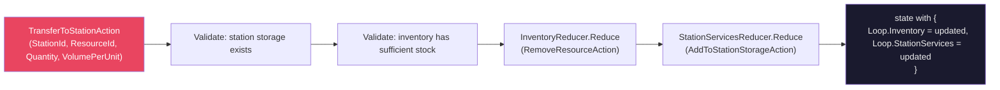
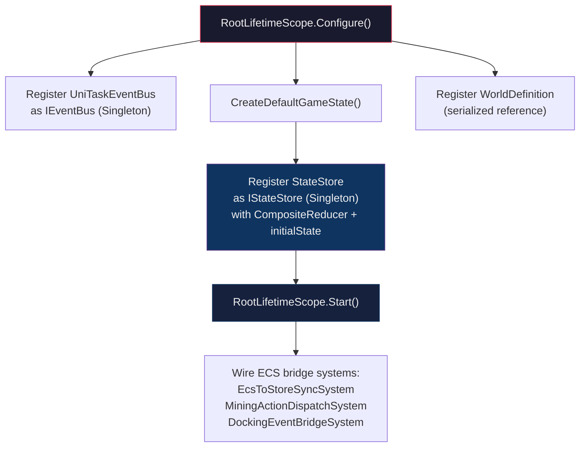

# State Management

## Purpose

VoidHarvest uses a **pure reducer pattern** for all player-domain state. Every state change follows the formula:

```
(State, Action) -> State
```

There is no direct mutation of game state anywhere in the codebase. All state objects are immutable C# `record` types. When an action is dispatched, the root reducer produces a brand-new `GameState` instance using `with` expressions, leaving the previous snapshot untouched. This guarantees deterministic, testable, and replay-safe state transitions with zero hidden side effects.

The pattern is enforced by the project constitution (`.specify/memory/constitution.md` Section I: Functional & Immutable First) and is a non-negotiable architectural constraint.

## State Tree

The root `GameState` record contains four top-level slices. The `GameLoopState` slice acts as a composite container for all gameplay subsystem state.

```mermaid
graph TD
    GS["GameState"]
    GS --> ASP["ActiveShipPhysics : ShipState"]
    GS --> CAM["Camera : CameraState"]
    GS --> WLD["World : WorldState"]
    GS --> LOOP["Loop : GameLoopState"]

    LOOP --> EXP["Explore : ExploreState"]
    LOOP --> MIN["Mining : MiningSessionState"]
    LOOP --> INV["Inventory : InventoryState"]
    LOOP --> SS["StationServices : StationServicesState"]
    LOOP --> TT["TechTree : TechTreeState"]
    LOOP --> FLT["Fleet : FleetState"]
    LOOP --> BASE["Base : BaseState"]
    LOOP --> MKT["Market : MarketState"]
    LOOP --> DCK["Docking : DockingState"]
    LOOP --> TGT["Targeting : TargetingState"]

    ASP -.- SHIP_NOTE["Position, Rotation, Velocity,<br/>AngularVelocity, Mass, MaxThrust,<br/>MaxSpeed, HullIntegrity, FlightMode"]
    CAM -.- CAM_NOTE["OrbitYaw/Pitch, TargetDistance,<br/>FreeLook, Zoom/Pitch limits"]
    WLD -.- WLD_NOTE["Stations : ImmutableArray&lt;StationData&gt;,<br/>WorldTime"]

    INV -.- INV_NOTE["Stacks : ImmutableDictionary,<br/>MaxSlots, MaxVolume, CurrentVolume"]
    SS -.- SS_NOTE["Credits, StationStorages,<br/>RefiningJobs"]
    DCK -.- DCK_NOTE["Phase, TargetStationId,<br/>DockingPortPosition/Rotation"]
    TGT -.- TGT_NOTE["Selection, LockAcquisition,<br/>LockedTargets"]
    MIN -.- MIN_NOTE["TargetAsteroidId, ActiveOreId,<br/>BeamEnergy, YieldAccumulator"]
    FLT -.- FLT_NOTE["Ships, ActiveShipId,<br/>DockedAtStation"]

    style GS fill:#1a1a2e,stroke:#e94560,color:#eee
    style LOOP fill:#16213e,stroke:#0f3460,color:#eee
    style ASP fill:#0f3460,stroke:#533483,color:#eee
    style CAM fill:#0f3460,stroke:#533483,color:#eee
    style WLD fill:#0f3460,stroke:#533483,color:#eee
    style EXP fill:#533483,stroke:#e94560,color:#eee
    style MIN fill:#533483,stroke:#e94560,color:#eee
    style INV fill:#533483,stroke:#e94560,color:#eee
    style SS fill:#533483,stroke:#e94560,color:#eee
    style TT fill:#533483,stroke:#e94560,color:#ddd
    style FLT fill:#533483,stroke:#e94560,color:#eee
    style BASE fill:#533483,stroke:#e94560,color:#ddd
    style MKT fill:#533483,stroke:#e94560,color:#ddd
    style DCK fill:#533483,stroke:#e94560,color:#eee
    style TGT fill:#533483,stroke:#e94560,color:#eee
```



> **Stub slices:** TechTreeState (Phase 1+), BaseState (Phase 2+), MarketState (Phase 3+), and ExploreState are defined but their reducers return the input state unchanged.

## Action Dispatch Flow

All state changes pass through a single synchronous pipeline. Views and systems never mutate state directly -- they dispatch action objects through the `IStateStore` interface.

```mermaid
sequenceDiagram
    participant View as View / MonoBehaviour
    participant Store as StateStore
    participant CR as CompositeReducer
    participant FR as Feature Reducer
    participant EB as EventBus
    participant Sub as Subscribers

    View->>Store: Dispatch(IGameAction)
    Store->>CR: CompositeReducer(oldState, action)

    alt Cross-cutting action
        CR->>CR: Route to HandleTransferToStation /<br/>HandleTransferToShip / HandleRepairShip
        CR->>FR: Call multiple feature reducers atomically
        FR-->>CR: Updated state slices
    else Single-slice action
        CR->>CR: Pattern-match on action interface<br/>(ICameraAction, IShipAction, etc.)
        CR->>FR: FeatureReducer.Reduce(slice, action)
        FR-->>CR: New slice
        CR-->>CR: state with { Slice = newSlice }
    else Unrecognized action
        CR-->>CR: Return state unchanged
    end

    CR-->>Store: newState : GameState
    Store->>Store: _current = newState<br/>_version++
    Store->>Store: Channel.Writer.TryWrite(newState)

    alt State reference changed
        Store->>EB: Publish(StateChangedEvent&lt;GameState&gt;)
        EB->>Sub: PreviousState + CurrentState
    end

    Store-->>View: (synchronous return)
```

### Key Properties of the Dispatch Pipeline

| Property | Detail |
|----------|--------|
| **Thread safety** | `Dispatch()` must be called on the main thread only. `Current` is safe to read from any thread (immutable reference). |
| **Synchronous** | The reducer runs synchronously within `Dispatch()`. The new state is available on `Current` immediately after the call returns. |
| **Versioned** | Every dispatch increments a monotonic `Version` counter. ECS bridge systems compare against a cached version to skip redundant state copies. |
| **Dual notification** | `OnStateChanged` (UniTask `Channel`) fires on every dispatch. `StateChangedEvent<GameState>` (EventBus) fires only when the state reference actually changed (`!ReferenceEquals`). |

## Reducer Composition

The root reducer is a static method `CompositeReducer` defined in `RootLifetimeScope` (the VContainer root DI scope). It lives in `Assembly-CSharp` so it can reference all feature assemblies.

The composite reducer uses C# pattern matching on the action's marker interface to route to the correct feature reducer:

```
CompositeReducer(GameState, IGameAction)
    |
    |-- Cross-cutting actions (matched first):
    |       TransferToStationAction  -> HandleTransferToStation
    |       TransferToShipAction     -> HandleTransferToShip
    |       RepairShipAction         -> HandleRepairShip
    |       CompleteDockingAction    -> HandleDockingWithLockClear
    |       CompleteUndockingAction  -> HandleUndockingWithLockClear
    |
    |-- Single-slice routing (by marker interface):
    |       ICameraAction            -> CameraReducer.Reduce
    |       IShipAction              -> ShipStateReducer.Reduce
    |       IMiningAction            -> MiningReducer.Reduce
    |       IInventoryAction         -> InventoryReducer.Reduce
    |       IDockingAction           -> DockingReducer.Reduce
    |       IFleetAction             -> FleetReducer.Reduce
    |       ITechAction              -> TechTreeReducer.Reduce      (stub)
    |       IMarketAction            -> MarketReducer.Reduce        (stub)
    |       IBaseAction              -> BaseReducer.Reduce          (stub)
    |       IStationServicesAction   -> StationServicesReducer.Reduce
    |       ITargetingAction         -> TargetingReducer.Reduce
    |
    |-- Default                      -> return state unchanged
```

### Feature Reducers

Each feature reducer is a `public static class` with a single `Reduce` method. They are pure functions with no side effects.

| Reducer | State Slice | Actions Handled | Assembly |
|---------|------------|-----------------|----------|
| `CameraReducer` | `CameraState` | Orbit, Zoom, SpeedZoom, ToggleFreeLook, FreeLook | `VoidHarvest.Features.Camera` |
| `ShipStateReducer` | `ShipState` | SyncShipPhysics, RepairHull | `VoidHarvest.Features.Ship` |
| `MiningReducer` | `MiningSessionState` | BeginMining, MiningTick, MiningDepletionTick, StopMining | `VoidHarvest.Features.Mining` |
| `InventoryReducer` | `InventoryState` | AddResource, RemoveResource | `VoidHarvest.Features.Resources` |
| `DockingReducer` | `DockingState` | BeginDocking, CompleteDocking, CancelDocking, BeginUndocking, CompleteUndocking | `VoidHarvest.Features.Docking` |
| `FleetReducer` | `FleetState` | DockAtStation, UndockFromStation | `VoidHarvest.Core.State` |
| `StationServicesReducer` | `StationServicesState` | SetCredits, InitializeStorage, AddToStorage, RemoveFromStorage, SellResource, StartRefiningJob, CompleteRefiningJob, CollectRefiningJob | `VoidHarvest.Features.StationServices` |
| `StationStorageReducer` | `StationStorageState` | (Helper; called by StationServicesReducer) | `VoidHarvest.Features.StationServices` |
| `TargetingReducer` | `TargetingState` | SelectTarget, ClearSelection, BeginLock, LockTick, CompleteLock, CancelLock, UnlockTarget, ClearAllLocks | `VoidHarvest.Features.Targeting` |
| `TechTreeReducer` | `TechTreeState` | (Stub -- returns unchanged state) | `VoidHarvest.Core.State` |
| `MarketReducer` | `MarketState` | (Stub -- returns unchanged state) | `VoidHarvest.Core.State` |
| `BaseReducer` | `BaseState` | (Stub -- returns unchanged state) | `VoidHarvest.Core.State` |

## Cross-Cutting Actions

Some actions must update multiple state slices atomically. These are intercepted by the composite reducer **before** the single-slice routing and produce a new `GameState` that reflects changes across two or more slices in a single dispatch.

### TransferToStationAction

Moves resources from the player's ship inventory to a station's storage.



**Atomicity guarantee:** If either the inventory removal or the storage addition would fail validation, the entire action returns the original state unchanged. There is no partial update.

### TransferToShipAction

Moves resources from a station's storage to the player's ship inventory. Mirrors `TransferToStationAction` in reverse: validates station storage has sufficient stock and ship has cargo capacity, then atomically removes from station storage and adds to ship inventory.

### RepairShipAction

Deducts credits from `StationServicesState` and restores hull integrity on `ShipState`. Validates sufficient credit balance before applying.

### Docking/Undocking with Lock Clear

When docking completes (`CompleteDockingAction`) or undocking completes (`CompleteUndockingAction`), the composite reducer updates both `DockingState` via `DockingReducer` and clears all target locks via `TargetingReducer.Reduce(ClearAllLocksAction)`. This enforces the rule that targeting is suppressed while docked (FR-035).

## Action Interface Hierarchy

All actions implement the root `IGameAction` marker interface. Each feature defines its own sub-interface for routing:

```mermaid
graph TD
    IGA["IGameAction"]
    IGA --> ICA["ICameraAction"]
    IGA --> ISA["IShipAction"]
    IGA --> IMA["IMiningAction"]
    IGA --> IIA["IInventoryAction"]
    IGA --> IDA["IDockingAction"]
    IGA --> IFA["IFleetAction"]
    IGA --> ITA["ITechAction"]
    IGA --> IMKA["IMarketAction"]
    IGA --> IBA["IBaseAction"]
    IGA --> ISSA["IStationServicesAction"]
    IGA --> ITGA["ITargetingAction"]

    ICA --> OA["OrbitAction"]
    ICA --> ZA["ZoomAction"]
    ICA --> SZA["SpeedZoomAction"]
    ICA --> TFL["ToggleFreeLookAction"]
    ICA --> FLA["FreeLookAction"]

    ISA --> SSPA["SyncShipPhysicsAction"]
    ISA --> RHA["RepairHullAction"]

    IMA --> BMA["BeginMiningAction"]
    IMA --> MTA["MiningTickAction"]
    IMA --> MDTA["MiningDepletionTickAction"]
    IMA --> SMA["StopMiningAction"]

    IIA --> ARA["AddResourceAction"]
    IIA --> RRA["RemoveResourceAction"]

    IDA --> BDA["BeginDockingAction"]
    IDA --> CDA["CompleteDockingAction"]
    IDA --> CNDA["CancelDockingAction"]
    IDA --> BUA["BeginUndockingAction"]
    IDA --> CUA["CompleteUndockingAction"]

    ISSA --> SRA["SellResourceAction"]
    ISSA --> SRJA["StartRefiningJobAction"]
    ISSA --> CRJA["CompleteRefiningJobAction"]
    ISSA --> COJA["CollectRefiningJobAction"]
    ISSA --> ATSSA["AddToStationStorageAction"]
    ISSA --> RFSSA["RemoveFromStationStorageAction"]
    ISSA --> ISSA2["InitializeStationStorageAction"]
    ISSA --> SCA["SetCreditsAction"]
    ISSA --> TTSA["TransferToStationAction"]
    ISSA --> TTSHA["TransferToShipAction"]
    ISSA --> RPSA["RepairShipAction"]

    ITGA --> STA["SelectTargetAction"]
    ITGA --> CSA["ClearSelectionAction"]
    ITGA --> BLA["BeginLockAction"]
    ITGA --> LTA["LockTickAction"]
    ITGA --> CLA["CompleteLockAction"]
    ITGA --> CNLA["CancelLockAction"]
    ITGA --> UTA["UnlockTargetAction"]
    ITGA --> CALA["ClearAllLocksAction"]

    IFA --> DASA["DockAtStationAction"]
    IFA --> UFSA["UndockFromStationAction"]

    style IGA fill:#1a1a2e,stroke:#e94560,color:#eee
    style ICA fill:#0f3460,stroke:#533483,color:#eee
    style ISA fill:#0f3460,stroke:#533483,color:#eee
    style IMA fill:#0f3460,stroke:#533483,color:#eee
    style IIA fill:#0f3460,stroke:#533483,color:#eee
    style IDA fill:#0f3460,stroke:#533483,color:#eee
    style ISSA fill:#0f3460,stroke:#533483,color:#eee
    style ITGA fill:#0f3460,stroke:#533483,color:#eee
    style IFA fill:#0f3460,stroke:#533483,color:#eee
```



> Actions are `sealed record` types. The marker interfaces (`ICameraAction`, `IShipAction`, etc.) carry no members -- they exist solely for pattern-match routing in the composite reducer.

## Immutability Enforcement

### Record Types

All state slices are `sealed record` classes. The `with` expression produces a shallow copy with specified properties replaced, while the original remains unchanged:

```csharp
// CameraReducer -- produces a new CameraState, original is untouched
return state with { OrbitYaw = newYaw, OrbitPitch = newPitch };
```

### Value Types

Small data carriers use `readonly struct` to avoid heap allocation in hot paths:

- `ResourceStack` (inventory entry)
- `SelectionData`, `LockAcquisitionData`, `TargetLockData` (targeting)
- `ModuleSlot` (fleet equipment)
- `StateChangedEvent<T>` (event bus notification)

All fields on these structs are declared `readonly`.

### Immutable Collections

Domain state uses `System.Collections.Immutable` from NuGet (via NuGetForUnity):

| Collection | Usage |
|------------|-------|
| `ImmutableDictionary<string, ResourceStack>` | Inventory stacks, station storage stacks |
| `ImmutableDictionary<int, StationStorageState>` | Per-station storage map |
| `ImmutableDictionary<int, ImmutableArray<RefiningJobState>>` | Per-station refining jobs |
| `ImmutableDictionary<string, TechNodeStatus>` | Tech tree node progression |
| `ImmutableDictionary<string, CommodityMarket>` | Market commodity data |
| `ImmutableArray<StationData>` | World stations |
| `ImmutableArray<TargetLockData>` | Confirmed target locks |
| `ImmutableArray<OwnedShip>` | Fleet ships |
| `ImmutableArray<PlacedModule>` | Base building modules |
| `ImmutableArray<RefiningOutputConfig>` | Refining job output configs |
| `ImmutableArray<MaterialOutput>` | Generated refining outputs |
| `ImmutableArray<MarketOrder>` | Market open orders |

Mutable `List<T>` and `Dictionary<K,V>` are **never** used for domain state. They may appear only in transient local variables within a single reducer method (such as `ImmutableArray.CreateBuilder`), never stored on state records.

### Option Type

The project uses a custom `Option<T>` value type (in `VoidHarvest.Core.Extensions`) instead of nullable references for optional domain values. This appears on state fields like `MiningSessionState.TargetAsteroidId`, `DockingState.TargetStationId`, and `FleetState.DockedAtStation`.

## StateStore and Dependency Injection

### IStateStore Interface

The `IStateStore` interface is the single entry point for all state reads and writes:

```csharp
public interface IStateStore
{
    GameState Current { get; }                           // Latest snapshot
    int Version { get; }                                 // Monotonic counter
    void Dispatch(IGameAction action);                   // Apply an action
    IUniTaskAsyncEnumerable<GameState> OnStateChanged { get; } // Stream
}
```

### Registration

`RootLifetimeScope` (the VContainer root scope) registers a single `StateStore` instance as `IStateStore` with `Lifetime.Singleton`. The composite reducer function and the initial `GameState` are injected as constructor parameters:



### Initial State Construction

`CreateDefaultGameState()` builds the initial `GameState` from data-driven ScriptableObjects:

- **WorldDefinition** provides station data (`BuildWorldStations()`) and the starting ship archetype
- **CameraConfig** provides camera pitch/distance/zoom limits
- **ShipArchetypeConfig** (via WorldDefinition) provides `CargoSlots` and `CargoCapacity` for `InventoryState`
- Station storages are pre-initialized for each station defined in `WorldDefinition`
- All other slices start at their `*.Empty` defaults

## Subscriber Notification

Views and systems can react to state changes through two mechanisms:

### 1. UniTask Channel (OnStateChanged)

The `StateStore` maintains a `Channel<GameState>` that emits after every dispatch (even if state did not change). Consumers use `await foreach` with cancellation:

```csharp
await foreach (var state in stateStore.OnStateChanged
    .WithCancellation(cancellationToken))
{
    UpdateUI(state);
}
```

This is the primary subscription mechanism for MonoBehaviour views.

### 2. EventBus (StateChangedEvent)

When a dispatch produces a new state reference (`!ReferenceEquals(oldState, newState)`), the store publishes a `StateChangedEvent<GameState>` through the `IEventBus`. This carries both `PreviousState` and `CurrentState`, enabling delta-based UI updates (e.g., only refresh the sell panel when credits or inventory actually changed).

## ECS Bridge

The reducer-based state store lives in the managed (MonoBehaviour) world. Several bridge systems synchronize between DOTS/ECS and the store:

- **EcsToStoreSyncSystem**: Reads ECS ship physics data and dispatches `SyncShipPhysicsAction` to project position/velocity/rotation into `ShipState`.
- **MiningActionDispatchSystem**: Reads ECS mining results and dispatches `BeginMiningAction`, `MiningTickAction`, `StopMiningAction`, and `AddResourceAction` to the store.
- **DockingEventBridgeSystem**: Reads ECS docking event flags and dispatches `CompleteDockingAction`, `CompleteUndockingAction`, `DockAtStationAction`, `UndockFromStationAction`, and related fleet/targeting actions.

These systems are wired in `RootLifetimeScope.Start()` after the DI container is built, receiving the `IStateStore` and `IEventBus` references via static setters.

## Key Source Files

| File | Path | Purpose |
|------|------|---------|
| `GameState.cs` | `Assets/Core/State/` | Root immutable state record |
| `GameLoopState.cs` | `Assets/Core/State/` | Composite container for gameplay slices |
| `StateStore.cs` | `Assets/Core/State/` | Dispatch pipeline, versioning, notifications |
| `IStateStore.cs` | `Assets/Core/State/` | State store contract |
| `RootLifetimeScope.cs` | `Assets/Core/` | Composite reducer, initial state, DI registration |
| `GameStateReducer.cs` | `Assets/Core/State/` | Stub reducers (Fleet, TechTree, Market, Base) |
| `StateChangedEvent.cs` | `Assets/Core/EventBus/Events/` | Before/after state notification |
| `*State.cs` | `Assets/Core/State/` | All state slice records |
| `*Actions.cs` | `Assets/Core/State/` and `Assets/Features/*/Data/` | Action record types |
| `*Reducer.cs` | `Assets/Features/*/Systems/` | Feature reducer implementations |

## Cross-References

- [Event System](./event-system.md) -- `StateChangedEvent<T>` publishing and subscription patterns
- [Ship System](../systems/ship.md) -- `ShipState`, `ShipStateReducer`, ECS sync bridge
- [Camera System](../systems/camera.md) -- `CameraState`, `CameraReducer`, `CameraConfig` SO
- [Mining System](../systems/mining.md) -- `MiningSessionState`, `MiningReducer`, yield formula
- [Inventory / Resources](../systems/resources.md) -- `InventoryState`, `InventoryReducer`, cargo volume
- [Docking System](../systems/docking.md) -- `DockingState`, `DockingReducer`, phase state machine
- [Station Services](../systems/station-services.md) -- `StationServicesState`, `StationServicesReducer`, refining jobs
- [Targeting System](../systems/targeting.md) -- `TargetingState`, `TargetingReducer`, lock acquisition
- [Architecture Overview](./overview.md) -- High-level system architecture and feature map
- [Dependency Injection](./dependency-injection.md) -- VContainer registration, `RootLifetimeScope`
