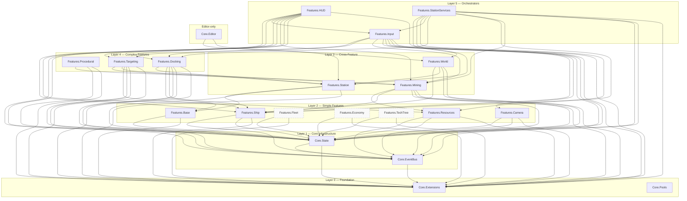
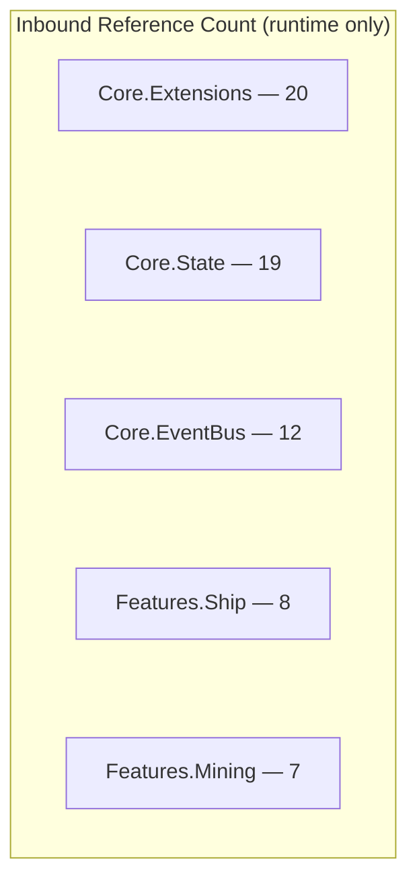

# Assembly Dependency Map

This document maps all 38 assembly definitions (`.asmdef` files) in VoidHarvest, their dependency layers, and their relationships to each other and to external packages. It serves as a quick reference for understanding compile-time boundaries, planning new features, and diagnosing circular-dependency risks.

## Assembly Counts

| Category       | Count | Description                                    |
|----------------|------:|------------------------------------------------|
| Core (runtime) |     5 | Shared infrastructure assemblies               |
| Feature (runtime) | 16 | One per gameplay system                        |
| Editor-only    |     1 | `Core.Editor` (Editor platform only)           |
| Test           |    16 | One per testable assembly + cross-feature suite |
| **Total**      | **38** |                                              |

## Layered Overview

Assemblies are organized into dependency layers. An assembly at layer N may only depend on assemblies at layers 0 through N-1 (plus external packages). No lateral dependencies within the same layer unless explicitly noted.

| Layer | Name                | Assemblies | Description |
|------:|---------------------|-----------|-------------|
|     0 | Foundation          | `Core.Extensions`, `Core.Pools` | No VoidHarvest dependencies. Leaf nodes. |
|     1 | Core Infrastructure | `Core.EventBus`, `Core.State` | Shared state management and reactive messaging. |
|     2 | Simple Features     | `Base`, `Resources`, `Fleet`, `Economy`, `TechTree`, `Camera`, `Ship` | Single-concern features depending only on Core. |
|     3 | Cross-Feature       | `Station`, `Mining`, `World` | Features that bridge multiple Layer 2 assemblies. |
|     4 | Complex Features    | `Procedural`, `Docking`, `Targeting` | Features with deeper cross-feature dependencies. |
|     5 | Orchestrators       | `Input`, `HUD`, `StationServices` | High fan-out assemblies that wire multiple systems together. |
|     E | Editor-only         | `Core.Editor` | Editor platform only. References feature assemblies upward. |

## Runtime Assembly Dependency Diagram

The following Mermaid diagram shows all VoidHarvest-internal dependencies between the 22 runtime assemblies (21 runtime + 1 editor-only). External packages (Unity, UniTask, VContainer, etc.) are omitted for clarity. Skeleton features (Fleet, Economy, TechTree) are styled with dashed borders.

## Detailed Assembly Reference Table

Each row lists a runtime assembly, its VoidHarvest-internal dependencies, external package references, and notable flags.

### Core Assemblies (5)

| Assembly | Layer | VH Dependencies | External Packages | Unsafe | Platform |
|----------|------:|-----------------|-------------------|--------|----------|
| `Core.Extensions` | 0 | _(none)_ | _(none)_ | No | All |
| `Core.Pools` | 0 | _(none)_ | _(none)_ | No | All |
| `Core.EventBus` | 1 | Extensions | UniTask, Unity.Mathematics | No | All |
| `Core.State` | 1 | Extensions, EventBus | UniTask, Unity.Mathematics, Unity.Entities, Unity.Collections | No | All |
| `Core.Editor` | E | Features.Station, Features.World | _(none)_ | No | **Editor** |

### Feature Assemblies (16)

| Assembly | Layer | VH Dependencies | External Packages | Unsafe | Platform |
|----------|------:|-----------------|-------------------|--------|----------|
| `Features.Base` | 2 | Ext, State | _(none)_ | No | All |
| `Features.Resources` | 2 | Ext, State, EB | _(none)_ | No | All |
| `Features.Fleet` | 2 | Ext, State | _(none)_ | No | All |
| `Features.Economy` | 2 | Ext, State | _(none)_ | No | All |
| `Features.TechTree` | 2 | Ext, State | _(none)_ | No | All |
| `Features.Camera` | 2 | Ext, State, EB | Cinemachine, Unity.Math, VContainer | No | All |
| `Features.Ship` | 2 | Ext, State, EB | Entities, Entities.Hybrid, Math, Burst, Collections, Transforms, VContainer | **Yes** | All |
| `Features.Station` | 3 | Ext, State, Base | _(none)_ | No | All |
| `Features.Mining` | 3 | Ext, State, EB, Ship, Resources | Entities, Entities.Graphics, Math, Burst, Collections, Transforms, VContainer, UniTask | **Yes** | All |
| `Features.World` | 3 | Ext, State, Station, Ship | Unity.Mathematics | No | All |
| `Features.Procedural` | 4 | Ext, State, Mining | Entities, Entities.Graphics, Entities.Hybrid, Math, Burst, Collections, Transforms | **Yes** | All |
| `Features.Docking` | 4 | Ext, State, EB, Ship, Base, Station | Entities, Entities.Hybrid, Math, Burst, Collections, Transforms, VContainer, UniTask | **Yes** | All |
| `Features.Targeting` | 4 | Ext, State, EB, Ship, Mining, Station | Entities, Entities.Graphics, Entities.Hybrid, Cinemachine, Math, Burst, Collections, Transforms, VContainer, UniTask | **Yes** | All |
| `Features.Input` | 5 | Ext, State, EB, Camera, Ship, Mining, Docking, Targeting | InputSystem, Entities, Collections, Math, Transforms, VContainer, UniTask | No | All |
| `Features.HUD` | 5 | Ext, State, EB, Mining, Resources, Ship, Input, Docking, Targeting | UniTask, VContainer, InputSystem, Math, URP.Runtime, RenderPipelines.Core | No | All |
| `Features.StationServices` | 5 | Ext, State, EB, Mining, Resources, Docking, Input, Ship, Station, World | VContainer, UniTask, Unity.Mathematics | No | All |

## Notable Observations

### Most Depended-Upon Assemblies (Inbound Count)

The following assemblies are referenced by the most other VoidHarvest assemblies. Changes to these types have the widest blast radius.

| Rank | Assembly | Inbound Refs | Notes |
|-----:|----------|-------------:|-------|
| 1 | `Core.Extensions` | 20 | Referenced by every other VH assembly. Houses `TargetType`, `ITargetable`, shared utilities. |
| 2 | `Core.State` | 19 | All state records, reducers, store. Nearly universal dependency. |
| 3 | `Core.EventBus` | 12 | Reactive messaging hub. Used by all active (non-skeleton) features. |
| 4 | `Features.Ship` | 8 | Ship state/archetype config touches Mining, Docking, Targeting, Input, HUD, World, StationServices. |
| 5 | `Features.Mining` | 7 | Ore data types flow into Procedural, Targeting, Input, HUD, StationServices, and test suites. |

### Widest Fan-Out (Outbound Count)

Assemblies with the most outbound VoidHarvest dependencies. These are the hardest to refactor.

| Rank | Assembly | Outbound VH Deps | Total Deps (incl. external) |
|-----:|----------|------------------:|----------------------------:|
| 1 | `Features.StationServices` | 10 | 13 |
| 2 | `Features.HUD` | 9 | 15 |
| 3 | `Features.Input` | 8 | 16 |
| 4 | `Features.Targeting` | 6 | 16 |
| 5 | `Features.Docking` | 6 | 14 |

### Unsafe Code Assemblies

Five assemblies enable `allowUnsafeCode: true` for Burst-compiled ECS systems and native container access:

- `Features.Ship` — Ship physics systems (Burst jobs)
- `Features.Mining` — Mining beam ECS systems (Burst jobs)
- `Features.Procedural` — Asteroid field generation (Burst jobs, NativeArray)
- `Features.Docking` — Docking state machine ECS system (Burst jobs)
- `Features.Targeting` — Target preview cloning, ECS queries (Burst jobs)

All unsafe usage is confined to DOTS/ECS system code. No managed MonoBehaviour or reducer code uses unsafe.

### Core.Pools: Orphan Assembly

`Core.Pools` has **zero inbound references** from any other VoidHarvest assembly. It was created as shared infrastructure for object pooling but is not yet consumed. It should either be integrated into a feature (likely Procedural or VFX) or removed to reduce assembly count.

### Core.Editor: Upward Dependency

`Core.Editor` is an **Editor-only** assembly that references two feature assemblies (`Features.Station`, `Features.World`). This is an intentional architectural exception: it contains editor tools like `SceneConfigValidator` and custom inspectors (e.g., `WorldDefinitionEditor`) that need to inspect feature ScriptableObjects. The Editor platform constraint prevents this from creating runtime coupling.

### Skeleton Features

Three assemblies are skeleton placeholders for future phases and have minimal dependency footprints:

- **Features.Fleet** (Phase 1) -- Ext, State only
- **Features.TechTree** (Phase 1) -- Ext, State only
- **Features.Economy** (Phase 3) -- Ext, State only

These have no test assemblies and no inbound references from other features yet. They exist to reserve the namespace and assembly structure.

## External Package Usage

The table below shows which external packages are consumed by VoidHarvest assemblies and how widely.

| Package | Used By (VH Assembly Count) | Purpose |
|---------|----------------------------:|---------|
| `Unity.Mathematics` | 15 | Float/int math, `float3`, `quaternion`, `Random` |
| `UniTask` | 10 | Async/reactive patterns, EventBus subscriptions |
| `VContainer` | 8 | Dependency injection (`[Inject]`, lifetime scopes) |
| `Unity.Entities` | 8 | DOTS/ECS core (`ISystem`, `IComponentData`, queries) |
| `Unity.Collections` | 7 | `NativeArray`, `NativeList`, `BlobAsset` |
| `Unity.Burst` | 5 | Burst compilation for ECS systems |
| `Unity.Transforms` | 5 | `LocalTransform`, `LocalToWorld` ECS components |
| `Unity.Entities.Hybrid` | 4 | `CompanionGameObjectUpdateTransformSystem`, baking |
| `Unity.Entities.Graphics` | 3 | `RenderMeshUtility`, material property overrides |
| `Unity.InputSystem` | 3 | `InputAction`, player input bindings |
| `Unity.Cinemachine` | 2 | Camera follow targets, virtual camera config |
| `Unity.RenderPipelines.Universal.Runtime` | 1 | URP rendering utilities (HUD only) |
| `Unity.RenderPipelines.Core.Runtime` | 1 | Render pipeline shared types (HUD only) |
| `Unity.PerformanceTesting` | 1 | Performance benchmarks (Procedural.Tests only) |
| `Unity.InputSystem.TestFramework` | 1 | Input simulation for tests (Input.Tests only) |

Precompiled DLL references (via `overrideReferences`):

| DLL | Used By | Purpose |
|-----|---------|---------|
| `nunit.framework.dll` | All 16 test assemblies | Unit testing framework |
| `System.Collections.Immutable.dll` | 7 test assemblies | `ImmutableArray<T>`, `ImmutableDictionary<K,V>` for state assertions |

## Test Assemblies

All 16 test assemblies are **Editor-only** (`includePlatforms: ["Editor"]`) and gated behind `UNITY_INCLUDE_TESTS`. They follow the pattern `<Runtime Assembly>.Tests` and always reference their corresponding runtime assembly plus any additional assemblies needed for test setup.

| Test Assembly | Runtime Assembly | Additional VH Test Deps | Special Refs |
|---------------|-----------------|-------------------------|--------------|
| `Core.Extensions.Tests` | Core.Extensions | _(none)_ | |
| `Core.EventBus.Tests` | Core.EventBus | Extensions | UniTask |
| `Core.State.Tests` | Core.State | Extensions, EventBus | UniTask, Math, Immutable |
| `Core.Editor.Tests` | Core.Editor | _(none)_ | |
| `Features.Camera.Tests` | Features.Camera | Extensions, State | |
| `Features.Ship.Tests` | Features.Ship | Extensions, State | Math, Entities, Burst, Collections; **unsafe** |
| `Features.Mining.Tests` | Features.Mining | Resources, Extensions, State | Math, Entities, Collections |
| `Features.Resources.Tests` | Features.Resources | Extensions, State | Immutable |
| `Features.Procedural.Tests` | Features.Procedural | Mining, Extensions | Math, Burst, Collections, **PerformanceTesting**; **unsafe** |
| `Features.Input.Tests` | Features.Input | Extensions, State | InputSystem, InputSystem.TestFramework, Math, Immutable |
| `Features.HUD.Tests` | Features.HUD | Mining, Extensions, State | |
| `Features.Docking.Tests` | Features.Docking | State, EventBus, Extensions, Ship | Math, Entities, Collections, Immutable |
| `Features.StationServices.Tests` | Features.StationServices | State, Extensions, EventBus, Mining, Station, Resources | UniTask, Math, Immutable; **autoReferenced: false** |
| `Features.Targeting.Tests` | Features.Targeting | Extensions, State, EventBus, Station | Math, Immutable |
| `Features.Station.Tests` | Features.Station | Base, State, Extensions | |
| `Features.World.Tests` | Features.World | Station, Ship, State, Extensions | Math, Immutable |
| `Features.Tests` _(cross-feature)_ | _(multiple)_ | Camera, Input, Ship, Mining, Resources, Procedural, HUD, Extensions, State, EventBus | UniTask, Math, Entities, Collections, Immutable |

**Notable test patterns:**

- `Features.Tests` is a cross-feature integration suite that references 10 VoidHarvest assemblies (7 feature + 3 core).
- `Features.StationServices.Tests` is the only test assembly with `autoReferenced: false`, requiring explicit inclusion in test runs.
- Two test assemblies enable `allowUnsafeCode`: Ship.Tests and Procedural.Tests (for Burst/NativeArray test setup).
- `Procedural.Tests` uniquely references `Unity.PerformanceTesting` for benchmark tests.

## Cross-References

- [Architecture Overview](architecture/overview.md) -- High-level system architecture and data flow
- [State Management](architecture/state-management.md) -- Reducer pattern and state shape across assemblies
- [Data Pipeline](architecture/data-pipeline.md) -- DOTS baking pipelines and their assembly homes
- [Onboarding Guide](onboarding.md) -- Getting started with the codebase
- [Troubleshooting](troubleshooting.md) -- Common assembly-related build errors
