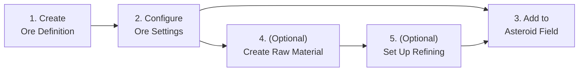

# Adding a New Ore Type

This guide walks you through creating a brand-new ore type for VoidHarvest entirely within the Unity Editor. No programming is required. By the end, your ore will spawn in asteroid fields, be mineable by players, and be refinable at stations.

---

## Before You Start

You will need:

- The Unity Editor open with the VoidHarvest project loaded.
- A general idea of your ore's name, rarity, and gameplay role (common filler vs. rare prize).
- (Optional) A sprite image for the ore's inventory icon.
- (Optional) Asteroid mesh files if you want unique rock shapes for this ore.

For reference on all available configuration assets, see the [Configuration Asset Catalog](scriptable-objects.md).

---

## Quick Overview

Creating a new ore involves three required steps and two optional steps:

| Step | Required? | What It Does |
|---|---|---|
| 1. Create Ore Definition | Yes | Makes the asset file that stores all your ore's data. |
| 2. Configure Ore Settings | Yes | Sets the ore's name, mining speed, value, beam color, etc. |
| 3. Add to Asteroid Field | Yes | Tells the asteroid field to actually spawn asteroids containing your ore. |
| 4. Create Raw Material | Only if this ore refines into something new | Makes a new refined material that stations can produce from your ore. |
| 5. Set Up Refining | Only if this ore is refinable | Links your ore to the materials it produces at a refinery. |

---

## Step 1: Create the Ore Definition Asset

1. In the **Project** window, navigate to `Assets/Features/Mining/Data/Ores/`.
2. Right-click in the folder area.
3. Choose **Create > VoidHarvest > Mining > Ore Definition**.
4. A new asset file appears. Rename it to match your ore (e.g., `Celestium`).
5. Click on the new asset to select it. Its settings appear in the **Inspector** panel on the right.

> **Naming convention:** Use the ore's display name in PascalCase with no spaces (e.g., `Celestium`, `DarkIronite`, `VoidCrystal`). This keeps the project folder tidy and easy to search.

---

## Step 2: Configure Basic Properties

With your new Ore Definition selected, fill in the following settings in the **Inspector**:

### Identity

| Setting | What to Enter | Example |
|---|---|---|
| **Ore Id** | A unique lowercase identifier. No spaces, no special characters. Must be different from every other ore. | `celestium` |
| **Display Name** | The name players see in the HUD, inventory, and tooltips. | `Celestium` |
| **Rarity Tier** | Choose from the dropdown: **Common**, **Uncommon**, or **Rare**. Affects UI display and sorting. | `Uncommon` |
| **Icon** | Drag a sprite image from your Project window into this slot. Used for inventory display. Leave empty if you do not have one yet. | *(drag sprite here)* |
| **Description** | Flavor text shown in player tooltips. Use the text box to write one or two sentences. | `A shimmering teal crystal found in deep-field asteroid clusters. Valued for its unique conductive properties.` |

### Economy

| Setting | What to Enter | Example |
|---|---|---|
| **Base Value** | The base sell price in credits for one unit of raw ore. Higher means more valuable. Must be zero or greater. | `40` |
| **Rarity Weight** | A number between 0 and 1 controlling how commonly this ore appears. Lower numbers mean rarer. For reference: Luminite (Common) uses 0.6, Ferrox (Uncommon) uses 0.3, Auralite (Rare) uses 0.1. | `0.2` |

### Mining

| Setting | What to Enter | Example |
|---|---|---|
| **Base Yield Per Second** | How many units of ore the mining beam extracts per second. Higher means faster mining. Must be greater than 0. | `8` |
| **Hardness** | Resistance to mining. Acts as a divisor on extraction speed -- higher hardness means slower effective mining. Must be greater than 0. A value of 1 is baseline; 2 takes roughly twice as long. | `1.8` |
| **Volume Per Unit** | How much cargo space each unit of ore occupies in the ship's hold. Must be greater than 0. Smaller values mean you can carry more. | `0.2` |
| **Beam Color** | The color of the mining laser when extracting this ore type. Click the color swatch to open the color picker. Choose something visually distinct from existing ores. | Teal: `(R: 0.2, G: 0.8, B: 0.7, A: 1.0)` |

### Refining

| Setting | What to Enter | Example |
|---|---|---|
| **Base Processing Time Per Unit** | How many seconds it takes to refine one unit of this ore at a station. Must be greater than 0. | `6` |
| **Refining Credit Cost Per Unit** | How many credits the station charges to refine one unit. Must be zero or greater. Set to 0 for free refining. | `20` |
| **Refining Outputs** | A list of raw materials produced when this ore is refined. See [Step 5](#step-5-set-up-refining-outputs) for details. You can leave this empty for now and come back later. | *(see below)* |

---

## Step 3: Add to an Asteroid Field Definition

Your ore exists as data now, but it will not appear in the game until you add it to an asteroid field.

1. In the **Project** window, navigate to `Assets/Features/Procedural/Data/Fields/`.
2. Click on the field definition you want to update (e.g., `DefaultField`).
3. In the **Inspector**, find the **Ore Entries** list.
4. Click the **+** button at the bottom of the list to add a new entry.
5. Fill in the new entry:

| Setting | What to Enter | Example |
|---|---|---|
| **Ore Definition** | Drag your new Ore Definition asset from the Project window into this slot. | *(drag Celestium here)* |
| **Weight** | The relative spawn probability for this ore. This is NOT a percentage -- it is a ratio compared to other entries. If Luminite has weight 6, Ferrox has weight 3, and you set Celestium to 2, then roughly 2 out of every 11 asteroids will be Celestium. | `2` |
| **Mesh Variant A** | Drag an asteroid mesh from the Project window. This is the first rock shape used for asteroids of this ore type. | *(drag mesh here)* |
| **Mesh Variant B** | Drag a second asteroid mesh for visual variety. Can be the same mesh as Variant A if you only have one. | *(drag mesh here)* |
| **Tint Color** | The color tint applied to asteroids of this type so players can visually distinguish them at a glance. | Teal-green: `(R: 0.4, G: 1.2, B: 1.0, A: 1.0)` |

> **Where to find meshes:** Asteroid meshes from the SF_Asteroids-M2 pack are located in the project's model import folders. You can reuse meshes already assigned to other ore entries if you do not have custom models.

---

## Step 4 (Optional): Create a New Raw Material

If your ore should produce a refined material that does not already exist, create one first. If your ore refines into existing materials (like Luminite Ingots or Energium Dust), skip to Step 5.

1. Navigate to `Assets/Features/Station/Data/RawMaterials/`.
2. Right-click and choose **Create > VoidHarvest > Station > Raw Material Definition**.
3. Rename it descriptively (e.g., `CelestiumWire`).
4. Fill in the settings:

| Setting | What to Enter | Example |
|---|---|---|
| **Material Id** | A unique lowercase identifier with underscores. | `celestium_wire` |
| **Display Name** | The name players see when viewing refined goods. | `Celestium Wire` |
| **Icon** | Drag a sprite for the material's inventory icon. | *(drag sprite here)* |
| **Description** | Flavor text for tooltips. | `Thin conductive wire drawn from refined Celestium. Used in advanced electronics.` |
| **Base Value** | Sell price per unit of this refined material in credits. | `65` |
| **Volume Per Unit** | Cargo space consumed per unit. | `0.15` |

---

## Step 5 (Optional): Set Up Refining Outputs

Back on your Ore Definition asset, scroll down to the **Refining Outputs** section. This tells the game what materials are produced when a player refines your ore at a station.

1. Click the **+** button to add a new output entry.
2. For each output entry, fill in:

| Setting | What to Enter | Example |
|---|---|---|
| **Material** | Drag a Raw Material Definition asset into this slot. | *(drag CelestiumWire here)* |
| **Base Yield Per Unit** | How many units of this material are produced per unit of ore refined (before variance). Must be greater than 0. | `3` |
| **Variance Min** | The minimum random offset added to the base yield. Can be negative (meaning sometimes you get less than the base). | `-1` |
| **Variance Max** | The maximum random offset added to the base yield. Must be greater than or equal to Variance Min. | `1` |

You can add multiple output entries if your ore produces more than one material. For example, Luminite produces both Luminite Ingots (base 4, variance -1 to +2) and Energium Dust (base 2, variance 0 to +1).

> **How variance works:** Each time one unit of ore is refined, the game rolls a random number between Variance Min and Variance Max and adds it to Base Yield Per Unit. With a base of 3 and variance -1 to +1, you get between 2 and 4 units per ore refined.

---

## Field-by-Field Reference: Ore Definition

Complete reference table for every setting on an Ore Definition asset.

| Field Name | Description | Default | Valid Range |
|---|---|---|---|
| Ore Id | Unique lowercase string identifier for this ore type. Used internally to track ore across all systems. | *(empty -- must be set)* | Any non-empty string; must be unique across all ores |
| Display Name | Player-facing name shown in the HUD, inventory, and tooltips. | *(empty -- must be set)* | Any non-empty string |
| Rarity Tier | Drop-down classification: Common, Uncommon, or Rare. Affects UI sorting and display. | Common | Common, Uncommon, or Rare |
| Icon | Sprite image for inventory and UI display. | None (empty) | Any sprite, or leave empty |
| Base Value | Sell price per unit of raw ore in credits. | 0 | 0 or greater (whole number) |
| Description | Flavor text for player-facing tooltips. Supports multiple lines. | *(empty)* | Any text |
| Rarity Weight | Spawn frequency weight between 0 and 1. Lower values mean the ore spawns less often. | 0 | 0.0 to 1.0 |
| Base Yield Per Second | Units of ore extracted per second by the mining beam. | 0 | Greater than 0 |
| Hardness | Mining difficulty multiplier. Divides effective extraction speed. | 0 | Greater than 0 |
| Volume Per Unit | Cargo space consumed per unit of mined ore. | 0 | Greater than 0 |
| Beam Color | Color of the mining laser when targeting this ore. Set via color picker (RGBA). | White (1,1,1,1) | Any color |
| Base Processing Time Per Unit | Seconds to refine one unit at a station. | 0 | Greater than 0 |
| Refining Outputs | List of raw materials produced by refining. Each entry has Material, Base Yield Per Unit, Variance Min, Variance Max. | Empty list | 0 or more entries |
| Refining Credit Cost Per Unit | Station fee in credits to refine one unit. | 0 | 0 or greater (whole number) |

---

## Existing Ore Reference

The three ores currently in the game, for comparison when tuning your values:

| Ore | Rarity | Base Value | Yield/Sec | Hardness | Volume | Beam Color | Refine Time | Refine Cost |
|---|---|---|---|---|---|---|---|---|
| Luminite | Common | 10 | 10 | 1.0 | 0.10 | Ice blue | 2s | 5 |
| Ferrox | Uncommon | 25 | 7 | 1.5 | 0.15 | Bronze orange | 5s | 15 |
| Auralite | Rare | 75 | 5 | 2.5 | 0.25 | Violet | 10s | 40 |

Notice the pattern: rarer ores have higher value, slower yield, higher hardness, larger volume, and higher refining costs. You do not have to follow this pattern exactly, but it is a good starting point for balance.

---

## Tips and Common Mistakes

### Things that will catch you off guard

- **Forgot to add ore to a field definition.** Creating an Ore Definition alone does nothing. The ore will not appear in-game until you add it as an entry in at least one Asteroid Field Definition (Step 3). This is the most common mistake.

- **Weight of 0 means never spawns.** If you set the Weight to 0 in the Asteroid Field Definition's Ore Entries list, that ore will never be selected for any asteroid. Always use a positive number.

- **Ore Id must be unique.** If two ores share the same Ore Id string, the game may confuse them. Double-check that your identifier is not already used by another ore.

- **Rarity Weight vs. Field Weight -- they are different things.** The Rarity Weight on the Ore Definition (0 to 1) is a default reference value. The Weight on each Ore Field Entry in the Asteroid Field Definition is the actual spawn weight used by that specific field. They are independent settings.

- **Beam Color should be visually distinct.** Players identify ore types partly by the color of the mining laser. Pick a color that stands out from the existing ores (ice blue, bronze orange, violet). If two ores have similar beam colors, players will find it confusing.

- **Hardness of 0 causes problems.** Hardness is used as a divisor in the mining formula. Setting it to 0 is invalid and the editor will warn you. Always use a value greater than 0.

- **Missing refining outputs means the ore cannot be refined.** If the Refining Outputs list is empty, players will not be able to refine this ore at stations. This is acceptable if you want a "sell raw only" ore, but make sure it is intentional.

- **Variance Min greater than Variance Max is invalid.** The editor will warn you. The minimum random offset must always be less than or equal to the maximum.

- **Mesh Variant slots in the field entry must not be empty.** Every ore entry in the Asteroid Field Definition needs at least one mesh assigned (Mesh Variant A). If both slots are empty, asteroids of that type will be invisible.

### Balancing advice

- **Start by copying an existing ore's values** and adjust from there. This gives you a known-good baseline.

- **Test in-game after every change.** Enter Play mode and fly to the asteroid field. Check that your ore spawns, the beam color looks right, and mining feels appropriately fast or slow.

- **Economy balance:** Base Value x Base Yield Per Second gives the raw credit-per-second earning rate before hardness. For Luminite that is 10 x 10 = 100 credits/sec (before hardness). For Auralite it is 75 x 5 = 375 credits/sec (before hardness of 2.5, so effectively 150 credits/sec). Use this rough formula to check if your ore is wildly over- or under-valued.

- **Refining should be profitable.** The sell value of refined materials per unit of ore should exceed the Refining Credit Cost Per Unit, otherwise players have no reason to refine. A good rule of thumb is that refined output value should be 2-3x the raw ore value minus the refining cost.

- **Volume affects cargo strategy.** Higher volume per unit means the player's hold fills up faster, forcing more frequent trips to station. Use this as a balancing lever for high-value ores.

### Quick validation checklist

Before you consider your new ore done, verify each of these:

- [ ] Ore Id is filled in and unique.
- [ ] Display Name is filled in.
- [ ] Base Yield Per Second is greater than 0.
- [ ] Hardness is greater than 0.
- [ ] Volume Per Unit is greater than 0.
- [ ] Base Processing Time Per Unit is greater than 0 (if refinable).
- [ ] Beam Color is set to something visually distinct.
- [ ] Ore is added to at least one Asteroid Field Definition with a Weight greater than 0.
- [ ] Both Mesh Variant slots in the field entry have meshes assigned.
- [ ] Refining Outputs are configured (if the ore is meant to be refinable).
- [ ] No warnings appear in the Console window when you select the asset.

---

## File Locations Summary

| Asset Type | Folder Path | Create Menu Path |
|---|---|---|
| Ore Definition | `Assets/Features/Mining/Data/Ores/` | Create > VoidHarvest > Mining > Ore Definition |
| Asteroid Field Definition | `Assets/Features/Procedural/Data/Fields/` | Create > VoidHarvest > Procedural > Asteroid Field Definition |
| Raw Material Definition | `Assets/Features/Station/Data/RawMaterials/` | Create > VoidHarvest > Station > Raw Material Definition |

---

## Related Guides

- [Configuration Asset Catalog](scriptable-objects.md) -- Full reference for every configuration asset in the project.
