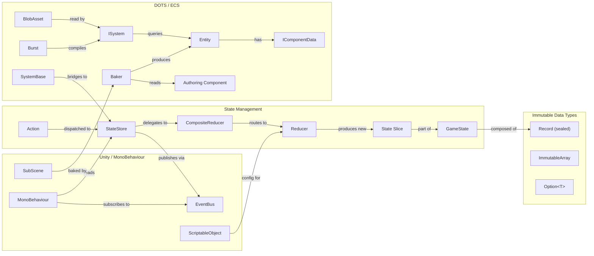

# Glossary

## Purpose

Alphabetical reference of project-specific terms used throughout the VoidHarvest codebase, documentation, and specifications. Each entry includes a concise definition and the primary system or module where the term is most commonly encountered.

## Terms

| Term | Definition | Where Used |
|------|-----------|------------|
| **Action** | An immutable command object (typically a `sealed record`) dispatched to a Reducer to produce a new state. Actions implement a marker interface such as `IGameAction`, `IShipAction`, or `IMiningAction`. They carry only the data needed for the state transition and contain no logic. | Core/State (all reducers) |
| **Addressables** | Unity's asset management system for loading assets at runtime by address string rather than direct reference. All runtime-loaded assets in VoidHarvest use Addressables; `Resources.Load` is prohibited. | Core, all features with runtime assets |
| **Assembly Definition** | A Unity `.asmdef` file that defines a compilation unit boundary. VoidHarvest uses 29 assembly definitions to enforce dependency direction (e.g., feature assemblies depend on Core but never on each other directly). Each feature's `Data/`, `Systems/`, `Views/`, and `Tests/` layers may have separate assemblies. | All features, Core |
| **Authoring (component)** | A MonoBehaviour placed on a GameObject in a SubScene that serves as the design-time representation of ECS data. During baking, the Baker reads the authoring component's fields and produces corresponding ECS components on the baked entity. Examples: `AsteroidFieldSpawner`, `AsteroidPrefabAuthoring`, `DockingConfigAuthoring`. | Procedural, Docking, Mining |
| **Baker / Baking** | The Unity DOTS process that converts authoring GameObjects in a SubScene into optimized ECS entities at edit-time or build-time. Bakers read MonoBehaviour authoring components and emit `IComponentData`, `ISharedComponentData`, or `BlobAsset` references onto entities. Runs automatically when SubScene contents change. | Procedural, Docking, Mining |
| **BlobAsset** | A DOTS immutable, Burst-compatible data structure stored in unmanaged memory. Used for read-only lookup data that many entities share (e.g., `OreTypeBlobDatabase` for ore properties, `DockingConfigBlob` for docking parameters). Created during baking and accessed at runtime via `BlobAssetReference<T>`. | Procedural (OreTypeBlob), Docking (DockingConfigBlob) |
| **Burst (compiler)** | Unity's LLVM-based compiler that translates C# Jobs and ISystem code into highly optimized native machine code. All simulation-critical ECS systems in VoidHarvest are Burst-compiled with the `[BurstCompile]` attribute for zero GC allocation and maximum throughput. | Ship, Mining, Procedural, Docking |
| **Cinemachine** | Unity's camera system (v3.1.2) used for the 3rd-person orbiting follow camera. The `CinemachineCamera` component tracks the ship and its `Target.TrackingTarget` Transform provides the authoritative live ship position for managed code. | Camera |
| **CompositeReducer** | The root reducer function in `RootLifetimeScope` that routes dispatched actions to the appropriate feature reducer based on the action's marker interface. Also handles cross-cutting actions (e.g., `TransferToStationAction`, `RepairShipAction`) that atomically update multiple state slices. | Core (RootLifetimeScope) |
| **DOTS (Data-Oriented Technology Stack)** | Unity's high-performance framework comprising Entities (ECS), Burst compiler, and the C# Job System. VoidHarvest uses DOTS for all simulation-heavy systems (ship physics, mining, asteroid generation, docking state machine) while keeping UI and input in the MonoBehaviour world. | Ship, Mining, Procedural, Docking |
| **ECS (Entity Component System)** | The data-oriented architecture pattern at the heart of Unity DOTS. Data lives on **Entities** as **Components** (`IComponentData` structs), and **Systems** (`ISystem` or `SystemBase`) iterate over component queries to perform logic. Separates data from behavior for cache-friendly, parallelizable execution. | Ship, Mining, Procedural, Docking |
| **Entity** | A lightweight identifier (integer index + version) in the DOTS world that serves as a container for components. Entities have no behavior; they are pure data handles. Examples: asteroid entities, ship entity (`PlayerControlledTag`), docking config singleton entity. | All ECS features |
| **EventBus** | The UniTask Channel-backed pub/sub system (`UniTaskEventBus` implementing `IEventBus`) used for decoupled cross-system communication. Publishes struct events with zero allocation. Subscribers receive events as `IUniTaskAsyncEnumerable<T>`. Registered as a singleton via VContainer. | Core/EventBus, all features |
| **GameState** | The root immutable state record (`sealed record`) that contains all game state: `GameLoopState` (subsystem states), `ShipState`, `CameraState`, and `WorldState`. Held by the `StateStore` and replaced atomically on every dispatch. | Core/State |
| **IComponentData** | The DOTS interface for unmanaged component data structs attached to entities. Must be a struct with no reference types. Examples: `ShipInputComponent`, `AsteroidTag`, `DockingStateComponent`, `MiningBeamComponent`. | All ECS features |
| **ImmutableArray** | `System.Collections.Immutable.ImmutableArray<T>` -- the primary immutable collection type for ordered lists in domain state (e.g., `WorldState.Stations`, `TargetingState.LockedTargets`). Imported via NuGetForUnity. Never use mutable `List<T>` for domain state. | Core/State, all state records |
| **ISystem** | The DOTS unmanaged system interface. Unlike `SystemBase`, `ISystem` systems can be Burst-compiled. Used for performance-critical simulation loops: `ShipFlightSystem`, `MiningBeamSystem`, `AsteroidFieldSystem`, `DockingSystem`. | Ship, Mining, Procedural, Docking |
| **ITargetable** | Interface defined in `Core/Extensions` that any targetable scene object must implement. Exposes `TargetInfo` (id, display name, position, target type). Used by the targeting system to abstract over asteroids, stations, and future targetable types. | Core/Extensions, Targeting, Input |
| **MonoBehaviour** | Unity's component base class for GameObjects. In VoidHarvest, MonoBehaviours serve strictly as view/input layers: they read state from the `StateStore`, subscribe to `EventBus` events, and bridge player input to actions. They never hold or mutate game state. | All view layers (Camera, HUD, Input, StationServices, Targeting) |
| **NativeArray** | A DOTS-compatible unmanaged array allocated in native memory. Used in Burst-compiled systems and jobs where managed collections are not allowed. Typical uses: temporary buffers in systems, entity queries, batch operations. | Ship, Mining, Procedural |
| **Option&lt;T&gt;** | A custom `readonly struct` in `Core/Extensions` that replaces nullable references with explicit `Some`/`None` semantics. Supports `Match`, `Map`, `FlatMap`, and `GetValueOrDefault`. Used throughout state records to represent optional values (e.g., `FleetState.DockedAtStation`). | Core/Extensions, all state records |
| **OreDefinition** | A ScriptableObject (`Assets/Features/Mining/Data/`) that defines a single ore type: display name, rarity tier, yield rate, hardness, beam color, volume, tint, refining outputs, and refining credit cost. The data-driven replacement for hard-coded ore types (Spec 005). | Mining, Procedural, StationServices |
| **PilotCommand** | An immutable record generated from raw player input. Contains thrust vector, rotation input, and module activation flags. Flows through the pipeline: Raw Input -> `PilotCommand` -> `ShipStateReducer`. Ensures input processing is pure and testable. | Input, Ship |
| **Reducer** | A pure static function with signature `(State, Action) -> State` that produces a new immutable state from an existing state and an action. Never mutates input. Examples: `ShipStateReducer`, `MiningReducer`, `InventoryReducer`, `DockingReducer`, `StationServicesReducer`, `TargetingReducer`. | Core/State, all feature Systems/ layers |
| **Record (sealed)** | C# 9.0 `sealed record` class used for all immutable domain state types. Provides structural equality, `with` expression support for non-destructive mutation, and value-based `ToString`. All state records in VoidHarvest are sealed to prevent inheritance. Examples: `GameState`, `ShipState`, `MiningSessionState`, `DockingState`. | Core/State, all Data/ layers |
| **ScriptableObject** | Unity asset type used as the single source of truth for all static designer data. Suffixed `Config` or `Definition`. Examples: `OreDefinition`, `ShipArchetypeConfig`, `StationDefinition`, `WorldDefinition`, `CameraConfig`, `DockingConfig`, `TargetingConfig`. Created via the `VoidHarvest/<System>/<Type>` asset menu. | All features, Core/Editor |
| **State Slice** | A named sub-section of the `GameLoopState` record that a single feature reducer owns. Each slice is an independent immutable record (e.g., `MiningSessionState`, `InventoryState`, `DockingState`, `TargetingState`). The `CompositeReducer` routes actions to the correct slice's reducer. | Core/State |
| **StateStore** | The centralized immutable state container (`Core/State/StateStore.cs`). Holds the current `GameState`, applies actions through the `CompositeReducer`, increments a version counter, and publishes `StateChangedEvent` via the `EventBus`. Registered as a singleton via VContainer. | Core/State |
| **SubScene** | A Unity DOTS construct that converts a scene's GameObjects into baked ECS entities at edit-time. VoidHarvest uses `ShipSubScene` (ship entity + physics) and `AsteroidsSubScene` (asteroid field + ore blob database) within `GameScene`. Changes to SubScene contents trigger automatic re-baking. | Ship, Procedural, Docking |
| **SystemBase** | The DOTS managed system base class. Unlike `ISystem`, it supports managed code (reference types, GC allocations) but cannot be Burst-compiled. Used for ECS bridge systems that need access to managed singletons: `EcsToStoreSyncSystem`, `MiningActionDispatchSystem`, `DockingEventBridgeSystem`. | Core/State, Mining, Docking |
| **TargetType** | An enum in `Core/Extensions` (`None`, `Asteroid`, `Station`) that discriminates the player's current target. Placed in Core to avoid circular assembly dependencies between EventBus and State assemblies. Used by radial menus to show context-appropriate segments. | Core/Extensions, HUD, Input, Targeting |
| **UniTask** | A high-performance async/await library for Unity (v2.5.10) by Cysharp. Powers the `EventBus` via `Channel<T>` and `IUniTaskAsyncEnumerable<T>`. Preferred over Unity coroutines and C# `Task` for zero/low-allocation async operations. | Core/EventBus, all async view controllers |
| **URP (Universal Render Pipeline)** | Unity's scriptable render pipeline (v17.3.0) used for all rendering. VoidHarvest maintains two pipeline configs: `PC_RPAsset` (quality) and `Mobile_RPAsset` (performance). Post-processing is configured via Volume Profiles in `Assets/Settings/`. | Settings, Camera, all visual features |
| **VContainer** | A lightweight dependency injection framework for Unity (v1.16.7). VoidHarvest uses `RootLifetimeScope` (core singletons: EventBus, StateStore) and `SceneLifetimeScope` (scene-specific registrations). Pure constructor injection for non-MonoBehaviour types; `[Inject]` method injection for MonoBehaviours. | Core (RootLifetimeScope, SceneLifetimeScope), all features |
| **WorldDefinition** | A ScriptableObject that defines the entire game world: station list (`StationDefinition[]`), starting ship archetype, and field references. Its `BuildWorldStations()` method produces the `ImmutableArray<StationData>` for `WorldState`. Introduced in Spec 009 to replace hard-coded world initialization. | World, Core (RootLifetimeScope) |
| **WorldState** | An immutable `sealed record` within `GameState` containing world-level data: the station list (`ImmutableArray<StationData>`) and `WorldTime`. Populated at startup from `WorldDefinition.BuildWorldStations()`. | Core/State, World |

## Diagram: Term Relationships

## See Also

- [Architecture Overview](architecture/overview.md) -- full system-level architecture diagram and explanation
- [State Management](architecture/state-management.md) -- deep dive into reducers, actions, and the StateStore
- [Event System](architecture/event-system.md) -- EventBus design and subscription lifecycle
- [Data Pipeline](architecture/data-pipeline.md) -- ScriptableObject to ECS baking pipeline
- [Dependency Injection](architecture/dependency-injection.md) -- VContainer scoping and registration patterns
