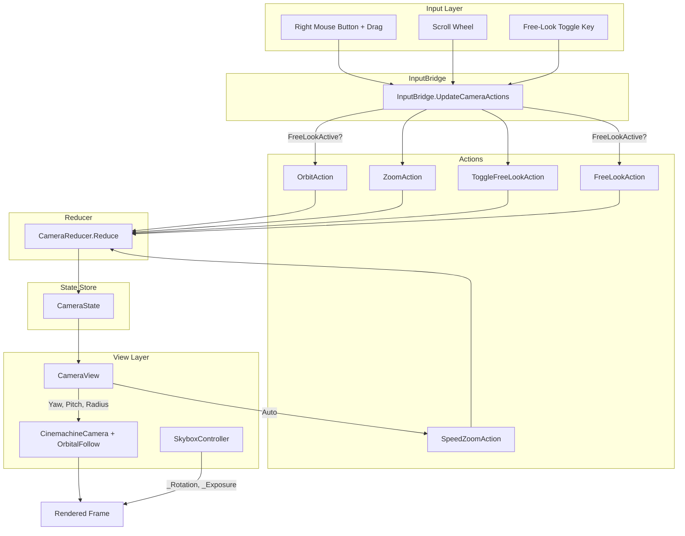

# Camera System

## 1. Purpose

The Camera system provides a 3rd-person orbiting follow camera with speed-based auto-zoom, free-look mode, and a rotating nebula skybox. It converts player input into immutable `CameraState` via a pure reducer, then applies that state to Cinemachine each frame. The system is entirely managed-layer (no ECS components) and operates as a thin view bridge between the state store and the Unity rendering pipeline.

## 2. Architecture Diagram



## 3. State Shape

All camera state lives in a single immutable record in `Assets/Core/State/CameraState.cs`:

```csharp
public sealed record CameraState(
    float OrbitYaw,          // Current horizontal orbit angle (degrees)
    float OrbitPitch,        // Current vertical orbit angle (degrees)
    float TargetDistance,     // Desired camera distance from ship (meters)
    bool  FreeLookActive,    // Whether free-look mode is enabled
    float FreeLookYaw,       // Free-look horizontal offset (degrees)
    float FreeLookPitch,     // Free-look vertical offset (degrees)
    float MinPitch = -80f,   // Lower pitch clamp (from CameraConfig)
    float MaxPitch = 80f,    // Upper pitch clamp (from CameraConfig)
    float MinDistance = 5f,  // Closest camera distance (from CameraConfig)
    float MaxDistance = 50f, // Farthest camera distance (from CameraConfig)
    float MinZoomDistance = 10f, // Closest at full speed (from CameraConfig)
    float MaxZoomDistance = 40f  // Farthest at zero speed (from CameraConfig)
);
```

Default: `CameraState.Default` = Yaw 0, Pitch 15, Distance 25, FreeLook off.

Limit fields (`MinPitch`, `MaxPitch`, `MinDistance`, `MaxDistance`, `MinZoomDistance`, `MaxZoomDistance`) are initialized from `CameraConfig` SO at startup and embedded in the state so the reducer remains pure with no external reads.

## 4. Actions

All actions implement `ICameraAction : IGameAction` and are defined in `Assets/Core/State/CameraActions.cs`:

| Action | Parameters | Description |
|--------|-----------|-------------|
| `OrbitAction` | `DeltaYaw`, `DeltaPitch` | Right-click drag orbit. Yaw unbounded, pitch clamped to `[MinPitch, MaxPitch]`. |
| `ZoomAction` | `Delta` | Scroll wheel zoom. Clamped to `[MinDistance, MaxDistance]`. |
| `SpeedZoomAction` | `NormalizedSpeed` | Auto-zoom based on ship speed (0=far, 1=close). Lerps between `MaxZoomDistance` and `MinZoomDistance`. |
| `ToggleFreeLookAction` | (none) | Toggles `FreeLookActive`. Resets `FreeLookYaw`/`FreeLookPitch` to 0. |
| `FreeLookAction` | `DeltaYaw`, `DeltaPitch` | Free-look offset. Only applied when `FreeLookActive` is true. Pitch clamped. |

## 5. ScriptableObject Configs

### CameraConfig

**Path:** `Assets/Features/Camera/Data/CameraConfig.cs`
**Menu:** `VoidHarvest/Camera/Camera Config`

| Field | Type | Default | Description |
|-------|------|---------|-------------|
| `MinPitch` | float | -80 | Minimum pitch angle (degrees, negative = look down) |
| `MaxPitch` | float | 80 | Maximum pitch angle (degrees, positive = look up) |
| `MinDistance` | float | 5 | Minimum camera distance from target (meters) |
| `MaxDistance` | float | 50 | Maximum camera distance from target (meters) |
| `MinZoomDistance` | float | 10 | Closest zoom at full speed (meters) |
| `MaxZoomDistance` | float | 40 | Farthest zoom at zero speed (meters) |
| `ZoomCooldownDuration` | float | 2.0 | Seconds after manual zoom before speed-zoom resumes |
| `OrbitSensitivity` | float | 0.1 | Orbit sensitivity multiplier (degrees per pixel) |
| `DefaultYaw` | float | 0 | Default yaw angle on startup (degrees) |
| `DefaultPitch` | float | 15 | Default pitch angle on startup (degrees) |
| `DefaultDistance` | float | 25 | Default camera distance on startup (meters) |

Includes `OnValidate()` with range warnings for all fields.

### SkyboxConfig

**Path:** `Assets/Features/Camera/Data/SkyboxConfig.cs`
**Menu:** `VoidHarvest/Camera/Skybox Config`

| Field | Type | Default | Description |
|-------|------|---------|-------------|
| `SkyboxMaterial` | Material | (none) | Primary Nebula HDRI material (Skybox/Panoramic shader) |
| `FallbackMaterial` | Material | (none) | Fallback skybox material if primary is null |
| `RotationSpeed` | float | 0.5 | Skybox rotation in degrees/second. Range [0, 5]. |
| `ExposureOverride` | float | 1.0 | Skybox brightness multiplier. Range [0.1, 3.0]. |

Has `GetEffectiveMaterial()` method that returns primary or fallback. `Validate()` clamps values.

## 6. ECS Components

**None.** The camera system is entirely managed-layer. It reads `ShipState` from the state store (for speed-based zoom) but does not own or create any ECS components.

## 7. Events

**None published or subscribed.** The camera system communicates exclusively through the state store dispatch/read cycle. `CameraView.NotifyManualZoom()` is called directly by `InputBridge` to start the zoom cooldown timer.

## 8. Assembly Dependencies

**Assembly:** `VoidHarvest.Features.Camera`

```
VoidHarvest.Features.Camera
  +-- VoidHarvest.Core.Extensions
  +-- VoidHarvest.Core.State
  +-- VoidHarvest.Core.EventBus
  +-- Unity.Cinemachine
  +-- Unity.Mathematics
  +-- VContainer
```

The camera assembly has no dependencies on other feature assemblies. It is a leaf dependency consumed by `VoidHarvest.Features.Input` (which dispatches camera actions).

## 9. Key Types

| Type | File | Role |
|------|------|------|
| `CameraState` | `Assets/Core/State/CameraState.cs` | Immutable state record with orbit angles, distance, free-look, and limits |
| `ICameraAction` | `Assets/Core/State/ICameraAction.cs` | Marker interface for camera actions routed to CameraReducer |
| `OrbitAction` | `Assets/Core/State/CameraActions.cs` | Right-click drag orbit delta |
| `ZoomAction` | `Assets/Core/State/CameraActions.cs` | Manual scroll wheel zoom delta |
| `SpeedZoomAction` | `Assets/Core/State/CameraActions.cs` | Auto-zoom from ship speed (0-1) |
| `ToggleFreeLookAction` | `Assets/Core/State/CameraActions.cs` | Toggle free-look mode on/off |
| `FreeLookAction` | `Assets/Core/State/CameraActions.cs` | Free-look offset delta |
| `CameraReducer` | `Assets/Features/Camera/Systems/CameraReducer.cs` | Pure static reducer: (CameraState, ICameraAction) -> CameraState |
| `CameraConfig` | `Assets/Features/Camera/Data/CameraConfig.cs` | ScriptableObject for designer-tunable camera limits |
| `SkyboxConfig` | `Assets/Features/Camera/Data/SkyboxConfig.cs` | ScriptableObject for per-scene skybox configuration |
| `CameraView` | `Assets/Features/Camera/Views/CameraView.cs` | MonoBehaviour driving Cinemachine from CameraState, dispatches SpeedZoomAction |
| `SkyboxController` | `Assets/Features/Camera/Views/SkyboxController.cs` | MonoBehaviour applying skybox rotation and exposure each frame |

## 10. Designer Notes

**What designers can change without code:**

- **Camera feel:** Adjust `CameraConfig` fields (pitch limits, zoom range, speed-zoom range, sensitivity, cooldown) to change how the camera responds to player input. Wider pitch limits allow more vertical freedom; smaller `MinDistance` lets players zoom in closer.
- **Speed zoom behavior:** `MinZoomDistance` and `MaxZoomDistance` control the automatic zoom-in when the ship is moving fast. Set them equal to disable speed zoom entirely.
- **Zoom cooldown:** `ZoomCooldownDuration` controls how long after a manual scroll-wheel zoom before speed-zoom resumes. Increase this value to give players more manual zoom control.
- **Skybox appearance:** Assign different Nebula HDRI materials to `SkyboxConfig.SkyboxMaterial` per scene. Adjust `RotationSpeed` for dramatic slow rotation or set to 0 for a static sky. Increase `ExposureOverride` for brighter ambient lighting.
- **Fallback safety:** Always assign `SkyboxConfig.FallbackMaterial` in case the primary material fails to load at runtime.
- **Cinemachine setup:** The `CameraView` requires a `CinemachineCamera` with a `CinemachineOrbitalFollow` component on the same GameObject. The view writes `HorizontalAxis`, `VerticalAxis`, and `Radius` to the orbital follow component. Cinemachine's `TrackingTarget` should point to the ship GameObject.
- **Adding new scenes:** Create a new `SkyboxConfig` asset via `Create > VoidHarvest > Camera > Skybox Config`, assign materials, and drop a `SkyboxController` into the scene referencing the config.

See also: [Architecture Overview](../architecture/overview.md)
