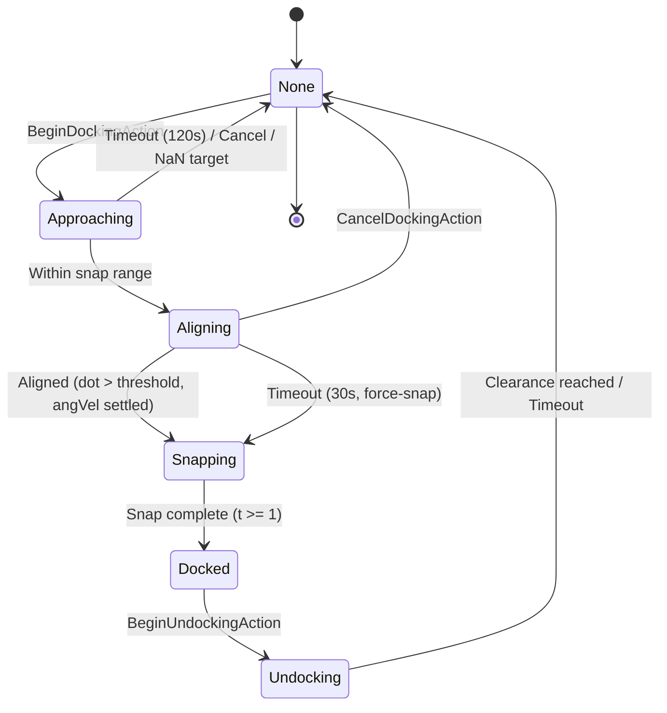
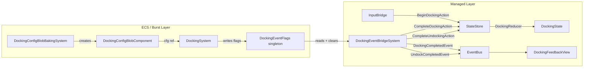

# Docking System

## 1. Purpose

The Docking system implements the full station docking lifecycle: approach, alignment, magnetic snap, docked state, and undocking with clearance. It spans both ECS (Burst-compiled simulation) and managed layers (state reducer, event bridge, VFX/audio feedback), connected by a flag-based bridge pattern that preserves zero-GC guarantees in the hot path. All docking parameters are data-driven via DockingConfig ScriptableObject, baked into a BlobAsset for Burst access.

## 2. Architecture Diagram





## 3. State Shape

### DockingState (sealed record, Core/State)

```csharp
public sealed record DockingState(
    DockingPhase Phase,                    // None | Approaching | Aligning | Snapping | Docked | Undocking
    Option<int> TargetStationId,           // Station being docked at
    Option<float3> DockingPortPosition,    // World-space port position
    Option<quaternion> DockingPortRotation  // World-space port rotation
);
```

Computed properties:
- `IsDocked` -- true when `Phase == Docked`
- `IsInProgress` -- true when Approaching, Aligning, or Snapping

### DockingPhase (enum, Core/State)

| Value | Int | Description |
|---|---|---|
| `None` | 0 | Ship is free-flying |
| `Approaching` | 1 | Ship is navigating toward docking port |
| `Aligning` | 5 | Ship is within snap range, rotating to match port orientation |
| `Snapping` | 2 | Smoothstep interpolation to final docked pose |
| `Docked` | 3 | Ship is locked at port, flight mode = Docked |
| `Undocking` | 4 | Ship is thrusting away to clearance distance |

## 4. Actions

All actions implement `IDockingAction : IGameAction`.

| Action | Fields | Valid From Phase | Result Phase |
|---|---|---|---|
| `BeginDockingAction` | `StationId`, `PortPosition`, `PortRotation` | None | Approaching |
| `CompleteDockingAction` | `StationId` | Approaching / Aligning | Docked |
| `CancelDockingAction` | (none) | Approaching / Aligning | None (Empty) |
| `BeginUndockingAction` | (none) | Docked | Undocking |
| `CompleteUndockingAction` | (none) | Undocking | None (Empty) |

Invalid phase transitions return the state unchanged (no-op).

## 5. ScriptableObject Configs

### DockingConfig

**Menu Path:** `VoidHarvest/Docking/Docking Config`

| Field | Type | Default | Description |
|---|---|---|---|
| `MaxDockingRange` | float | 500 | Maximum range to initiate docking (meters) |
| `SnapRange` | float | 30 | Range where alignment phase begins (meters) |
| `SnapDuration` | float | 1.5 | Duration of the smoothstep snap animation (seconds) |
| `UndockClearanceDistance` | float | 100 | Distance ship moves away during undock (meters) |
| `UndockDuration` | float | 2.0 | Duration of the undock movement (seconds) |
| `ApproachTimeout` | float | 120 | Safety timeout for approach phase (seconds) |
| `AlignTimeout` | float | 30 | Safety timeout for alignment phase before force-snap (seconds) |
| `AlignDotThreshold` | float | 0.999 | Dot product threshold for alignment completion (0-1) |
| `AlignAngVelThreshold` | float | 0.01 | Angular velocity threshold for alignment settling (rad/s) |

Includes `OnValidate()` with range guards on all fields.

### DockingVFXConfig

**Menu Path:** `VoidHarvest/Docking/Docking VFX Config`

| Field | Type | Description |
|---|---|---|
| `AlignmentGuideEffect` | GameObject | Approach phase alignment guide VFX prefab |
| `ApproachGlowIntensity` | float | Intensity of approach glow (default 1.0) |
| `SnapFlashEffect` | GameObject | Flash VFX on snap completion |
| `SnapFlashDuration` | float | Duration of snap flash (default 0.5s) |
| `UndockReleaseEffect` | GameObject | VFX played on undock completion |

### DockingAudioConfig

**Menu Path:** `VoidHarvest/Docking/Docking Audio Config`

| Field | Type | Description |
|---|---|---|
| `ApproachHumClip` | AudioClip | Looping hum during approach phase |
| `DockClampClip` | AudioClip | One-shot on dock completion |
| `DockClampVolume` | float | Volume for dock clamp (default 0.8) |
| `UndockReleaseClip` | AudioClip | One-shot on undock completion |
| `UndockReleaseVolume` | float | Volume for undock release (default 0.6) |
| `EngineStartClip` | AudioClip | One-shot on undock start |
| `MaxAudibleDistance` | float | Spatial audio max distance (default 200m) |

## 6. ECS Components

### DockingStateComponent (IComponentData)

Added to the ship entity when a docking sequence begins. Removed when undocking completes.

| Field | Type | Description |
|---|---|---|
| `Phase` | DockingPhase | Current ECS-level phase |
| `TargetPortPosition` | float3 | World-space dock port position |
| `TargetPortRotation` | quaternion | World-space dock port rotation |
| `TargetStationId` | int | Station ID |
| `SnapTimer` | float | Elapsed time in current sub-phase |
| `StartPosition` | float3 | Ship position at snap start (for interpolation) |
| `StartRotation` | quaternion | Ship rotation at snap start (for interpolation) |

### DockingEventFlags (IComponentData, Singleton)

Written by DockingSystem (Burst), read and cleared by DockingEventBridgeSystem (managed).

| Field | Type | Description |
|---|---|---|
| `DockCompleted` | bool | Set when snap finishes |
| `DockStationId` | int | Station ID for the completed dock |
| `UndockCompleted` | bool | Set when undock clearance reached |

### DockingConfigBlobComponent (IComponentData, Singleton)

| Field | Type | Description |
|---|---|---|
| `Config` | BlobAssetReference\<DockingConfigBlob\> | Reference to baked config blob |

### DockingConfigBlob (BlobAsset)

Mirror of all DockingConfig SO fields. Built by `DockingConfigBlob.BuildFromConfig()` using `Allocator.Persistent`. Contains: `MaxDockingRange`, `SnapRange`, `SnapDuration`, `UndockClearanceDistance`, `UndockDuration`, `ApproachTimeout`, `AlignTimeout`, `AlignDotThreshold`, `AlignAngVelThreshold`.

### DockingPortComponent (MonoBehaviour, not ECS)

Marker on station prefab GameObjects. Provides `WorldPortPosition` and `WorldPortRotation` computed from local-space `PortPosition`/`PortRotation` plus the station Transform. Station ID derived from `StationDefinition` SO in `Awake()`.

## 7. Events

### Published

| Event | Publisher | Payload |
|---|---|---|
| `DockingStartedEvent` | RadialMenuController / InputBridge | `StationId` |
| `DockingCompletedEvent` | DockingEventBridgeSystem | `StationId` |
| `UndockingStartedEvent` | StationServicesMenuController / RadialMenuController | `StationId` |
| `UndockCompletedEvent` | DockingEventBridgeSystem | `StationId` |
| `DockingCancelledEvent` | (cancel path) | (no payload) |

### Consumed

| Event | Consumer | Behavior |
|---|---|---|
| `DockingStartedEvent` | DockingFeedbackView | Spawn alignment guide VFX, play approach hum audio |
| `DockingCompletedEvent` | DockingFeedbackView, HUDView, StationServicesMenuController | Snap flash VFX + dock clamp audio; hide HUD panels; open station services menu |
| `DockingCancelledEvent` | DockingFeedbackView | Clean up approach VFX, stop audio |
| `UndockingStartedEvent` | DockingFeedbackView, HUDView, StationServicesMenuController | Engine start audio; show HUD panels; close station services menu |
| `UndockCompletedEvent` | DockingFeedbackView | Undock release VFX + audio |

## 8. Assembly Dependencies

Assembly: `VoidHarvest.Features.Docking`

| Dependency | Purpose |
|---|---|
| `VoidHarvest.Core.Extensions` | `Option<T>`, `TargetType` |
| `VoidHarvest.Core.State` | `IStateStore`, `DockingState`, `DockingPhase`, `IDockingAction` |
| `VoidHarvest.Core.EventBus` | `IEventBus`, docking events |
| `VoidHarvest.Features.Ship` | `ShipPositionComponent`, `ShipVelocityComponent`, `ShipFlightModeComponent`, `ShipConfigComponent`, `ShipPhysicsMath`, `PlayerControlledTag` |
| `VoidHarvest.Features.Base` | Station prefab references |
| `VoidHarvest.Features.Station` | `StationDefinition` SO for DockingPortComponent |
| `Unity.Entities` | `IComponentData`, `ISystem`, `SystemBase`, `BlobAssetReference` |
| `Unity.Entities.Hybrid` | Hybrid authoring |
| `Unity.Mathematics` | `float3`, `quaternion`, `math.*` |
| `Unity.Burst` | `[BurstCompile]` on DockingSystem |
| `Unity.Collections` | `NativeArray`, `Allocator` for blob builder |
| `Unity.Transforms` | Transform components |
| `VContainer` | `[Inject]` on DockingFeedbackView |
| `UniTask` | Async event subscriptions in DockingFeedbackView |

## 9. Key Types

| Type | Role |
|---|---|
| `DockingState` | Immutable record tracking docking phase and target info. Lives in `GameLoopState.Docking`. |
| `DockingReducer` | Pure static reducer. Pattern-matches on action type + current phase. Invalid transitions return unchanged state. |
| `DockingMath` | Pure static math utilities: approach target computation, smoothstep snap progress, pose interpolation, clearance position, range checks. |
| `DockingSystem` | Burst-compiled `ISystem`. Runs before `ShipPhysicsSystem`. Manages approach physics (thrust + braking), alignment (dual-axis torque + station-keeping), snap interpolation, docked lock, and undock clearance. Writes `DockingEventFlags` singleton. |
| `DockingEventBridgeSystem` | Managed `SystemBase`. Reads `DockingEventFlags`, dispatches `CompleteDockingAction`/`CompleteUndockingAction` to StateStore, publishes events to EventBus, clears flags. Runs after DockingSystem. |
| `DockingConfigBlobBakingSystem` | Managed `SystemBase` in `InitializationSystemGroup`. Bakes `DockingConfig` SO into `DockingConfigBlob` BlobAsset. Self-disables after first run. |
| `DockingConfigBlob` | Burst-accessible struct mirroring all DockingConfig fields. Built via `BlobBuilder` with `Allocator.Persistent`. |
| `DockingConfigBlobComponent` | Singleton ECS component holding the `BlobAssetReference<DockingConfigBlob>`. |
| `DockingStateComponent` | Per-entity ECS component tracking phase, timer, target pose, and snap interpolation data. |
| `DockingEventFlags` | Singleton ECS component for Burst-to-managed bridging. Zero-GC write path. |
| `DockingPortComponent` | MonoBehaviour marker on station prefabs. Provides world-space docking port pose. Not an ECS component. |
| `DockingFeedbackView` | MonoBehaviour subscribing to all 5 docking events via EventBus. Manages VFX instantiation/cleanup and spatial audio playback. |

## 10. Designer Notes

**What designers can change without code:**

- **DockingConfig** (`Assets/Features/Station/Data/Presets/` or project-specific location):
  - `MaxDockingRange` -- how far away the player can initiate docking (default 500m)
  - `SnapRange` -- distance at which the ship stops approaching and begins alignment rotation (default 30m)
  - `SnapDuration` -- how long the final smoothstep snap takes (default 1.5s; lower = snappier, higher = cinematic)
  - `UndockClearanceDistance` -- how far the ship moves before returning to free flight (default 100m)
  - `ApproachTimeout` -- safety timeout before auto-cancelling approach (default 120s)
  - `AlignTimeout` -- safety timeout before force-snapping alignment (default 30s)
  - `AlignDotThreshold` -- precision required for alignment (default 0.999; lower = more forgiving)
  - `AlignAngVelThreshold` -- how still the ship must be before snap starts (default 0.01 rad/s)

- **DockingVFXConfig**: Assign prefabs for alignment guide, snap flash, and undock release effects. Adjust approach glow intensity and snap flash duration.

- **DockingAudioConfig**: Assign audio clips for approach hum (looping), dock clamp, undock release, and engine start. Adjust volumes and max audible distance.

- **Station Docking Ports**: On station prefab GameObjects, add a `DockingPortComponent` and set:
  - `PortPosition` -- local-space position of the docking port
  - `PortRotation` -- local-space orientation the ship should face when docked
  - `StationDefinition` -- reference to the station's `StationDefinition` SO (provides StationId)

- **Edge Cases**:
  - Approach auto-cancels after `ApproachTimeout` seconds if the ship cannot reach the port
  - NaN or Inf target positions are rejected, reverting to None phase
  - Alignment phase force-snaps after `AlignTimeout` to prevent infinite rotation settling

See also: [Architecture Overview](../architecture/overview.md) | [Ship System](ship.md) | [Station Services](station-services.md) | [HUD System](hud.md)
