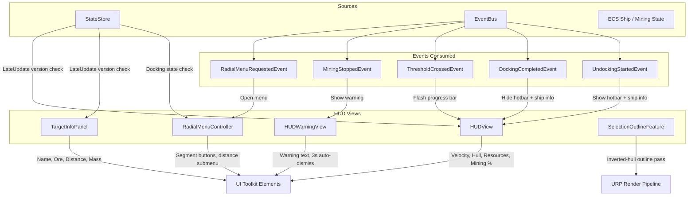

# HUD System

## 1. Purpose

The HUD system provides the in-game heads-up display, including velocity/hull readouts, resource counts, mining progress bars, a context-sensitive radial menu, target information panels, mining warnings, and a selection outline renderer feature. It is a pure view layer -- it owns no game state, holds no reducers, and contains no ECS components. All data flows from the StateStore and EventBus into UI Toolkit elements updated each frame.

## 2. Architecture Diagram

## 3. State Shape

The HUD system owns no state. It reads from the global `GameState` via `IStateStore`:

| Field Read | Source | Used By |
|---|---|---|
| `ActiveShipPhysics.Velocity` | `GameState` | HUDView velocity label |
| `ActiveShipPhysics.HullIntegrity` | `GameState` | HUDView hull bar |
| `Loop.Inventory.Stacks` | `GameState` | HUDView resource list |
| `Loop.Mining.TargetAsteroidId` | `GameState` | HUDView mining panel visibility |
| `Loop.Mining.DepletionFraction` | `GameState` | HUDView progress bar |
| `Loop.Mining.YieldAccumulator` | `GameState` | HUDView yield label |
| `Loop.Docking.IsDocked` | `GameState` | RadialMenuController suppression |

HUDView uses a version-check pattern (`_stateStore.Version == _lastVersion`) to skip redundant UI rebuilds.

## 4. Actions

The HUD dispatches a small number of actions through the InputBridge, but owns no reducer:

| Action | Dispatched By | Target |
|---|---|---|
| `BeginDockingAction` | RadialMenuController (Dock segment) | DockingReducer |
| `BeginUndockingAction` | RadialMenuController (via station services) | DockingReducer |
| Mining start | RadialMenuController (`_inputBridge.StartMiningFromRadial()`) | InputBridge/ECS |
| Lock target | RadialMenuController (`_targetingController.AttemptLockOnSelected()`) | TargetingController |
| Radial choice | RadialMenuController (`_inputBridge.SetRadialChoice()`) | InputBridge |

## 5. ScriptableObject Configs

| SO Type | Menu Path | Fields | Used By |
|---|---|---|---|
| `DepletionVFXConfig` | (Mining feature) | `VeinGlowPulseSpeed`, `VeinGlowPulseAmplitude` | HUDView progress bar pulse sync |
| `InteractionConfig` | (Input feature) | `DefaultApproachDistance`, `DefaultOrbitDistance`, `DefaultKeepAtRangeDistance` | RadialMenuController distance defaults |

The HUD does not define its own ScriptableObjects. It consumes configs from Mining and Input via DI.

## 6. ECS Components

None. The HUD is entirely managed-layer (MonoBehaviour + UI Toolkit). It reads ECS-derived state indirectly through the StateStore, which is kept in sync by ECS bridge systems.

## 7. Events

### Consumed

| Event | Publisher | Consumer | Behavior |
|---|---|---|---|
| `RadialMenuRequestedEvent` | InputBridge | RadialMenuController | Opens radial menu at mouse position with context-sensitive segments |
| `MiningStoppedEvent` | MiningBeamSystem | HUDWarningView | Shows warning (CARGO FULL / OUT OF RANGE / ASTEROID DEPLETED), auto-dismisses after 3s |
| `ThresholdCrossedEvent` | MiningBeamSystem | HUDView | Triggers white flash on progress bar |
| `DockingCompletedEvent` | DockingEventBridgeSystem | HUDView | Hides hotbar and ship info panels |
| `UndockingStartedEvent` | RadialMenuController / StationServicesMenuController | HUDView | Shows hotbar and ship info panels |

### Published

| Event | Publisher | Trigger |
|---|---|---|
| `DockingStartedEvent` | RadialMenuController | Dock segment clicked |

## 8. Assembly Dependencies

Assembly: `VoidHarvest.Features.HUD`

| Dependency | Purpose |
|---|---|
| `VoidHarvest.Core.Extensions` | `TargetType` enum |
| `VoidHarvest.Core.State` | `IStateStore`, `GameState`, `DockingPhase` |
| `VoidHarvest.Core.EventBus` | `IEventBus`, all consumed events |
| `VoidHarvest.Features.Mining` | `DepletionVFXConfig`, `MiningVFXFormulas`, `OreDefinitionRegistry` |
| `VoidHarvest.Features.Resources` | Resource display names |
| `VoidHarvest.Features.Ship` | Ship state types |
| `VoidHarvest.Features.Input` | `InputBridge`, `InteractionConfig` |
| `VoidHarvest.Features.Docking` | `BeginDockingAction`, `DockingPortComponent` |
| `VoidHarvest.Features.Targeting` | `TargetingController` |
| `UniTask` | Async EventBus subscriptions |
| `VContainer` | `[Inject]` constructor injection |
| `Unity.InputSystem` | Keyboard/Mouse polling in RadialMenuController |
| `Unity.Mathematics` | `math.length` for velocity display |
| `Unity.RenderPipelines.Universal.Runtime` | `ScriptableRendererFeature` base class |
| `Unity.RenderPipelines.Core.Runtime` | Render pipeline core types |

## 9. Key Types

| Type | Role |
|---|---|
| `HUDView` | Root HUD controller. Reads StateStore each LateUpdate; updates velocity, hull bar, resource list, mining progress bar with depletion color + pulse sync. Hides/shows panels on dock/undock events. |
| `RadialMenuController` | Context-sensitive radial menu. Segments: Approach, Orbit, Mine (asteroid), KeepAtRange, Dock (station), Lock Target (all). Distance submenu with slider + presets (25/50/100/250/500m). Suppressed while docked. |
| `TargetInfoPanel` | Displays selected target name, ore type, distance, mass percentage. Populated via `ShowTarget()` from InputBridge. |
| `HUDWarningView` | Shows mining stop warnings (CargoFull, OutOfRange, AsteroidDepleted) with 3-second auto-dismiss. |
| `SelectionOutlineFeature` | URP `ScriptableRendererFeature` rendering a 2px white inverted-hull outline on selected objects via a dedicated selection layer. |
| `SelectionOutlinePass` | Internal `ScriptableRenderPass` executing the outline draw call with front-face culling and vertex extrusion. |

## 10. Designer Notes

**What designers can change without code:**

- **Selection Outline**: On the URP Renderer Asset, expand the SelectionOutlineFeature settings:
  - `Outline Material` -- assign a material with front-face culling and vertex extrusion shader
  - `Outline Width` -- world-space width (default 0.02)
  - `Outline Color` -- default white
  - `Selection Layer` -- layer mask for which objects get the outline
  - `Render Pass Event` -- when in the render pipeline the outline draws (default AfterRenderingOpaques)

- **Radial Menu Distance Defaults**: Controlled by `InteractionConfig` ScriptableObject (Input feature):
  - `DefaultApproachDistance` (default 50m)
  - `DefaultOrbitDistance` (default 100m)
  - `DefaultKeepAtRangeDistance` (default 50m)

- **Mining Progress Bar Pulse**: Syncs with `DepletionVFXConfig` (Mining feature):
  - `VeinGlowPulseSpeed` (default 1.5)
  - `VeinGlowPulseAmplitude` (default 0.25)

- **Warning Duration**: Currently hardcoded at 3 seconds in `HUDWarningView`. To change, modify the `UniTask.Delay(3000)` call.

- **Flash Duration**: Progress bar threshold flash duration is hardcoded at 0.3 seconds in `HUDView`.

- **UI Layout**: All HUD panels are defined in UXML documents referenced by each MonoBehaviour's `UIDocument` serialized field. Edit the UXML/USS files to change layout and styling.

- **Radial Menu Segments**: Segment visibility is context-driven by `TargetType`:
  - **Station**: Approach, Orbit, KeepAtRange, Lock Target, Dock
  - **Asteroid**: Approach, Orbit, Mine, KeepAtRange, Lock Target

See also: [Architecture Overview](../architecture/overview.md) | [Input System](input.md) | [Mining System](mining.md) | [Docking System](docking.md) | [Targeting System](targeting.md)
