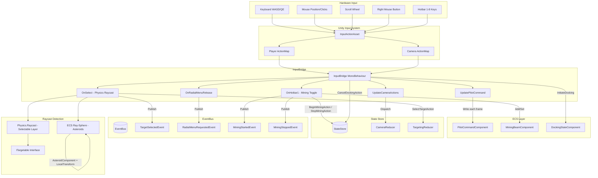

# Input System

## 1. Purpose

The Input system bridges Unity's Input System to the game's immutable state architecture and ECS simulation layer. It translates raw hardware input (keyboard, mouse) into structured dispatches: `PilotCommand` records written to ECS for ship physics, camera actions dispatched to the state store, and target selection events published on the EventBus. The system enforces EVE Online-inspired interaction patterns including right-click orbit, double-click align, radial context menus, and hotbar module activation.

## 2. Architecture Diagram



## 3. State Shape

The Input system does **not own** a state record in the store. It dispatches actions to other system reducers (Camera, Targeting, Ship, Mining, Docking). Its primary output is the `PilotCommand` record and the `PilotCommandComponent` ECS struct.

### PilotCommand (immutable record)

**File:** `Assets/Features/Input/Data/PilotCommand.cs`

```csharp
public sealed record PilotCommand(
    Option<int> SelectedTarget,           // Instance ID of selected target
    Option<float3> AlignPoint,            // World-space double-click point
    Option<RadialMenuChoice> RadialChoice,// Radial menu action + distance
    ThrustInput ManualThrust,             // Forward/Strafe/Roll [-1,1]
    ImmutableArray<int> ActivatedModules  // Hotbar module indices
);
```

### ThrustInput (readonly struct)

```csharp
public readonly struct ThrustInput
{
    public readonly float Forward;  // W/S axis [-1, 1]
    public readonly float Strafe;   // A/D axis [-1, 1]
    public readonly float Roll;     // Q/E axis [-1, 1]
}
```

### RadialMenuChoice (readonly struct)

```csharp
public readonly struct RadialMenuChoice
{
    public readonly RadialMenuAction Action;   // Approach, Orbit, Mine, KeepAtRange, Dock, Warp
    public readonly float DistanceMeters;      // Distance parameter for the action
}
```

### RadialMenuAction (enum)

`Approach`, `Orbit`, `Mine`, `KeepAtRange`, `Dock`, `Warp`

## 4. Actions

The Input system dispatches actions owned by other systems. It does not define its own reducer.

| Action Dispatched | Target Reducer | Trigger |
|-------------------|---------------|---------|
| `OrbitAction(DeltaYaw, DeltaPitch)` | CameraReducer | Right-click drag (FreeLook off) |
| `FreeLookAction(DeltaYaw, DeltaPitch)` | CameraReducer | Right-click drag (FreeLook on) |
| `ZoomAction(Delta)` | CameraReducer | Scroll wheel (when not over scroll UI) |
| `ToggleFreeLookAction()` | CameraReducer | Free-look toggle key |
| `SelectTargetAction(TargetId, TargetType, DisplayName, TypeLabel)` | TargetingReducer | Left-click on targetable object |
| `ClearSelectionAction()` | TargetingReducer | Left-click on empty space |
| `BeginMiningAction(TargetId, OreId)` | MiningReducer | Hotbar 1 (start mining) |
| `StopMiningAction()` | MiningReducer | Hotbar 1 (stop mining) |
| `CancelDockingAction()` | DockingReducer | Manual thrust or radial action during dock approach |
| `RepairHullAction(NewIntegrity)` | ShipStateReducer | DebugHullDamage (F9 debug key) |

## 5. ScriptableObject Configs

### InteractionConfig

**Path:** `Assets/Features/Input/Data/InteractionConfig.cs`
**Menu:** `VoidHarvest/Input/Interaction Config`

| Field | Type | Default | Valid Range | Description |
|-------|------|---------|-------------|-------------|
| `DoubleClickWindow` | float | 0.3 | [0.1, 1.0] | Time window for double-click detection (seconds) |
| `RadialMenuDragThreshold` | float | 5 | [1, 20] | Pixel distance threshold to distinguish tap from drag for radial menu |
| `DefaultApproachDistance` | float | 50 | > 0 | Default stop distance for approach commands (meters) |
| `DefaultOrbitDistance` | float | 100 | > 0 | Default orbit radius for orbit commands (meters) |
| `DefaultKeepAtRangeDistance` | float | 50 | > 0 | Default keep-at-range distance (meters) |
| `MiningBeamMaxRange` | float | 50 | > 0 | Maximum range for mining beam activation (meters) |

Injected into `InputBridge` via VContainer constructor injection with optional parameter for backward compatibility.

## 6. ECS Components

The Input system writes to (but does not own) these ECS components:

| Component | Owned By | How InputBridge Uses It |
|-----------|----------|------------------------|
| `PilotCommandComponent` | Ship | Written every frame with thrust, selection, align point, and radial action |
| `MiningBeamComponent` | Mining | Added/set on ship entity when mining starts; deactivated on stop |
| `DockingStateComponent` | Docking | Added on dock initiation; removed on manual thrust cancellation |
| `PlayerControlledTag` | Ship | Queried to locate the player ship entity at startup |

## 7. Events

### Published

| Event | Payload | Trigger |
|-------|---------|---------|
| `TargetSelectedEvent` | `int TargetId` | Left-click selects a target (`-1` on clear) |
| `RadialMenuRequestedEvent` | `int TargetId, TargetType Type` | Right-click tap on selected target |
| `MiningStartedEvent` | `int TargetId, string OreId` | Hotbar 1 starts mining |
| `MiningStoppedEvent` | `int TargetId, StopReason Reason` | Hotbar 1 stops mining |
| `DockingCancelledEvent` | (none) | Manual thrust cancels docking approach |

### Subscribed

| Event | Handler | Purpose |
|-------|---------|---------|
| `UndockingStartedEvent` | `ListenForUndockingStarted` | Transitions ECS `DockingStateComponent` to Undocking phase |
| `MiningStoppedEvent` | `ListenForMiningStopped` | Resets internal `_isMining` flag |
| `StateChangedEvent<GameState>` | `ListenForStateSelectionChanges` | Syncs local selection from state store (for UI-initiated selections) |

Subscriptions follow the `OnEnable/OnDisable` lifecycle pattern with `CancellationTokenSource`.

## 8. Assembly Dependencies

**Assembly:** `VoidHarvest.Features.Input`

```
VoidHarvest.Features.Input
  +-- VoidHarvest.Core.Extensions     (ITargetable, TargetType, Option<T>)
  +-- VoidHarvest.Core.State          (IStateStore, actions, ShipFlightMode)
  +-- VoidHarvest.Core.EventBus       (IEventBus, event types)
  +-- VoidHarvest.Features.Camera     (CameraView.NotifyManualZoom)
  +-- VoidHarvest.Features.Ship       (ShipConfigComponent, PlayerControlledTag)
  +-- VoidHarvest.Features.Mining     (MiningBeamComponent, OreDisplayNames, OreTypeBlobBakingSystem)
  +-- VoidHarvest.Features.Docking    (DockingStateComponent, DockingPhase, DockingPortComponent)
  +-- VoidHarvest.Features.Targeting  (TargetingActions, TargetableStation)
  +-- Unity.InputSystem
  +-- Unity.Entities
  +-- Unity.Collections
  +-- Unity.Mathematics
  +-- Unity.Transforms
  +-- VContainer
  +-- UniTask
```

The Input assembly is a high-level orchestration layer with wide dependencies. It is consumed by no other feature assembly.

## 9. Key Types

| Type | File | Role |
|------|------|------|
| `PilotCommand` | `Assets/Features/Input/Data/PilotCommand.cs` | Immutable record capturing one frame of player intent |
| `ThrustInput` | `Assets/Features/Input/Data/PilotCommand.cs` | Readonly struct for 6DOF thrust axes (Forward, Strafe, Roll) |
| `RadialMenuChoice` | `Assets/Features/Input/Data/PilotCommand.cs` | Readonly struct for radial menu selection + distance |
| `RadialMenuAction` | `Assets/Features/Input/Data/PilotCommand.cs` | Enum: Approach, Orbit, Mine, KeepAtRange, Dock, Warp |
| `InteractionConfig` | `Assets/Features/Input/Data/InteractionConfig.cs` | ScriptableObject with designer-tunable input timing/distances |
| `InputBridge` | `Assets/Features/Input/Views/InputBridge.cs` | Central MonoBehaviour bridging Unity Input System to ECS and store |
| `ITargetable` | `Assets/Core/Extensions/ITargetable.cs` | Interface for MonoBehaviour-based targetable objects (TargetId, DisplayName, TypeLabel, TargetType) |
| `TargetType` | `Assets/Core/Extensions/TargetType.cs` | Enum discriminator: None, Asteroid, Station |
| `DebugHullDamage` | `Assets/Features/Input/Views/DebugHullDamage.cs` | Debug tool: F9 reduces hull integrity by 25% for testing repair |

## 10. Designer Notes

**What designers can change without code:**

- **Double-click timing:** Adjust `InteractionConfig.DoubleClickWindow` to make double-click detection more or less forgiving. The default 0.3s works for most players; increase to 0.5s for accessibility.
- **Radial menu sensitivity:** `RadialMenuDragThreshold` controls how far the mouse must move during a right-click hold before it counts as an orbit drag instead of a radial menu tap. Lower values make the menu easier to trigger accidentally; higher values require more intentional taps.
- **Default distances:** `DefaultApproachDistance`, `DefaultOrbitDistance`, and `DefaultKeepAtRangeDistance` set the initial distance parameters for radial menu actions before the player customizes them.
- **Mining range:** `MiningBeamMaxRange` caps how far the mining beam can reach. This affects the `MaxRange` field written to `MiningBeamComponent` when mining starts.
- **Input action mappings:** All key bindings are defined in the `InputSystem_Actions.inputactions` asset. The `Player` action map contains thrust, select, radial menu, and hotbar actions. The `Camera` action map contains orbit, zoom, and free-look toggle. Rebind actions in the Input Actions editor without touching code.
- **Selectable layer:** Physics raycasts for station/object selection use the `Selectable` layer. Any GameObject on this layer with an `ITargetable` component will be selectable by left-click.
- **ECS asteroid selection:** Asteroids are selected via ECS ray-sphere intersection (no Physics collider needed). The asteroid must have `AsteroidComponent` and `LocalTransform` components.
- **Docked-state guard:** All target selection is suppressed while the ship is docked (`IsDocked` check). This prevents accidental re-targeting during station services.
- **Adding new targetable objects:** Implement `ITargetable` on a MonoBehaviour, place the GameObject on the `Selectable` layer, and the Input system will automatically detect it on left-click.

See also: [Architecture Overview](../architecture/overview.md), [Camera System](camera.md), [Ship System](ship.md)
