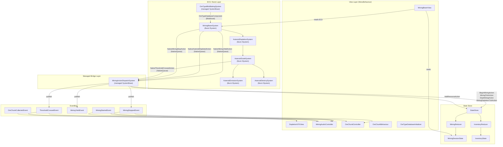

# Mining System

## 1. Purpose

The Mining system implements the core extraction gameplay loop: targeting an asteroid, firing a mining beam, computing yield based on ore properties and ship stats, depleting asteroid mass with visual feedback (color shift, scaling, emission glow, crumble pauses, fade-out destruction), and delivering extracted ore to the player's inventory. It spans both the Burst-compiled ECS simulation layer (beam physics, depletion math, visual systems) and the managed MonoBehaviour view layer (beam rendering, VFX particles, spatial audio, cosmetic ore chunks).

## 2. Architecture Diagram

## 3. State Shape

### MiningSessionState (sealed record)

Defined in `Assets/Core/State/MiningState.cs`, namespace `VoidHarvest.Core.State`.

| Field              | Type           | Description                                       |
|--------------------|----------------|---------------------------------------------------|
| TargetAsteroidId   | Option\<int\>  | Entity index of the asteroid being mined           |
| ActiveOreId        | Option\<string\>| OreId string of the ore being extracted            |
| BeamEnergy         | float          | Current beam energy level [0, 1]                   |
| YieldAccumulator   | float          | Fractional yield accumulated across frames          |
| MiningDuration     | float          | Total seconds spent mining in this session          |
| BeamMaxRange       | float          | Maximum beam range in meters (default 50)           |
| DepletionFraction  | float          | Current asteroid depletion [0, 1] for HUD display  |

Static member `MiningSessionState.Empty` provides the default idle state.

### MiningYieldResult (sealed record)

| Field              | Type   | Description                             |
|--------------------|--------|-----------------------------------------|
| OreId              | string | Ore type identifier                      |
| WholeUnitsYielded  | int    | Whole units extracted this computation   |
| RemainingFraction  | float  | Fractional leftover for next accumulation|

## 4. Actions

All actions implement `IMiningAction : IGameAction` (defined in `Assets/Core/State/IMiningAction.cs`).

| Action                   | Fields                                                     | Description                                           |
|--------------------------|------------------------------------------------------------|-------------------------------------------------------|
| BeginMiningAction        | AsteroidId (int), OreId (string)                           | Starts a mining session on a target asteroid           |
| MiningTickAction         | DeltaTime, BaseYield, Hardness, Depth, ShipMiningPower     | Per-frame yield computation tick                       |
| StopMiningAction         | (none)                                                     | Ends the current mining session, resets to Empty       |
| MiningDepletionTickAction| DepletionFraction (float)                                  | Updates depletion fraction for HUD display             |

**Yield formula:** `(ShipMiningPower * BaseYield * DeltaTime) / (Hardness * (1 + Depth))`

Zero hardness guard returns zero yield.

## 5. ScriptableObject Configs

### OreDefinition

**Menu path:** `VoidHarvest/Mining/Ore Definition`
**File:** `Assets/Features/Mining/Data/OreDefinition.cs`

| Field                    | Type                  | Description                                         |
|--------------------------|-----------------------|-----------------------------------------------------|
| OreId                    | string                | Unique ore identifier (e.g., "luminite")            |
| DisplayName              | string                | Human-readable name for HUD/inventory               |
| RarityTier               | OreRarityTier         | Common, Uncommon, or Rare                           |
| Icon                     | Sprite                | Inventory/UI icon (nullable)                        |
| BaseValue                | int                   | Base market value per unit in credits                |
| Description              | string (TextArea)     | Flavor text for tooltips                            |
| RarityWeight             | float [0, 1]          | Default spawn probability weight                    |
| BaseYieldPerSecond       | float                 | Base ore yield per second before modifiers           |
| Hardness                 | float                 | Extraction difficulty multiplier                    |
| VolumePerUnit            | float                 | Cargo volume consumed per unit mined                |
| BeamColor                | Color                 | Mining laser color for this ore                     |
| BaseProcessingTimePerUnit| float                 | Refining time per unit in seconds                   |
| RefiningOutputs          | RefiningOutputEntry[] | Raw material outputs from refining                  |
| RefiningCreditCostPerUnit| int                   | Credit cost per unit refined                        |

### OreChunkConfig

**Menu path:** `VoidHarvest/Mining/Ore Chunk Config`
**File:** `Assets/Features/Mining/Data/OreChunkConfig.cs`

| Field                 | Type  | Default | Description                              |
|-----------------------|-------|---------|------------------------------------------|
| SpawnIntervalMin      | float | 3.0     | Minimum seconds between chunk spawns     |
| SpawnIntervalMax      | float | 7.0     | Maximum seconds between chunk spawns     |
| ChunksPerSpawnMin     | int   | 2       | Min chunks per burst                     |
| ChunksPerSpawnMax     | int   | 5       | Max chunks per burst                     |
| ChunkScaleMin         | float | 0.03    | Smallest chunk scale                     |
| ChunkScaleMax         | float | 0.12    | Largest chunk scale                      |
| InitialDriftDuration  | float | 0.75    | Seconds of outward drift phase           |
| InitialDriftSpeed     | float | 2.0     | Outward drift speed (m/s)               |
| AttractionSpeed       | float | 8.0     | Max attraction speed toward barge (m/s) |
| AttractionAcceleration| float | 3.0     | Attraction ramp-up (m/s^2)              |
| CollectionFlashDuration| float| 0.15    | Flash duration on arrival (seconds)     |
| MaxLifetime           | float | 5.0     | Force-despawn safety timeout (seconds)   |
| GlowIntensity         | float | 2.0     | Emission intensity on chunks             |

### MiningVFXConfig

**Menu path:** `VoidHarvest/Mining/Mining VFX Config`
**File:** `Assets/Features/Mining/Data/MiningVFXConfig.cs`

| Field              | Type  | Default | Description                              |
|--------------------|-------|---------|------------------------------------------|
| BeamWidth          | float | 0.15    | LineRenderer width in meters             |
| BeamPulseSpeed     | float | 3.0     | Pulse animation cycles per second        |
| BeamPulseAmplitude | float | 0.3     | Width oscillation range [0, 1]           |
| SparkEmissionRate  | int   | 15      | Sparks per second at impact              |
| SparkLifetime      | float | 0.4     | Spark particle lifetime (seconds)        |
| SparkSpeed         | float | 3.0     | Initial outward spark velocity (m/s)    |
| HeatHazeIntensity  | float | 0.5     | Distortion quad opacity [0, 1]           |
| HeatHazeScale      | float | 0.3     | Distortion quad size (meters)            |

### MiningAudioConfig

**Menu path:** `VoidHarvest/Mining/Mining Audio Config`
**File:** `Assets/Features/Mining/Data/MiningAudioConfig.cs`

| Field                   | Type      | Default | Description                              |
|-------------------------|-----------|---------|------------------------------------------|
| LaserHumClip            | AudioClip | null    | Looping beam sound (procedural if null)  |
| LaserHumBaseVolume      | float     | 0.6     | Base volume [0, 1]                       |
| LaserHumPitchMin        | float     | 0.8     | Pitch at 0% depletion                   |
| LaserHumPitchMax        | float     | 1.4     | Pitch at 100% depletion                 |
| LaserHumFadeOutDuration | float     | 0.3     | Fade-out on stop (seconds)              |
| SparkCrackleClip        | AudioClip | null    | Impact sound (procedural if null)        |
| SparkCrackleVolume      | float     | 0.4     | Impact volume [0, 1]                     |
| CrumbleRumbleClip       | AudioClip | null    | Threshold sound (procedural if null)     |
| CrumbleRumbleVolume     | float     | 0.7     | Crumble volume [0, 1]                   |
| ExplosionClip           | AudioClip | null    | Destruction sound (procedural if null)   |
| ExplosionVolume         | float     | 0.8     | Explosion volume [0, 1]                 |
| CollectionClinkClip     | AudioClip | null    | Chunk arrival sound (procedural if null) |
| CollectionClinkVolume   | float     | 0.3     | Collection volume [0, 1]                 |
| MaxAudibleDistance       | float     | 100.0   | 3D spatial rolloff distance (meters)    |

### DepletionVFXConfig

**Menu path:** `VoidHarvest/Mining/Depletion VFX Config`
**File:** `Assets/Features/Mining/Data/DepletionVFXConfig.cs`

| Field                  | Type    | Default          | Description                                  |
|------------------------|---------|------------------|----------------------------------------------|
| VeinGlowMinIntensity   | float   | 0.0              | Emission intensity at 0% depletion           |
| VeinGlowMaxIntensity   | float   | 0.6              | Emission intensity at 100% depletion         |
| VeinGlowColor          | Color   | (1, 0.8, 0.4, 1)| Base emission color (warm)                   |
| VeinGlowPulseSpeed     | float   | 1.5              | Glow pulse cycles per second                 |
| VeinGlowPulseAmplitude | float   | 0.15             | Pulse oscillation range [0, 1]               |
| CrumbleBurstCountBase  | int     | 8                | Particles at 25% threshold                   |
| CrumbleBurstCountScale | float   | 1.5              | Multiplier per threshold tier                |
| CrumbleBurstSpeed      | float   | 5.0              | Outward velocity (m/s)                      |
| CrumbleBurstLifetime   | float   | 0.5              | Particle lifetime (seconds)                  |
| CrumbleFlashDuration   | float   | 0.3              | Flash intensity ramp (seconds)               |
| FragmentCount          | int     | 12               | Fragments on final explosion [8-15]          |
| FragmentSpeed          | float   | 4.0              | Outward velocity (m/s)                      |
| FragmentLifetime       | float   | 3.0              | Time to fade and disappear (seconds)         |
| FragmentScaleRange     | Vector2 | (0.05, 0.2)      | Min/max scale for fragments                  |

## 6. ECS Components

### IComponentData

| Component                      | File                      | Fields                                                                                     | Description                                              |
|-------------------------------|---------------------------|---------------------------------------------------------------------------------------------|----------------------------------------------------------|
| MiningBeamComponent            | MiningComponents.cs       | TargetAsteroid (Entity), BeamEnergy (float), MiningPower (float), MaxRange (float), Active (bool) | Mining beam on the ship entity                           |
| AsteroidComponent              | MiningComponents.cs       | Radius, InitialMass, RemainingMass, Depletion, PristineTintedColor (float4), CrumbleThresholdsPassed (byte), CrumblePauseTimer, FadeOutTimer, MeshNormFactor, MeshIndex | Per-asteroid simulation and visual state                 |
| AsteroidOreComponent           | MiningComponents.cs       | OreTypeId (int), Quantity (float), Depth (float)                                            | Ore type and quantity on an asteroid entity               |
| AsteroidVisualMappingSingleton | MiningComponents.cs       | MinScaleFraction (float)                                                                    | Singleton config for minimum depletion scale              |
| AsteroidEmissionComponent      | AsteroidEmissionComponent.cs | Value (float4) [MaterialProperty("_EmissionColor")]                                      | Per-entity emission color for vein glow                   |
| AsteroidGlowFadeComponent      | AsteroidEmissionComponent.cs | Value (float)                                                                             | Glow fade multiplier [0, 1] per asteroid                  |
| OreTypeDatabaseComponent       | OreTypeBlob.cs            | Database (BlobAssetReference\<OreTypeBlobDatabase\>)                                        | Singleton holding the baked ore type BlobAsset             |
| MiningActionBufferSingleton    | NativeMiningActions.cs    | (tag-only)                                                                                  | Marks the entity owning NativeQueues                      |

### BlobAssets

| BlobAsset           | Fields                                          | Description                              |
|---------------------|-------------------------------------------------|------------------------------------------|
| OreTypeBlob         | BaseYieldPerSecond, Hardness, VolumePerUnit      | Per-ore-type data for Burst access        |
| OreTypeBlobDatabase | OreTypes (BlobArray\<OreTypeBlob\>)              | Array of all baked ore type entries        |

### NativeQueue Action Structs (Burst-to-managed bridge)

| Struct                       | Fields                                           | Description                              |
|------------------------------|--------------------------------------------------|------------------------------------------|
| NativeMiningYieldAction      | SourceAsteroid (Entity), OreTypeId (int), Amount  | Yield data from Burst to managed layer    |
| NativeAsteroidDepletedAction | Asteroid (Entity)                                 | Asteroid fully depleted signal            |
| NativeMiningStopAction       | SourceAsteroid (Entity), Reason (int)             | Mining stopped signal (reason as int)     |
| NativeThresholdCrossedAction | Asteroid (Entity), ThresholdIndex (byte), Position (float3), Radius | Depletion threshold crossed signal |

## 7. Events

All events are `readonly struct` types published via `IEventBus`. Defined in `Assets/Core/EventBus/Events/`.

| Event                  | Fields                                              | Published By                  | Subscribed By                        |
|------------------------|-----------------------------------------------------|-------------------------------|--------------------------------------|
| MiningStartedEvent     | AsteroidId (int), OreId (string)                    | InputBridge                   | MiningAudioController, OreChunkController |
| MiningStoppedEvent     | AsteroidId (int), Reason (StopReason)               | MiningActionDispatchSystem     | MiningAudioController, OreChunkController, HUDWarningView |
| MiningYieldEvent       | OreId (string), Quantity (int)                      | MiningActionDispatchSystem     | HUDView                              |
| ThresholdCrossedEvent  | AsteroidId (int), ThresholdIndex (byte), Position (float3), AsteroidRadius (float) | MiningActionDispatchSystem | DepletionVFXView, MiningAudioController |
| OreChunkCollectedEvent | Position (float3), OreId (string)                   | OreChunkBehaviour              | MiningAudioController                |

### StopReason enum

| Value           | Description                              |
|-----------------|------------------------------------------|
| PlayerStopped   | Player manually stopped mining           |
| OutOfRange      | Ship moved beyond beam max range         |
| AsteroidDepleted| Asteroid mass depleted to zero           |
| CargoFull       | Inventory volume capacity reached        |

## 8. Assembly Dependencies

**Assembly:** `VoidHarvest.Features.Mining`

| Dependency                       | Purpose                                      |
|----------------------------------|----------------------------------------------|
| VoidHarvest.Core.Extensions      | Option\<T\>, TargetType enum                 |
| VoidHarvest.Core.State           | IStateStore, MiningSessionState, actions      |
| VoidHarvest.Core.EventBus        | IEventBus, event structs                      |
| VoidHarvest.Features.Ship        | PlayerControlledTag, ShipPositionComponent, ShipConfigComponent |
| VoidHarvest.Features.Resources   | RawMaterialDefinition (for RefiningOutputEntry)|
| Unity.Entities                   | ISystem, SystemBase, IComponentData           |
| Unity.Entities.Graphics          | URPMaterialPropertyBaseColor, RenderMeshArray |
| Unity.Mathematics                | float3, float4, math, Random                  |
| Unity.Burst                      | [BurstCompile]                               |
| Unity.Collections                | NativeQueue, NativeArray, Allocator           |
| Unity.Transforms                 | LocalTransform                                |
| VContainer                       | [Inject] for view-layer DI                   |
| UniTask                          | Async EventBus subscriptions                  |

## 9. Key Types

| Type                         | Layer   | Role                                                         |
|------------------------------|---------|--------------------------------------------------------------|
| MiningReducer                | Systems | Pure static reducer: (MiningSessionState, IMiningAction) -> MiningSessionState |
| MiningBeamSystem             | Systems | Burst ISystem: beam range check, yield computation, mass subtraction |
| AsteroidDepletionSystem      | Systems | Burst ISystem: computes depletion fraction, writes base color |
| AsteroidScaleSystem          | Systems | Burst ISystem: mass-proportional scaling, threshold detection, crumble pauses |
| AsteroidEmissionSystem       | Systems | Burst ISystem: vein glow emission with pulse modulation      |
| AsteroidDestroySystem        | Systems | Burst ISystem: fade-out alpha interpolation, entity destruction |
| OreTypeBlobBakingSystem      | Systems | Managed SystemBase: bakes OreDefinition[] into OreTypeBlobDatabase BlobAsset |
| MiningActionDispatchSystem   | Systems | Managed SystemBase: drains NativeQueues, dispatches to StateStore/EventBus |
| AsteroidDepletionFormulas    | Systems | Pure static math: scale, threshold detection, fade alpha      |
| MiningVFXFormulas            | Systems | Pure static math: beam pulse, spark color, emission, audio pitch |
| MiningBeamView               | Views   | MonoBehaviour: LineRenderer beam, impact sparks, heat shimmer |
| DepletionVFXView             | Views   | MonoBehaviour: crumble burst particles, fragment explosion    |
| MiningAudioController        | Views   | MonoBehaviour: 3 AudioSources (hum, impact, event) with spatial 3D audio |
| OreChunkController           | Views   | MonoBehaviour: spawns pooled ore chunks during active mining  |
| OreChunkBehaviour            | Views   | MonoBehaviour: per-chunk lifecycle (drift -> bezier attract -> collect) |
| OreTypeDatabaseInitializer   | Views   | MonoBehaviour: scene bootstrap for OreTypeBlobBakingSystem    |
| ProceduralAudioGenerator     | Views   | Static: generates placeholder AudioClips when no designer audio assigned |
| ProceduralParticleTextures   | Views   | Static: generates placeholder particle textures at runtime    |
| OreDefinition                | Data    | ScriptableObject: all static data for an ore type             |
| OreChunkConfig               | Data    | ScriptableObject: chunk spawn/drift/attraction parameters    |
| MiningVFXConfig              | Data    | ScriptableObject: beam visual effect parameters              |
| MiningAudioConfig            | Data    | ScriptableObject: audio clip references and volume/pitch     |
| DepletionVFXConfig           | Data    | ScriptableObject: vein glow, crumble, fragment VFX parameters|
| OreDisplayNames              | Data    | Static registry: OreTypeId int -> display name string         |
| OreDefinitionRegistry        | Data    | Static registry: OreId string -> OreDefinition SO             |
| AsteroidMeshRegistry         | Data    | Static registry: mesh index -> Mesh for collider proxies      |
| OreRarityTier                | Data    | Enum: Common, Uncommon, Rare                                  |
| RefiningOutputEntry          | Data    | Serializable struct: refining output material + yield variance |

## 10. Designer Notes

### What designers can change without code

- **Add new ore types:** Create a new OreDefinition asset via `Create > VoidHarvest > Mining > Ore Definition`. Set OreId, DisplayName, RarityTier, yield/hardness/volume parameters, BeamColor, and refining outputs. Add it to the OreTypeDatabaseInitializer array in the scene and to the relevant AsteroidFieldDefinition OreEntries array.

- **Tune mining feel:** Adjust `BaseYieldPerSecond` and `Hardness` on each OreDefinition to control extraction speed. Higher hardness = slower mining. The `Depth` field on asteroids adds further difficulty scaling at runtime.

- **Adjust beam visuals:** Edit the MiningVFXConfig asset to change beam width, pulse speed/amplitude, spark rate/lifetime, and heat shimmer intensity/scale.

- **Adjust depletion visuals:** Edit the DepletionVFXConfig asset to change vein glow intensity/color/pulse, crumble burst particle counts/speed, and fragment explosion parameters. Depletion color lerps from ore-tinted pristine to dark gray using a sqrt ease-in curve.

- **Tune audio:** Edit the MiningAudioConfig asset. Assign custom AudioClips to any of the 5 audio slots (LaserHum, SparkCrackle, CrumbleRumble, Explosion, CollectionClink). If left null, procedural placeholder audio is generated automatically. Adjust volume and pitch ranges per cue.

- **Ore chunk behavior:** Edit the OreChunkConfig asset to change spawn timing (interval range, chunks per burst), chunk appearance (scale range, glow intensity), drift/attraction physics (speeds, durations), and collection feedback.

- **Depletion thresholds:** Crumble pauses occur at 25%, 50%, 75%, and 100% depletion. The pause duration (0.5s) and fade-out duration (0.5s) are constants in `AsteroidDepletionFormulas`. Changing these requires a code edit.

### Asset paths

| Asset                 | Path                                                    |
|-----------------------|---------------------------------------------------------|
| Luminite OreDefinition| `Assets/Features/Mining/Data/Luminite.asset`            |
| Ferrox OreDefinition  | `Assets/Features/Mining/Data/Ferrox.asset`              |
| Auralite OreDefinition| `Assets/Features/Mining/Data/Auralite.asset`            |
| OreChunkConfig        | `Assets/Features/Mining/Data/OreChunkConfig.asset`      |
| MiningVFXConfig       | `Assets/Features/Mining/Data/MiningVFXConfig.asset`     |
| MiningAudioConfig     | `Assets/Features/Mining/Data/MiningAudioConfig.asset`   |
| DepletionVFXConfig    | `Assets/Features/Mining/Data/DepletionVFXConfig.asset`  |

### Cross-references

- [Architecture Overview](../architecture/overview.md)
- [Procedural System](procedural.md) -- asteroid field generation feeds mining targets
- [Resources System](resources.md) -- mining yield flows into InventoryState
- [Station Services](station-services.md) -- refining uses OreDefinition.RefiningOutputs
