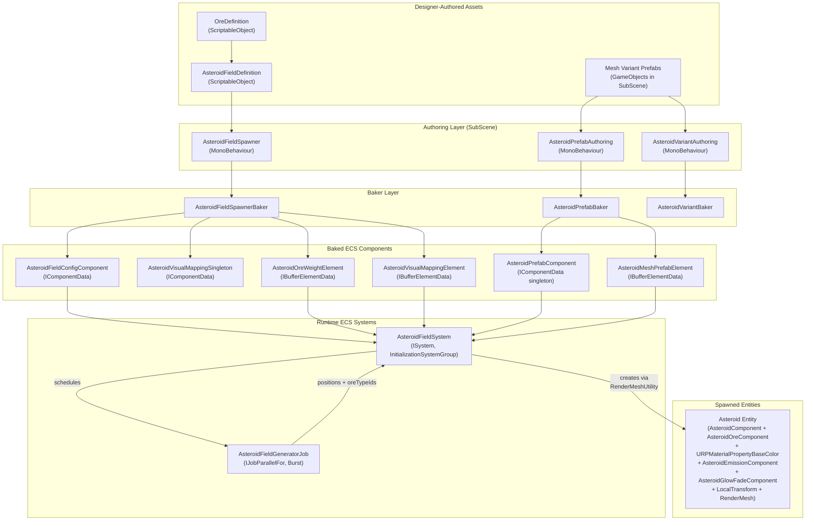

# Procedural System

## 1. Purpose

The Procedural system generates asteroid fields at scene load time using data-driven configuration. An AsteroidFieldDefinition ScriptableObject defines the field parameters (count, radius, ore composition, mesh variants, tint colors), which are baked into ECS components via the authoring/baker pipeline. A Burst-compiled parallel job generates deterministic positions and ore assignments, and the AsteroidFieldSystem creates fully-configured asteroid entities with per-instance material properties for rendering via Entities Graphics.

## 2. Architecture Diagram

## 3. State Shape

The Procedural system has no managed state record. All configuration is baked into ECS components at SubScene bake time, and the generation job produces entities directly. There is no reducer and no runtime state mutation beyond the one-time entity creation.

## 4. Actions

None. The Procedural system is a one-shot initialization system with no reducer or actions.

## 5. ScriptableObject Configs

### AsteroidFieldDefinition

**Menu path:** `VoidHarvest/Procedural/Asteroid Field Definition`
**File:** `Assets/Features/Procedural/Data/AsteroidFieldDefinition.cs`

| Field            | Type              | Description                                             |
|------------------|-------------------|---------------------------------------------------------|
| FieldName        | string            | Human-readable field name                               |
| OreEntries       | OreFieldEntry[]   | Ore types with weights and visual mappings              |
| AsteroidCount    | int               | Number of asteroids to spawn                            |
| FieldRadius      | float             | Spherical field radius in meters                        |
| AsteroidSizeMin  | float             | Minimum asteroid radius                                 |
| AsteroidSizeMax  | float             | Maximum asteroid radius                                 |
| RotationSpeedMin | float             | Minimum rotation speed (deg/s)                          |
| RotationSpeedMax | float             | Maximum rotation speed (deg/s)                          |
| Seed             | uint              | Deterministic RNG seed (same seed = identical field)    |
| MinScaleFraction | float [0.1, 0.5]  | Minimum asteroid scale at full depletion (default 0.3)  |

Static method `NormalizeWeights(OreFieldEntry[])` normalizes ore entry weights to probabilities at runtime.

### OreFieldEntry (serializable struct)

**File:** `Assets/Features/Procedural/Data/OreFieldEntry.cs`

| Field          | Type          | Description                                        |
|----------------|---------------|----------------------------------------------------|
| OreDefinition  | OreDefinition | Reference to the ore type ScriptableObject          |
| Weight         | float         | Relative spawn weight (normalized at runtime)       |
| MeshVariantA   | Mesh          | First mesh variant for visual variety               |
| MeshVariantB   | Mesh          | Second mesh variant for visual variety              |
| TintColor      | Color         | Ore-specific tint applied to asteroid material      |

## 6. ECS Components

### IComponentData

| Component                      | File                        | Fields                                              | Description                                             |
|-------------------------------|-----------------------------|-----------------------------------------------------|---------------------------------------------------------|
| AsteroidFieldConfigComponent   | AsteroidFieldSpawner.cs     | Count (int), Radius (float), Seed (uint), SizeMin, SizeMax, RotationMin, RotationMax | Baked spatial configuration for a field |
| AsteroidVisualMappingSingleton | MiningComponents.cs*        | MinScaleFraction (float)                            | Singleton: minimum scale at full depletion              |
| AsteroidPrefabComponent        | AsteroidPrefabAuthoring.cs  | Prefab (Entity)                                     | Singleton: default asteroid prefab entity reference     |

*Note: AsteroidVisualMappingSingleton is defined in the Mining assembly but baked by the Procedural baker.

### IBufferElementData

| Buffer Element               | File                        | Fields                                              | Description                                             |
|-----------------------------|-----------------------------|-----------------------------------------------------|---------------------------------------------------------|
| AsteroidOreWeightElement     | AsteroidFieldSpawner.cs     | NormalizedWeight (float), OreTypeIndex (int)         | Normalized ore spawn probability per entry              |
| AsteroidVisualMappingElement | AsteroidPrefabAuthoring.cs  | TintColor (float4), MeshVariantAIndex (int), MeshVariantBIndex (int) | Baked tint color and mesh variant indices per ore type |
| AsteroidMeshPrefabElement    | AsteroidPrefabAuthoring.cs  | Prefab (Entity)                                     | Mesh variant prefab entity reference                    |

### Spawned Entity Archetype

Each spawned asteroid entity has the following components (added by AsteroidFieldSystem):

| Component                     | Source                                |
|-------------------------------|---------------------------------------|
| LocalTransform                | Position from job, scale from radius * meshNormFactor |
| LocalToWorld                  | Computed from LocalTransform          |
| RenderMesh (via RenderMeshUtility) | Mesh + material from variant lookup |
| AsteroidComponent             | From Mining.Data (radius, mass, depletion fields) |
| AsteroidOreComponent          | OreTypeId from job, quantity = mass, depth = random |
| URPMaterialPropertyBaseColor  | Pristine tinted color from ore visual mapping |
| AsteroidEmissionComponent     | Initialized to zero (no glow)         |
| AsteroidGlowFadeComponent    | Initialized to zero (no fade)         |

## 7. Events

None. The Procedural system does not publish or subscribe to any events. It operates entirely within the ECS initialization pipeline.

## 8. Assembly Dependencies

**Assembly:** `VoidHarvest.Features.Procedural`

| Dependency                       | Purpose                                         |
|----------------------------------|-------------------------------------------------|
| VoidHarvest.Core.Extensions      | Shared utilities                                 |
| VoidHarvest.Core.State           | (transitive, not directly used)                  |
| VoidHarvest.Features.Mining      | AsteroidComponent, AsteroidOreComponent, AsteroidEmissionComponent, AsteroidGlowFadeComponent, AsteroidVisualMappingSingleton, AsteroidMeshRegistry |
| Unity.Entities                   | ISystem, IComponentData, IBufferElementData, Baker |
| Unity.Entities.Graphics          | URPMaterialPropertyBaseColor, RenderMeshArray, RenderMeshUtility |
| Unity.Entities.Hybrid            | Hybrid authoring support                         |
| Unity.Mathematics                | float3, float4, math, Random, quaternion          |
| Unity.Burst                      | [BurstCompile] on generator job                  |
| Unity.Collections                | NativeArray, NativeList, Allocator                |
| Unity.Transforms                 | LocalTransform, LocalToWorld                      |

## 9. Key Types

| Type                          | Layer   | Role                                                         |
|-------------------------------|---------|--------------------------------------------------------------|
| AsteroidFieldDefinition       | Data    | ScriptableObject: complete field configuration (count, radius, ores, visuals) |
| OreFieldEntry                 | Data    | Serializable struct: ore + weight + mesh variants + tint per field entry |
| AsteroidFieldSystem           | Systems | ISystem: orchestrates one-shot field generation at initialization |
| AsteroidFieldGeneratorJob     | Systems | Burst IJobParallelFor: deterministic position + ore assignment generation |
| AsteroidVisualMappingHelper   | Systems | Pure static helpers: mesh variant selection (position hash), tint calculation |
| AsteroidFieldSpawner          | Views   | MonoBehaviour authoring: references AsteroidFieldDefinition   |
| AsteroidFieldSpawnerBaker     | Views   | Baker: bakes field config + ore weights + visual mapping into ECS |
| AsteroidPrefabAuthoring       | Views   | MonoBehaviour authoring: references mesh variant prefabs      |
| AsteroidPrefabBaker           | Views   | Baker: bakes prefab entities (single or multi-prefab mode)    |
| AsteroidVariantAuthoring      | Views   | MonoBehaviour authoring: marks mesh variant GameObjects        |
| AsteroidVariantBaker          | Views   | Baker: adds Prefab tag + asteroid ECS components to variants   |
| AsteroidFieldConfigComponent  | ECS     | Baked spatial configuration for a field                        |
| AsteroidOreWeightElement      | ECS     | Buffer: normalized ore spawn weights                           |
| AsteroidVisualMappingElement  | ECS     | Buffer: tint color + mesh variant indices per ore type         |
| AsteroidPrefabComponent       | ECS     | Singleton: default prefab entity reference                     |
| AsteroidMeshPrefabElement     | ECS     | Buffer: mesh variant prefab entity references                  |

## 10. Designer Notes

### What designers can change without code

- **Create a new asteroid field:** Create an AsteroidFieldDefinition asset via `Create > VoidHarvest > Procedural > Asteroid Field Definition`. Set AsteroidCount, FieldRadius, size ranges, rotation speed, and seed. Add OreFieldEntry items referencing existing OreDefinition assets.

- **Tune field density:** Adjust `AsteroidCount` and `FieldRadius` on the AsteroidFieldDefinition. More asteroids in a smaller radius = denser field.

- **Change ore distribution:** Adjust the `Weight` values on OreFieldEntry items. Weights are normalized to probabilities at runtime, so only relative values matter (e.g., weights 60/30/10 produce 60%/30%/10% distribution).

- **Add visual variety:** Assign different meshes to `MeshVariantA` and `MeshVariantB` on each OreFieldEntry. The system uses a position-based hash to deterministically select between A and B variants, ensuring spatial variety without neighboring asteroids looking identical.

- **Customize ore tint:** Set `TintColor` on each OreFieldEntry to control the per-ore color applied to asteroid material at spawn time. The pristine color is computed as `PristineGray * TintColor`.

- **Control depletion scaling:** Set `MinScaleFraction` on the AsteroidFieldDefinition (range 0.1--0.5, default 0.3). This controls how small asteroids shrink when fully depleted. Lower values = more dramatic shrinkage.

- **Deterministic fields:** The `Seed` field controls the RNG. The same seed always generates the identical field layout. Change the seed to get a different arrangement.

- **Multi-prefab vs single-prefab mode:** If `MeshVariantPrefabs` on AsteroidPrefabAuthoring is populated, the system uses per-ore mesh variants. If left empty, all asteroids use the single mesh from the AsteroidPrefabAuthoring GameObject's MeshFilter.

### Asset paths

| Asset                     | Path                                                        |
|---------------------------|-------------------------------------------------------------|
| DefaultField definition   | `Assets/Features/Procedural/Data/DefaultField.asset`        |

### SubScene setup

1. Place an `AsteroidFieldSpawner` on a GameObject in the AsteroidsSubScene and assign the AsteroidFieldDefinition.
2. Place an `AsteroidPrefabAuthoring` on a separate GameObject in the same SubScene. For multi-prefab mode, populate the `MeshVariantPrefabs` array with GameObjects that have `AsteroidVariantAuthoring` + MeshFilter + MeshRenderer.
3. On bake, the bakers convert the authored data into ECS components. At runtime, AsteroidFieldSystem runs once during initialization to spawn all asteroid entities.

### Cross-references

- [Architecture Overview](../architecture/overview.md)
- [Mining System](mining.md) -- spawned asteroids are targets for the mining beam
- [Resources System](resources.md) -- ore type IDs link to inventory resource stacks
