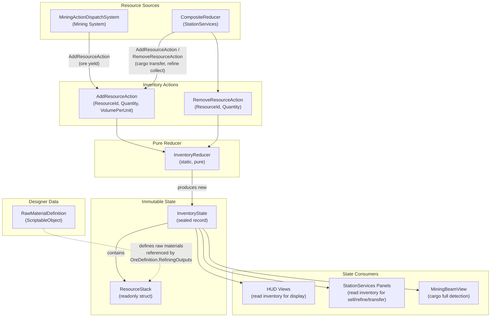

# Resources System

## 1. Purpose

The Resources system manages the player's cargo inventory as an immutable state slice. It tracks resource stacks (ore and raw materials) keyed by string ID, enforces volume capacity and slot limits, and exposes a pure reducer for adding/removing resources. The system operates entirely in the managed layer with no ECS components, serving as the central data sink for mining yield and the source for station services (selling, refining, cargo transfer).

## 2. Architecture Diagram

## 3. State Shape

### InventoryState (sealed record)

Defined in `Assets/Core/State/InventoryState.cs`, namespace `VoidHarvest.Core.State`.

| Field         | Type                                          | Default | Description                                   |
|---------------|-----------------------------------------------|---------|-----------------------------------------------|
| Stacks        | ImmutableDictionary\<string, ResourceStack\>  | Empty   | Resource stacks keyed by ResourceId            |
| MaxSlots      | int                                           | 20      | Maximum number of distinct resource types      |
| MaxVolume     | float                                         | 100.0   | Maximum total cargo volume                     |
| CurrentVolume | float                                         | 0.0     | Current total cargo volume consumed            |

Static member `InventoryState.Empty` provides the default state with 20 slots and 100 volume.

`MaxSlots` is set at startup from `ShipArchetypeConfig.CargoSlots` (see Spec 009: Data-Driven World Config).

### ResourceStack (readonly struct)

| Field        | Type   | Description                              |
|--------------|--------|------------------------------------------|
| ResourceId   | string | Unique identifier (ore ID or material ID)|
| Quantity     | int    | Number of units in this stack            |
| VolumePerUnit| float  | Cargo volume consumed per unit           |

## 4. Actions

All actions implement `IInventoryAction : IGameAction` (defined in `Assets/Core/State/IInventoryAction.cs`).

| Action              | Fields                                    | Description                                             |
|---------------------|-------------------------------------------|---------------------------------------------------------|
| AddResourceAction   | ResourceId (string), Quantity (int), VolumePerUnit (float) | Adds units to inventory. Rejected if volume would exceed MaxVolume or if a new stack would exceed MaxSlots. |
| RemoveResourceAction| ResourceId (string), Quantity (int)       | Removes units from inventory. Rejected if insufficient stock. Removes the stack entry entirely when quantity reaches zero. |

### Rejection rules

- **AddResourceAction** is a no-op (returns unchanged state) when:
  - `Quantity <= 0`
  - `CurrentVolume + (Quantity * VolumePerUnit) > MaxVolume`
  - ResourceId is not already in Stacks AND `Stacks.Count >= MaxSlots`

- **RemoveResourceAction** is a no-op when:
  - ResourceId is not found in Stacks
  - Existing quantity is less than requested removal amount

## 5. ScriptableObject Configs

### RawMaterialDefinition

**Menu path:** `VoidHarvest/Station/Raw Material Definition`
**File:** `Assets/Features/Resources/Data/RawMaterialDefinition.cs`

| Field        | Type           | Description                                        |
|--------------|----------------|----------------------------------------------------|
| MaterialId   | string         | Unique identifier (e.g., "luminite_ingots")        |
| DisplayName  | string         | Human-readable name shown in UI                    |
| Icon         | Sprite         | Inventory/UI icon                                  |
| Description  | string (TextArea)| Flavor text for tooltips                         |
| BaseValue    | int            | Sell price per unit in credits                     |
| VolumePerUnit| float          | Cargo volume consumed per unit                     |

OnValidate warns if MaterialId or DisplayName is empty.

## 6. ECS Components

None. The Resources system operates entirely in the managed layer. Inventory state is stored in the central StateStore as an immutable record, not as ECS components. This is deliberate: inventory mutations are infrequent (once per yield tick, not per-frame), so Burst/Jobs optimization is unnecessary, and the immutable record pattern provides stronger correctness guarantees.

## 7. Events

None. The Resources system does not publish or subscribe to any events. Inventory state changes are observed by consumers via StateStore subscriptions (reactive state observation). Related events like `MiningYieldEvent` are published by the Mining system, not the Resources system.

## 8. Assembly Dependencies

**Assembly:** `VoidHarvest.Features.Resources`

| Dependency                  | Purpose                                         |
|-----------------------------|-------------------------------------------------|
| VoidHarvest.Core.Extensions | Shared utilities                                 |
| VoidHarvest.Core.State      | IInventoryAction, InventoryState, ResourceStack, AddResourceAction, RemoveResourceAction |
| VoidHarvest.Core.EventBus   | (referenced but not directly used by reducer)    |

The Resources assembly has no Unity DOTS dependencies (no Entities, no Burst, no Mathematics). It is a pure managed-layer assembly with minimal coupling.

## 9. Key Types

| Type                  | Layer   | Role                                                          |
|-----------------------|---------|---------------------------------------------------------------|
| InventoryReducer      | Systems | Pure static reducer: (InventoryState, IInventoryAction) -> InventoryState |
| InventoryState        | State*  | Sealed record: immutable inventory state with stacks, slots, volume |
| ResourceStack         | State*  | Readonly struct: single resource type stack (id, quantity, volume) |
| AddResourceAction     | State*  | Sealed record: adds resource units with volume accounting      |
| RemoveResourceAction  | State*  | Sealed record: removes resource units with stack cleanup       |
| IInventoryAction      | State*  | Marker interface: routes actions to InventoryReducer           |
| RawMaterialDefinition | Data    | ScriptableObject: static data for processed material types     |

*State types are defined in the `VoidHarvest.Core.State` assembly, not in the Resources assembly itself. The Resources assembly contains only the reducer and the RawMaterialDefinition SO.

## 10. Designer Notes

### What designers can change without code

- **Add new raw materials:** Create a new RawMaterialDefinition asset via `Create > VoidHarvest > Station > Raw Material Definition`. Set MaterialId, DisplayName, Icon, Description, BaseValue, and VolumePerUnit. Then reference it from an OreDefinition's `RefiningOutputs` array to make it a refining product.

- **Adjust cargo capacity:** MaxSlots is configured per ship archetype via `ShipArchetypeConfig.CargoSlots`. MaxVolume is set at startup. To change the default, modify the ship archetype config assets.

- **Balance resource volumes:** Each resource type has a `VolumePerUnit` that controls how much cargo space it consumes. Ore VolumePerUnit is set on OreDefinition; raw material VolumePerUnit is set on RawMaterialDefinition. Lower volume = more can be carried. This creates meaningful trade-offs between mining common (low-value, low-volume) vs rare (high-value, high-volume) ores.

- **Display names:** ResourceId strings are used as keys in the inventory dictionary. Display names for UI come from OreDefinition.DisplayName (for ores) and RawMaterialDefinition.DisplayName (for processed materials), resolved at runtime via OreDefinitionRegistry.GetDisplayName().

### Asset paths

| Asset                    | Path                                                          |
|--------------------------|---------------------------------------------------------------|
| LuminiteIngots           | `Assets/Features/Station/Data/RawMaterials/LuminiteIngots.asset` |
| EnergiumDust             | `Assets/Features/Station/Data/RawMaterials/EnergiumDust.asset`   |
| FerroxSlabs              | `Assets/Features/Station/Data/RawMaterials/FerroxSlabs.asset`    |
| ConductiveResidue        | `Assets/Features/Station/Data/RawMaterials/ConductiveResidue.asset` |
| AuraliteShards           | `Assets/Features/Station/Data/RawMaterials/AuraliteShards.asset` |
| QuantumEssence           | `Assets/Features/Station/Data/RawMaterials/QuantumEssence.asset` |

### Key invariants

1. **Volume accounting is always consistent:** CurrentVolume is recomputed on every add/remove operation, never stored independently. Adding N units of resource R increases CurrentVolume by `N * VolumePerUnit`; removing decreases by the same formula.

2. **Stack cleanup:** When a RemoveResourceAction reduces a stack to zero quantity, the stack entry is removed entirely from the ImmutableDictionary, freeing a slot.

3. **No partial adds:** AddResourceAction is all-or-nothing. If the requested volume would exceed MaxVolume, the entire add is rejected (state unchanged). There is no "add as much as fits" behavior.

4. **Immutability guarantee:** InventoryState is a sealed record; ResourceStack is a readonly struct. No code path can mutate inventory in place. Every state transition produces a new record via `with` expressions.

### Cross-references

- [Architecture Overview](../architecture/overview.md)
- [Mining System](mining.md) -- mining yield dispatches AddResourceAction
- [Station Services](station-services.md) -- selling/refining/transferring reads and modifies inventory
