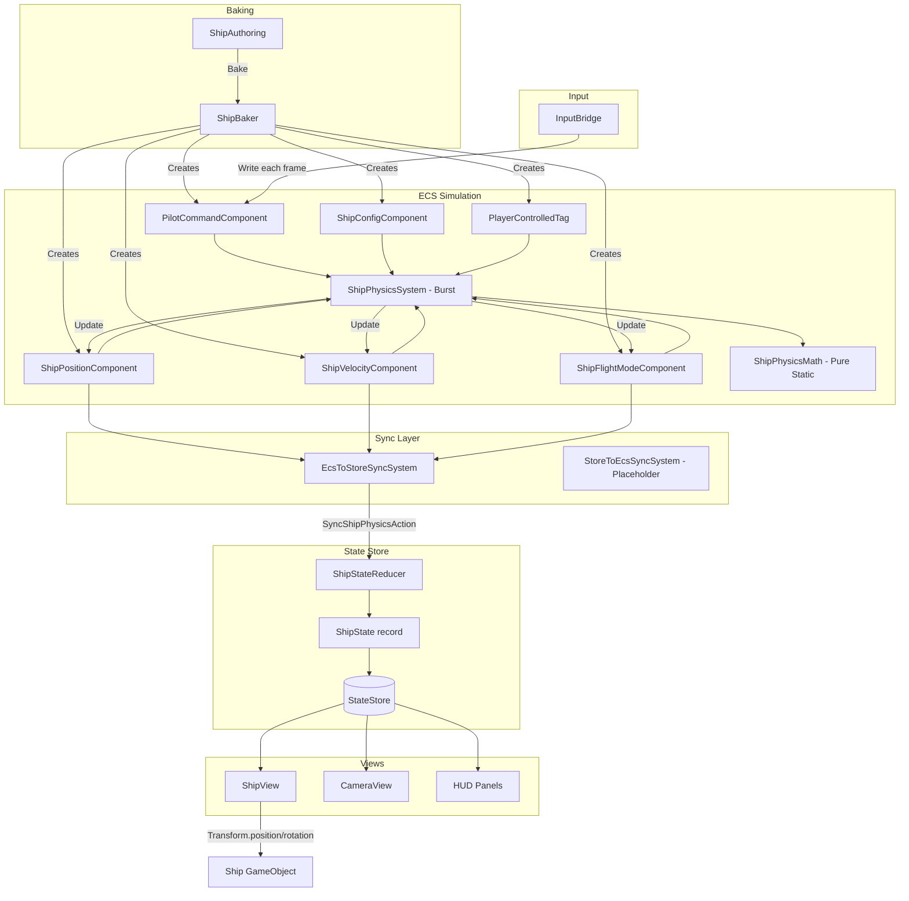
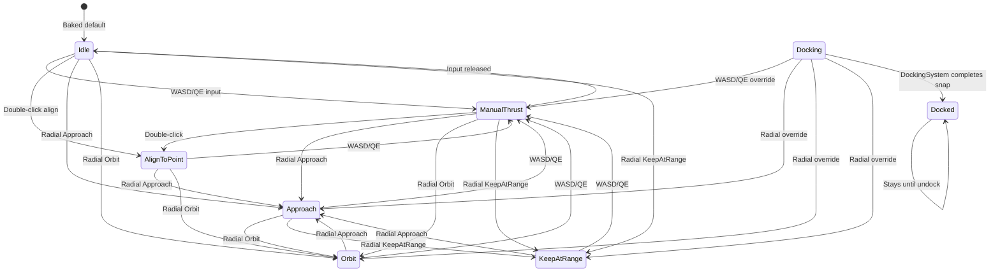

# Ship System

## 1. Purpose

The Ship system implements 6DOF Newtonian flight physics with EVE Online-inspired autopilot modes including align-to-point, approach, orbit, keep-at-range, docking, and manual thrust. The physics simulation runs in a Burst-compiled ECS system (`ShipPhysicsSystem`) for maximum performance, while the managed `ShipStateReducer` maintains an immutable state projection for HUD and UI consumption. A bidirectional sync pipeline bridges the ECS simulation and the state store.

## 2. Architecture Diagram



### Flight Mode State Machine



## 3. State Shape

### ShipState (immutable record)

**File:** `Assets/Core/State/ShipState.cs`

```csharp
public sealed record ShipState(
    float3     Position,         // World-space position (meters)
    quaternion Rotation,         // World-space rotation
    float3     Velocity,         // Linear velocity (m/s)
    float3     AngularVelocity,  // Angular velocity (rad/s)
    float      Mass,             // Ship mass (kg)
    float      MaxThrust,        // Maximum linear thrust (Newtons)
    float      MaxSpeed,         // Speed cap (m/s)
    float      RotationTorque,   // Maximum rotational torque
    float      LinearDamping,    // Linear velocity damping/s
    float      AngularDamping,   // Angular velocity damping/s
    ShipFlightMode FlightMode,   // Current flight automation mode
    float      HullIntegrity     // Hull health [0.0, 1.0]
);
```

Default: Position zero, identity rotation, zero velocity, Mass 1000, MaxThrust 5000, MaxSpeed 100, Idle mode, HullIntegrity 1.0.

### ShipFlightMode (enum)

**File:** `Assets/Core/State/ShipFlightMode.cs`

| Value | Description |
|-------|-------------|
| `Idle` | No active thrust or autopilot |
| `ManualThrust` | Player is providing WASD/QE input |
| `AlignToPoint` | Auto-rotate to face a double-clicked point |
| `Approach` | Auto-pilot: fly toward target, decelerate at distance |
| `Orbit` | Auto-pilot: maintain lateral orbit around target |
| `KeepAtRange` | Auto-pilot: maintain fixed radial distance from target |
| `Docking` | Automatic docking sequence (approach + snap) |
| `Docked` | Ship locked at station docking port |
| `Warp` | High-speed warp travel (Phase 1+) |

## 4. Actions

All actions implement `IShipAction : IGameAction`.

| Action | File | Parameters | Description |
|--------|------|-----------|-------------|
| `SyncShipPhysicsAction` | `Assets/Core/State/SyncShipPhysicsAction.cs` | `Position, Rotation, Velocity, AngularVelocity, FlightMode` | One-way ECS-to-Store projection dispatched each frame by `EcsToStoreSyncSystem` |
| `RepairHullAction` | `Assets/Core/State/RepairHullAction.cs` | `NewIntegrity` (float) | Sets hull integrity. Dispatched by `CompositeReducer` during repair or `DebugHullDamage`. |

The reducer is intentionally thin: ship physics runs in ECS, and the store-side state is a read-only projection for UI consumption.

## 5. ScriptableObject Configs

### ShipArchetypeConfig

**Path:** `Assets/Features/Ship/Data/ShipArchetypeConfig.cs`
**Menu:** `VoidHarvest/Ship/Ship Archetype Config`

| Field | Type | Default | Description |
|-------|------|---------|-------------|
| `ArchetypeId` | string | - | Unique identifier for this ship class |
| `DisplayName` | string | - | Human-readable name for HUD display |
| `Role` | ShipRole | - | Specialization enum (MiningBarge, Hauler, CombatScout, Explorer, Refinery) |
| `Mass` | float | - | Ship mass in kg for Newtonian F=ma |
| `MaxThrust` | float | - | Maximum linear thrust force in Newtons |
| `MaxSpeed` | float | - | Speed cap in m/s |
| `RotationTorque` | float | - | Maximum rotational torque |
| `LinearDamping` | float | - | Linear velocity damping per second |
| `AngularDamping` | float | - | Angular velocity damping per second |
| `MiningPower` | float | - | Mining yield multiplier |
| `ModuleSlots` | int | - | Number of module equipment slots (Phase 1+) |
| `CargoCapacity` | float | - | Maximum cargo volume in cubic meters |
| `CargoSlots` | int | 20 | Number of cargo inventory slots |
| `HullMesh` | Mesh | - | Visual hull mesh reference |
| `HullMaterial` | Material | - | Visual hull material reference |
| `BaseLockTime` | float | 1.5 | Seconds to acquire a target lock |
| `MaxTargetLocks` | int | 3 | Maximum simultaneous target locks |
| `MaxLockRange` | float | 5000 | Maximum range for lock acquisition (meters) |

Includes `OnValidate()` with warnings for invalid ranges on all numeric fields.

### ShipRole (enum)

`MiningBarge`, `Hauler`, `CombatScout`, `Explorer`, `Refinery`

**Existing archetype assets:**
- `StarterMiningBarge` -- lightweight, low cargo, fast
- `MediumMiningBarge` -- balanced
- `HeavyMiningBarge` -- high cargo, slow, high mining power

## 6. ECS Components

All components are defined in `Assets/Features/Ship/Data/ShipComponents.cs`. Each carries a `// CONSTITUTION DEVIATION: ECS mutable shell` comment acknowledging the necessary deviation from the immutability principle for the ECS simulation layer.

| Component | Type | Fields | Description |
|-----------|------|--------|-------------|
| `ShipPositionComponent` | `IComponentData` | `Position (float3)`, `Rotation (quaternion)` | Canonical world-space transform. Updated by `ShipPhysicsSystem` each frame. |
| `ShipVelocityComponent` | `IComponentData` | `Velocity (float3)`, `AngularVelocity (float3)` | Linear velocity (m/s) and angular velocity (rad/s). |
| `ShipConfigComponent` | `IComponentData` | `Mass`, `MaxThrust`, `MaxSpeed`, `RotationTorque`, `LinearDamping`, `AngularDamping`, `MiningPower` | Static configuration baked from `ShipAuthoring`. Read-only at runtime. |
| `ShipFlightModeComponent` | `IComponentData` | `Mode (ShipFlightMode)` | Current flight automation mode, determined by `ShipPhysicsMath.DetermineFlightMode`. |
| `PilotCommandComponent` | `IComponentData` | `Forward`, `Strafe`, `Roll`, `SelectedTargetId`, `AlignPoint`, `HasAlignPoint`, `RadialAction`, `RadialDistance` | Per-frame input written by `InputBridge`. |
| `PlayerControlledTag` | `IComponentData` | (none) | Zero-size tag identifying the player ship entity. Used for queries. |

## 7. Events

The Ship system does **not publish or subscribe** to any EventBus events directly. Communication flows through:

- **ECS-to-Store:** `EcsToStoreSyncSystem` dispatches `SyncShipPhysicsAction` to the state store each frame.
- **Store-to-ECS:** `StoreToEcsSyncSystem` is a placeholder for Phase 1+ fleet ship swap sync.
- **Cross-system:** Other systems (Docking, Mining, Input) read and write ship ECS components directly.

## 8. Assembly Dependencies

**Assembly:** `VoidHarvest.Features.Ship`

```
VoidHarvest.Features.Ship
  +-- VoidHarvest.Core.Extensions
  +-- VoidHarvest.Core.State        (ShipState, IShipAction, ShipFlightMode, IStateStore)
  +-- VoidHarvest.Core.EventBus
  +-- Unity.Entities
  +-- Unity.Entities.Hybrid
  +-- Unity.Mathematics
  +-- Unity.Burst
  +-- Unity.Collections
  +-- Unity.Transforms
  +-- VContainer
```

**Note:** `allowUnsafeCode: true` is enabled for Burst compilation compatibility.

**Consumed by:** `VoidHarvest.Features.Input`, `VoidHarvest.Features.Mining`, `VoidHarvest.Features.Docking`, `VoidHarvest.Features.Targeting`, `VoidHarvest.Features.HUD`.

## 9. Key Types

| Type | File | Role |
|------|------|------|
| `ShipState` | `Assets/Core/State/ShipState.cs` | Immutable record projecting ECS physics for HUD/view consumption |
| `ShipFlightMode` | `Assets/Core/State/ShipFlightMode.cs` | Enum of flight automation modes (Idle, ManualThrust, Approach, Orbit, etc.) |
| `IShipAction` | `Assets/Core/State/IShipAction.cs` | Marker interface for ship actions routed to ShipStateReducer |
| `SyncShipPhysicsAction` | `Assets/Core/State/SyncShipPhysicsAction.cs` | One-way ECS-to-Store projection of physics state |
| `RepairHullAction` | `Assets/Core/State/RepairHullAction.cs` | Sets hull integrity (from repair or debug) |
| `ShipStateReducer` | `Assets/Features/Ship/Systems/ShipStateReducer.cs` | Pure static reducer: (ShipState, IShipAction) -> ShipState |
| `ShipPhysicsSystem` | `Assets/Features/Ship/Systems/ShipPhysicsSystem.cs` | Burst-compiled ISystem: 6DOF Newtonian simulation reading PilotCommandComponent |
| `ShipPhysicsMath` | `Assets/Features/Ship/Systems/ShipPhysicsMath.cs` | Pure static math functions: thrust, torque, damping, speed clamp, orbit mechanics |
| `EcsToStoreSyncSystem` | `Assets/Features/Ship/Systems/EcsToStoreSyncSystem.cs` | Managed SystemBase projecting ECS physics into StateStore each frame |
| `StoreToEcsSyncSystem` | `Assets/Core/State/StoreToEcsSyncSystem.cs` | Placeholder ISystem for Phase 1+ store-to-ECS sync |
| `ShipPositionComponent` | `Assets/Features/Ship/Data/ShipComponents.cs` | ECS component: world-space position and rotation |
| `ShipVelocityComponent` | `Assets/Features/Ship/Data/ShipComponents.cs` | ECS component: linear and angular velocity |
| `ShipConfigComponent` | `Assets/Features/Ship/Data/ShipComponents.cs` | ECS component: baked ship configuration (mass, thrust, speed, etc.) |
| `ShipFlightModeComponent` | `Assets/Features/Ship/Data/ShipComponents.cs` | ECS component: current flight automation mode |
| `PilotCommandComponent` | `Assets/Features/Ship/Data/ShipComponents.cs` | ECS component: per-frame input from InputBridge |
| `PlayerControlledTag` | `Assets/Features/Ship/Data/ShipComponents.cs` | Zero-size ECS tag for player ship entity identification |
| `ShipArchetypeConfig` | `Assets/Features/Ship/Data/ShipArchetypeConfig.cs` | ScriptableObject defining a ship class (mass, thrust, cargo, etc.) |
| `ShipRole` | `Assets/Features/Ship/Data/ShipArchetypeConfig.cs` | Enum: MiningBarge, Hauler, CombatScout, Explorer, Refinery |
| `ShipAuthoring` | `Assets/Features/Ship/Views/ShipAuthoring.cs` | MonoBehaviour authoring component for SubScene baking |
| `ShipBaker` | `Assets/Features/Ship/Views/ShipAuthoring.cs` | Baker that creates all ship ECS components during baking |
| `ShipView` | `Assets/Features/Ship/Views/ShipView.cs` | MonoBehaviour applying ShipState position/rotation to the visual GameObject |

## 10. Designer Notes

**What designers can change without code:**

- **Ship handling:** Adjust `ShipArchetypeConfig` fields to tune how a ship feels. Higher `Mass` with the same `MaxThrust` produces a sluggish heavy ship. Higher `LinearDamping` makes the ship stop faster; lower values enable longer coasting. `RotationTorque` controls turn rate. `MaxSpeed` is a hard cap.
- **Creating new ship archetypes:** Use `Create > VoidHarvest > Ship > Ship Archetype Config`. Fill in a unique `ArchetypeId`, set physics parameters, and assign mesh/material references. The ship will automatically use these values when baked into a SubScene.
- **Mining power:** `MiningPower` on `ShipArchetypeConfig` is a yield multiplier. A ship with `MiningPower = 2.0` extracts ore twice as fast.
- **Cargo capacity:** `CargoSlots` determines how many inventory slots the ship has. `CargoCapacity` sets the volume limit. Both are read by the Inventory system at startup.
- **Targeting parameters:** `BaseLockTime`, `MaxTargetLocks`, and `MaxLockRange` control the targeting system behavior per ship archetype. Heavier ships might have more lock slots but slower lock times.
- **SubScene baking:** Place a `ShipAuthoring` component on a GameObject inside a SubScene. Set the physics parameters on the authoring component (these override the SO values for the baked entity). The baker creates all 6 ECS components automatically.
- **Flight mode tuning:** Flight mode transitions are determined by `ShipPhysicsMath.DetermineFlightMode`. Manual input always overrides autopilot. Radial menu actions take priority over align-to-point. The docked state can only be exited via the undock action (manual thrust does not break docked state).
- **Orbit mechanics:** The orbit autopilot uses a two-phase approach: tangent approach when far from the orbital circle, then stable orbit with centripetal compensation and PD radial correction when on the circle. Orbit radius is set by the `RadialDistance` from the radial menu.
- **Known gotcha:** The ECS `LocalTransform` on the ship entity does NOT sync with the visual Transform during gameplay. For live ship position (range calculations, preview cameras), use the Cinemachine tracking target Transform instead of querying ECS directly.

See also: [Architecture Overview](../architecture/overview.md), [Input System](input.md), [Camera System](camera.md)
