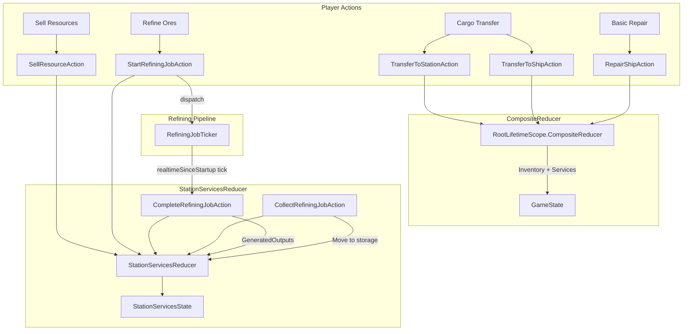
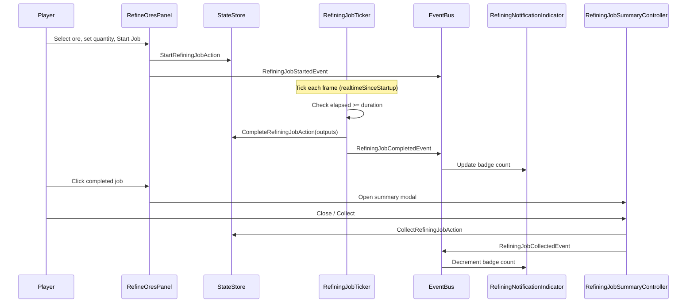

# Station Services System

## 1. Purpose

The Station Services system implements all station-side player services: cargo transfer between ship and station storage, selling resources for credits, ore refining with deterministic yield rolling and timed job processing, and hull repair. It operates entirely in the managed layer (no ECS components) using a pure reducer architecture with cross-cutting composite actions for operations that span multiple state slices (inventory, services, ship hull). The UI is built with UI Toolkit panels inside a tabbed menu that auto-opens on dock and auto-closes on undock.

## 2. Architecture Diagram





## 3. State Shape

### StationServicesState (sealed record, Core/State)

```csharp
public sealed record StationServicesState(
    int Credits,
    ImmutableDictionary<int, StationStorageState> StationStorages,
    ImmutableDictionary<int, ImmutableArray<RefiningJobState>> RefiningJobs
);
```

| Field | Type | Description |
|---|---|---|
| `Credits` | `int` | Player's global credit balance |
| `StationStorages` | `ImmutableDictionary<int, StationStorageState>` | Per-station storage keyed by StationId |
| `RefiningJobs` | `ImmutableDictionary<int, ImmutableArray<RefiningJobState>>` | Per-station active/completed refining jobs |

### StationStorageState (sealed record, Core/State)

```csharp
public sealed record StationStorageState(
    ImmutableDictionary<string, ResourceStack> Stacks
);
```

Unlimited per-station storage. Reuses the same `ResourceStack` type as ship inventory.

### RefiningJobState (sealed record, Core/State)

```csharp
public sealed record RefiningJobState(
    string JobId,              // GUID (no hyphens)
    string OreId,              // Source ore identifier
    int InputQuantity,         // Units of ore consumed
    float StartTime,           // realtimeSinceStartup at job creation
    float TotalDuration,       // Seconds to complete
    int CreditCostPaid,        // Credits deducted on start
    RefiningJobStatus Status,  // Active | Completed
    ImmutableArray<RefiningOutputConfig> OutputConfigs,    // Expected outputs
    ImmutableArray<MaterialOutput> GeneratedOutputs        // Actual outputs (populated on completion)
);
```

Computed methods: `Progress(currentTime)` returns [0,1], `RemainingTime(currentTime)` returns seconds.

### Supporting Value Types

| Type | Kind | Fields |
|---|---|---|
| `RefiningOutputConfig` | `readonly struct` | `MaterialId`, `BaseYieldPerUnit`, `VarianceMin`, `VarianceMax` |
| `MaterialOutput` | `readonly struct` | `MaterialId`, `Quantity` |
| `RefiningJobStatus` | `enum` | `Active = 0`, `Completed = 1` |
| `ResourceStack` | `readonly struct` | `ResourceId`, `Quantity`, `VolumePerUnit` |

## 4. Actions

All actions implement `IStationServicesAction : IGameAction`.

### Single-Slice Actions (StationServicesReducer)

| Action | Fields | Description |
|---|---|---|
| `SetCreditsAction` | `NewBalance` | Directly set credit balance |
| `InitializeStationStorageAction` | `StationId` | Create empty storage for a station |
| `AddToStationStorageAction` | `StationId`, `ResourceId`, `Quantity`, `VolumePerUnit` | Add resources to station storage |
| `RemoveFromStationStorageAction` | `StationId`, `ResourceId`, `Quantity` | Remove resources from station storage |
| `SellResourceAction` | `StationId`, `ResourceId`, `Quantity`, `PricePerUnit` | Sell from station storage, earn credits |
| `StartRefiningJobAction` | `StationId`, `OreId`, `InputQuantity`, `TotalCost`, `TotalDuration`, `OutputConfigs`, `MaxActiveSlots`, `StartTime` | Start a refining job (deducts ore + credits) |
| `CompleteRefiningJobAction` | `StationId`, `JobId`, `GeneratedOutputs` | Mark job Completed with generated outputs |
| `CollectRefiningJobAction` | `StationId`, `JobId` | Move outputs to station storage, remove job |

### Cross-Cutting Actions (CompositeReducer in RootLifetimeScope)

| Action | Fields | Slices Modified | Description |
|---|---|---|---|
| `TransferToStationAction` | `StationId`, `ResourceId`, `Quantity`, `VolumePerUnit` | Inventory, StationServices | Remove from ship, add to station storage |
| `TransferToShipAction` | `StationId`, `ResourceId`, `Quantity`, `VolumePerUnit` | StationServices, Inventory | Remove from station storage, add to ship (respects MaxSlots/MaxVolume) |
| `RepairShipAction` | `Cost`, `NewIntegrity` | StationServices (credits), Ship (hull via RepairHullAction) | Deduct credits, restore hull to 1.0 |

## 5. ScriptableObject Configs

### GameServicesConfig

**Menu Path:** `VoidHarvest/Station/Game Services Config`

| Field | Type | Default | Description |
|---|---|---|---|
| `StartingCredits` | `int` | 0 | Credits new players start with |

### StationServicesConfig (Station feature)

**Menu Path:** `VoidHarvest/Station/Station Services Config`

Per-station service capabilities, referenced from `StationPresetConfig` / `StationDefinition`.

| Field | Type | Default | Description |
|---|---|---|---|
| `MaxConcurrentRefiningSlots` | `int` | 3 | Max active refining jobs at this station |
| `RefiningSpeedMultiplier` | `float` | 1.0 | Duration divisor for refining (higher = faster) |
| `RepairCostPerHP` | `int` | 100 | Credit cost per HP of hull damage repaired (0 = no repair) |

### OreDefinition (Mining feature, extended for refining)

| Refining-Relevant Fields | Type | Description |
|---|---|---|
| `RefiningOutputs[]` | array | Per-ore material outputs with base yield and variance |
| `RefiningCreditCostPerUnit` | `int` | Credit cost per unit to refine |
| `BaseProcessingTimePerUnit` | `float` | Base seconds per unit before speed multiplier |

## 6. ECS Components

None. Station Services is entirely managed-layer. It reads/writes through `IStateStore` and `IEventBus`.

## 7. Events

### Published

| Event | Publisher | Payload |
|---|---|---|
| `RefiningJobStartedEvent` | RefineOresPanelController | `StationId`, `JobId` |
| `RefiningJobCompletedEvent` | RefiningJobTicker | `StationId`, `JobId` |
| `RefiningJobCollectedEvent` | RefiningJobSummaryController | `StationId`, `JobId` |
| `ResourcesSoldEvent` | SellResourcesPanelController | `ResourceId`, `Quantity`, `TotalCredits` |
| `CargoTransferredEvent` | CargoTransferPanelController | `ResourceId`, `Quantity`, `ToStation` (bool) |
| `ShipRepairedEvent` | BasicRepairPanelController | `Cost`, `NewIntegrity` |
| `CreditsChangedEvent` | SellResourcesPanelController, BasicRepairPanelController | `OldBalance`, `NewBalance` |

### Consumed

| Event | Consumer | Behavior |
|---|---|---|
| `DockingCompletedEvent` | StationServicesMenuController | Opens station services menu |
| `UndockingStartedEvent` | StationServicesMenuController | Closes station services menu |
| `StateChangedEvent<GameState>` | All 4 panel controllers, CreditBalanceIndicator | Refresh UI on state change (AND-skip pattern: both services + inventory must differ) |
| `RefiningJobCompletedEvent` | RefiningNotificationIndicator | Increment badge count |
| `RefiningJobCollectedEvent` | RefiningNotificationIndicator | Decrement badge count |

## 8. Assembly Dependencies

Assembly: `VoidHarvest.Features.StationServices`

| Dependency | Purpose |
|---|---|
| `VoidHarvest.Core.Extensions` | `Option<T>`, utility extensions |
| `VoidHarvest.Core.State` | `IStateStore`, `GameState`, `StationServicesState`, `RefiningJobState`, `ResourceStack`, `IStationServicesAction`, `RepairHullAction` |
| `VoidHarvest.Core.EventBus` | `IEventBus`, `StateChangedEvent<T>`, docking events |
| `VoidHarvest.Features.Mining` | `OreDefinition`, `OreDefinitionRegistry` (display names, refining outputs) |
| `VoidHarvest.Features.Resources` | Resource types |
| `VoidHarvest.Features.Docking` | `BeginUndockingAction` (undock button) |
| `VoidHarvest.Features.Input` | `InputBridge` (scroll-zoom blocking) |
| `VoidHarvest.Features.Ship` | Ship state types |
| `VoidHarvest.Features.Station` | `StationDefinition`, `StationServicesConfig` |
| `VoidHarvest.Features.World` | `WorldDefinition` (station lookup by ID) |
| `VContainer` | `[Inject]` constructor injection |
| `UniTask` | Async EventBus subscriptions, state change listeners |
| `Unity.Mathematics` | `Unity.Mathematics.Random` for deterministic refining yield |

## 9. Key Types

| Type | Role |
|---|---|
| `StationServicesState` | Immutable record: player credits, per-station storages, per-station refining jobs. |
| `StationServicesReducer` | Pure static reducer handling 8 single-slice actions: set credits, init/add/remove storage, sell, start/complete/collect refining. |
| `StationStorageReducer` | Pure static helper: `AddResource` and `RemoveResource` on `StationStorageState`. |
| `CompositeReducer` (in RootLifetimeScope) | Cross-cutting reducer for `TransferToStation`, `TransferToShip`, `RepairShip` -- atomic multi-slice operations. |
| `RefiningMath` | Pure static: `CalculateOutputs` (per-unit deterministic yield rolling via `Unity.Mathematics.Random`), `CalculateJobDuration`, `CalculateJobCost`. |
| `RepairMath` | Pure static: `CalculateRepairCost` using ceiling rounding from hull integrity. |
| `RefiningJobTicker` | MonoBehaviour ticking each frame with `Time.realtimeSinceStartup` (pause-safe). Dispatches `CompleteRefiningJobAction` when elapsed time exceeds duration. |
| `StationServicesMenuController` | Root menu controller. Auto-opens on `DockingCompletedEvent`, auto-closes on `UndockingStartedEvent`. Manages 4 sub-panel controllers + summary controller + credit indicator. Tabbed navigation (Cargo/Market/Refinery/Repair). Draggable header. Undock button. |
| `CargoTransferPanelController` | Bidirectional ship-to-station cargo transfer with quantity slider. |
| `SellResourcesPanelController` | Sell station storage resources for credits with confirmation overlay. |
| `RefineOresPanelController` | Ore dropdown, quantity slider, cost preview, active job progress display, completed job click-to-review. |
| `BasicRepairPanelController` | One-click hull repair. Shows cost, hull bar, affordability status. |
| `RefiningJobSummaryController` | Modal overlay showing generated materials from a completed job. Collect button dispatches `CollectRefiningJobAction`. |
| `CreditBalanceIndicator` | Persistent credit balance label in the menu header, updated on every state change. |
| `RefiningNotificationTracker` | Plain C# class (not MB) tracking pending completed job count via `HashSet<string>`. |
| `RefiningNotificationIndicator` | HUD badge showing count of uncollected completed refining jobs. |

## 10. Designer Notes

**What designers can change without code:**

- **Starting Credits**: In `GameServicesConfig` SO, set `StartingCredits` (default 0).

- **Per-Station Service Capabilities**: In each station's `StationServicesConfig` SO:
  - `MaxConcurrentRefiningSlots` -- how many refining jobs can run simultaneously (default 3)
  - `RefiningSpeedMultiplier` -- divisor for refining duration; set to 1.5 for a 50% speed boost
  - `RepairCostPerHP` -- credit cost per point of hull damage; set to 0 to disable repair at a station

- **Ore Refining Outputs**: On each `OreDefinition` SO (Mining feature):
  - `RefiningOutputs[]` -- configure which raw materials each ore produces, with `BaseYieldPerUnit` and `VarianceMin`/`VarianceMax` per output
  - `RefiningCreditCostPerUnit` -- credit cost to refine one unit of this ore
  - `BaseProcessingTimePerUnit` -- base seconds per unit (divided by the station's `RefiningSpeedMultiplier`)

- **Raw Material Definitions**: Create new `RawMaterialDefinition` SOs in `Assets/Features/Station/Data/RawMaterials/` for additional refining outputs. Each needs a unique `MaterialId`.

- **Station Tab Availability**: Controlled by the `AvailableServices` array on `StationDefinition` SO. Valid service strings: `"Cargo"`, `"Market"`, `"Refinery"`, `"Repair"`. Tabs for services not in this list are hidden.

- **Refining Yield Determinism**: Outputs use `Unity.Mathematics.Random` seeded from `JobId.GetHashCode()`. The same job always produces the same outputs, ensuring deterministic behavior across save/load.

- **Pause-Safe Timers**: `RefiningJobTicker` uses `Time.realtimeSinceStartup` instead of `Time.time`, so refining jobs continue ticking even when the game is paused (`Time.timeScale = 0`).

- **UI Layout**: All panels use UI Toolkit (UXML/USS). Edit the UXML documents and USS stylesheets to change layout, colors, and styling. The menu is draggable by its header.

- **State Change Detection**: Panel controllers use an AND-skip pattern -- they only rebuild UI when both the `StationServicesState` and `InventoryState` references have changed, preventing redundant rebuilds from unrelated state changes.

See also: [Architecture Overview](../architecture/overview.md) | [Docking System](docking.md) | [Mining System](mining.md) | [Resources System](resources.md) | [HUD System](hud.md)
