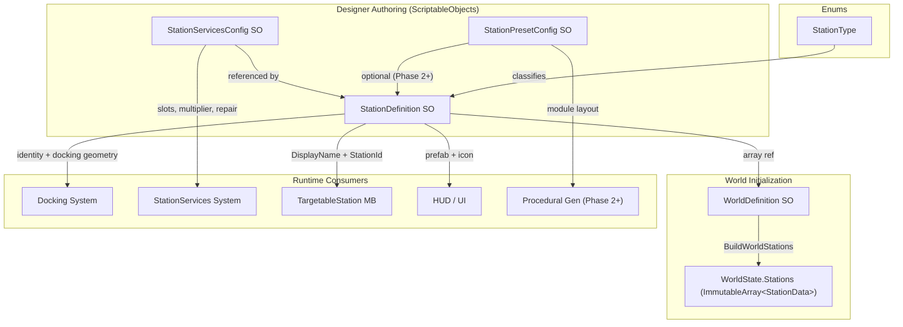

# Station System

## 1. Purpose

The Station system defines the data-driven identity, classification, and service configuration for every station in the game world. It provides the `StationDefinition` ScriptableObject as the single source of truth for a station's identity, world placement, docking geometry, available services, and visual prefab. This system is a pure data layer with no runtime state, reducer, or ECS components of its own -- it feeds into the [World system](./world.md) for state initialization and is consumed at runtime by [Docking](./docking.md), [StationServices](./station-services.md), and [Targeting](./targeting.md).

## 2. Architecture Diagram



## 3. State Shape

The Station system does not own a dedicated runtime state record. Station data flows into `WorldState.Stations` via the [World system](./world.md):

```csharp
// Assets/Core/State/WorldState.cs

public sealed record StationData(
    int Id,
    float3 Position,
    string Name,
    ImmutableArray<string> AvailableServices
);
```

At runtime, the `StationDefinition` SO is accessed directly by MonoBehaviours (`TargetableStation`, docking views) for fields not stored in state (docking port geometry, prefab references, service config).

## 4. Actions

The Station system defines no reducer actions. Station identity is static -- authored at design time and initialized into `WorldState` at startup. Service-related actions are handled by the [StationServices system](./station-services.md); docking-related actions by the [Docking system](./docking.md).

## 5. ScriptableObject Configs

### StationDefinition

**Create menu:** `VoidHarvest/Station/Station Definition`
**Path:** `Assets/Features/Station/Data/StationDefinition.cs`
**Namespace:** `VoidHarvest.Features.Station.Data`

| Field | Type | Default | Description |
|-------|------|---------|-------------|
| **Identity** | | | |
| `StationId` | `int` | -- | Unique ID (must be > 0, unique across WorldDefinition) |
| `DisplayName` | `string` | -- | Human-readable name shown in HUD |
| `Description` | `string` | -- | Optional designer description (TextArea) |
| `StationType` | `StationType` | -- | Classification enum |
| **World Placement** | | | |
| `WorldPosition` | `Vector3` | `(0,0,0)` | Station world position |
| `WorldRotation` | `Quaternion` | `identity` | Station world rotation |
| **Services** | | | |
| `AvailableServices` | `string[]` | -- | List of service names (e.g., "Sell", "Refine", "Repair", "Cargo") |
| `ServicesConfig` | `StationServicesConfig` | -- | Per-station service parameters (required) |
| `PresetConfig` | `StationPresetConfig` | null | Optional preset config for procedural generation (Phase 2+) |
| **Docking** | | | |
| `DockingPortOffset` | `Vector3` | `(0,0,0)` | Docking port position relative to station origin |
| `DockingPortRotation` | `Quaternion` | `identity` | Docking port rotation relative to station origin |
| `SafeUndockDirection` | `Vector3` | `forward` | Normalized direction to push ship on undock |
| **Visuals** | | | |
| `Prefab` | `GameObject` | null | Optional station prefab for scene instantiation |
| `Icon` | `Sprite` | null | Optional station icon for HUD/UI |

**Validation (`OnValidate`):** Warns on `StationId <= 0`, empty `DisplayName`, null `ServicesConfig`, empty `AvailableServices`, and `DockingPortOffset` magnitude >= 200.

### StationServicesConfig

**Create menu:** `VoidHarvest/Station/Station Services Config`
**Path:** `Assets/Features/Station/Data/StationServicesConfig.cs`
**Namespace:** `VoidHarvest.Features.Station.Data`

| Field | Type | Default | Description |
|-------|------|---------|-------------|
| `MaxConcurrentRefiningSlots` | `int` | `3` | Maximum concurrent active refining jobs |
| `RefiningSpeedMultiplier` | `float` | `1.0` | Duration divisor for refining jobs (higher = faster) |
| `RepairCostPerHP` | `int` | `100` | Credit cost per HP repaired (0 = no repair service) |

**Validation (`OnValidate`):** Warns on `MaxConcurrentRefiningSlots < 1`, `RefiningSpeedMultiplier <= 0`, `RepairCostPerHP < 0`.

### StationPresetConfig (from Base feature)

**Create menu:** `VoidHarvest/Station/Station Preset Config`
**Path:** `Assets/Features/Base/Data/StationPresetConfig.cs`
**Namespace:** `VoidHarvest.Features.Base.Data`

This SO is owned by the **Base** feature but documented here because it is directly referenced by `StationDefinition.PresetConfig`. It defines the modular composition of a station for future procedural generation (Phase 2+).

| Field | Type | Default | Description |
|-------|------|---------|-------------|
| `PresetName` | `string` | -- | Display name (e.g., "Small Mining Relay") |
| `PresetId` | `string` | -- | Unique preset identifier |
| `Description` | `string` | -- | Designer description (TextArea) |
| `Modules` | `StationModuleEntry[]` | -- | Ordered list of module placements |

**StationModuleEntry** (serializable struct):

| Field | Type | Description |
|-------|------|-------------|
| `ModulePrefab` | `GameObject` | Reference to a Station_MS2 module prefab |
| `LocalPosition` | `Vector3` | Position offset relative to station root |
| `LocalRotation` | `Quaternion` | Rotation relative to station root |
| `ModuleRole` | `string` | Functional role (e.g., "control", "storage", "energy") |

### StationType Enum

**Path:** `Assets/Features/Station/Data/StationType.cs`

| Value | Description |
|-------|-------------|
| `MiningRelay` | Small outpost with basic refining |
| `RefineryHub` | Medium station with advanced refining + repair |
| `TradePost` | Trading-focused station (Phase 3+) |
| `ResearchStation` | Research-focused station (Phase 1+) |

## 6. ECS Components

The Station system defines no ECS components. Stations are GameObject-based (prefab instantiation) and interact with ECS only indirectly through the [Docking system](./docking.md) bridge.

## 7. Events

The Station system publishes no events. Station-related events are owned by downstream systems:

- Docking events: see [Docking system](./docking.md)
- Service events (refining, selling, repair): see [StationServices system](./station-services.md)

## 8. Assembly Dependencies

**Assembly:** `VoidHarvest.Features.Station`

```
VoidHarvest.Features.Station
  +-- VoidHarvest.Core.Extensions   (shared enums, interfaces)
  +-- VoidHarvest.Core.State        (state types for downstream consumers)
  +-- VoidHarvest.Features.Base     (StationPresetConfig)
```

**Dependents** (assemblies that reference Station):

```
VoidHarvest.Features.World      (WorldDefinition references StationDefinition)
VoidHarvest.Features.Targeting  (TargetableStation reads StationDefinition)
```

## 9. Key Types

| Type | Location | Role |
|------|----------|------|
| `StationDefinition` | `Station/Data/StationDefinition.cs` | SO: single source of truth for one station's complete config |
| `StationServicesConfig` | `Station/Data/StationServicesConfig.cs` | SO: per-station refining/repair service parameters |
| `StationType` | `Station/Data/StationType.cs` | Enum: MiningRelay, RefineryHub, TradePost, ResearchStation |
| `StationPresetConfig` | `Base/Data/StationPresetConfig.cs` | SO: modular station composition for procedural generation |
| `StationModuleEntry` | `Base/Data/StationPresetConfig.cs` | Serializable struct: one module placement within a preset |
| `StationData` | `Core/State/WorldState.cs` | Sealed record: runtime station identity in WorldState |
| `TargetableStation` | `Targeting/Views/TargetableStation.cs` | MonoBehaviour: ITargetable implementation reading StationDefinition |

## 10. Designer Notes

**What designers can configure without code changes:**

- **Creating a new station:** Right-click in the Project window and select `Create > VoidHarvest > Station > Station Definition`. Fill in the identity fields, assign a `StationServicesConfig`, and add the new asset to the `WorldDefinition.Stations` array. The station will appear in `WorldState` at startup with zero code changes.

- **Station placement:** Set `WorldPosition` and `WorldRotation` directly on the `StationDefinition`. These values are baked into `WorldState.Stations` via `BuildWorldStations()`.

- **Docking geometry:** Adjust `DockingPortOffset`, `DockingPortRotation`, and `SafeUndockDirection` to control where ships snap to when docking and which direction they are pushed on undock.

- **Service configuration:** Create a `StationServicesConfig` asset (one per service tier) and assign it to the station. Tune `MaxConcurrentRefiningSlots` (how many refining jobs can run in parallel), `RefiningSpeedMultiplier` (higher values = faster refining), and `RepairCostPerHP` (set to 0 to disable repair at that station).

- **Available services list:** The `AvailableServices` string array controls which UI panels appear in the station services menu. Valid values: `"Sell"`, `"Refine"`, `"Repair"`, `"Cargo"`. Omitting a service name hides that panel.

- **Station types:** The `StationType` enum classifies stations for filtering and future gameplay rules. Extend the enum in code if new station categories are needed.

- **Preset configs (Phase 2+):** `StationPresetConfig` is optional and currently informational. When procedural station generation is implemented, it will drive module assembly from `StationModuleEntry[]` arrays. Designers can author presets now using `Create > VoidHarvest > Station > Station Preset Config`.

- **Visuals:** Assign a `Prefab` (station 3D model) and optional `Icon` (sprite for HUD markers). The prefab is instantiated by scene setup; the icon is used by targeting and map UI.

- **Existing station assets:** The project ships with two station definitions in `Assets/Features/Station/Data/Definitions/`: SmallMiningRelay (ID 1, MiningRelay type) and MediumRefineryHub (ID 2, RefineryHub type). Two service configs in `Assets/Features/Station/Data/ServiceConfigs/` provide the per-station parameters.
