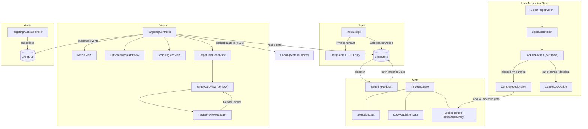

# Targeting System

## 1. Purpose

The Targeting system provides in-flight target selection, timed lock acquisition, and multi-target lock management for the player ship. It drives all targeting UI overlays (reticle, off-screen indicator, lock progress ring, target cards with live preview viewports) and enforces per-ship lock capacity, range limits, and docked-state suppression. The system operates entirely in managed C# with Physics raycasts for target detection and UI Toolkit for rendering.

## 2. Architecture Diagram



## 3. State Shape

All targeting state lives in `GameState.Loop.Targeting` as a `TargetingState` sealed record.

```csharp
// Assets/Core/State/TargetingState.cs

public sealed record TargetingState(
    SelectionData Selection,
    LockAcquisitionData LockAcquisition,
    ImmutableArray<TargetLockData> LockedTargets
);

public readonly struct SelectionData
{
    int TargetId;             // -1 = no selection
    TargetType TargetType;    // Asteroid, Station, None
    string DisplayName;
    string TypeLabel;
    bool HasSelection;        // derived: TargetId >= 0
}

public readonly struct LockAcquisitionData
{
    int TargetId;
    float ElapsedTime;
    float TotalDuration;
    LockAcquisitionStatus Status;  // None, InProgress, Completed, Cancelled
    float Progress;                // derived: ElapsedTime / TotalDuration
    bool IsActive;                 // derived: Status == InProgress
}

public readonly struct TargetLockData
{
    int TargetId;
    TargetType TargetType;
    string DisplayName;
    string TypeLabel;
}
```

Static sentinels: `SelectionData.None`, `LockAcquisitionData.None`, `TargetingState.Empty`.

## 4. Actions

All actions implement `ITargetingAction : IGameAction` and are routed by `CompositeReducer`.

| Action | Fields | Effect |
|--------|--------|--------|
| `SelectTargetAction` | `TargetId`, `TargetType`, `DisplayName`, `TypeLabel` | Sets `Selection`; cancels active lock if target changed |
| `ClearSelectionAction` | (none) | Clears `Selection` and cancels active lock |
| `BeginLockAction` | `TargetId`, `Duration` | Starts lock acquisition (no-op if already locked) |
| `LockTickAction` | `DeltaTime` | Advances `ElapsedTime`; sets `Completed` when elapsed >= duration |
| `CompleteLockAction` | (none) | Moves completed acquisition to `LockedTargets` |
| `CancelLockAction` | (none) | Resets `LockAcquisition` to `None` |
| `UnlockTargetAction` | `TargetId` | Removes specific target from `LockedTargets` |
| `ClearAllLocksAction` | (none) | Resets to `TargetingState.Empty` (used on dock/undock/ship swap) |

## 5. ScriptableObject Configs

### TargetingConfig

**Create menu:** `VoidHarvest/Targeting/Targeting Config`
**Path:** `Assets/Features/Targeting/Data/TargetingConfig.cs`

| Field | Type | Default | Description |
|-------|------|---------|-------------|
| `ReticlePadding` | `float` | `20` | Screen-space padding around target bounds (px) |
| `ReticleMinSize` | `float` | `40` | Minimum reticle size (px) |
| `ReticleMaxSize` | `float` | `300` | Maximum reticle size (px) |
| `LockProgressArcWidth` | `float` | `3` | Progress ring border width (px) |
| `OffScreenIndicatorMargin` | `float` | `30` | Edge margin for off-screen arrow (px) |
| `ViewportRenderWidth` | `int` | `140` | Target card preview RT width |
| `ViewportRenderHeight` | `int` | `100` | Target card preview RT height |
| `ViewportFOV` | `float` | `30` | Preview camera field of view |
| `PreviewStageOffset` | `Vector3` | `(0, -1000, 0)` | World offset for preview clone staging area |

### TargetingVFXConfig

**Create menu:** `VoidHarvest/Targeting/Targeting VFX Config`
**Path:** `Assets/Features/Targeting/Views/TargetingVFXConfig.cs`

| Field | Type | Default | Description |
|-------|------|---------|-------------|
| `LockFlashDuration` | `float` | `0.3` | Duration of the white flash on lock confirmation (s) |
| `ReticlePulseSpeed` | `float` | `2.0` | Speed of corner bracket pulsing during acquisition |

### TargetingAudioConfig

**Create menu:** `VoidHarvest/Targeting/Targeting Audio Config`
**Path:** `Assets/Features/Targeting/Views/TargetingAudioConfig.cs`

| Field | Type | Default | Description |
|-------|------|---------|-------------|
| `LockAcquiringClip` | `AudioClip` | null | Looping rising-tone during lock acquisition |
| `LockConfirmedClip` | `AudioClip` | null | One-shot on successful lock |
| `LockFailedClip` | `AudioClip` | null | One-shot on cancelled/failed lock |
| `LockSlotsFullClip` | `AudioClip` | null | One-shot when lock attempted at max capacity |
| `TargetLostClip` | `AudioClip` | null | One-shot when a locked target is destroyed |

### ShipArchetypeConfig (targeting-relevant fields)

Owned by the [Ship system](./ship.md); targeting reads these fields:

| Field | Type | Default | Description |
|-------|------|---------|-------------|
| `BaseLockTime` | `float` | `1.5` | Seconds to acquire a target lock |
| `MaxTargetLocks` | `int` | `3` | Maximum simultaneous locked targets |
| `MaxLockRange` | `float` | `5000` | Maximum range (meters) for lock acquisition |

## 6. ECS Components

The Targeting system does **not** define its own ECS components. It operates entirely in the managed layer:

- **Asteroid lookup:** Queries `AsteroidComponent` + `LocalTransform` from `VoidHarvest.Features.Mining`.
- **Ship position:** Reads the Cinemachine tracking target `Transform` (preferred) or falls back to `PlayerControlledTag` entity `LocalTransform`.
- **Station lookup:** Uses `FindObjectsByType<TargetableStation>()` for station GameObjects.

## 7. Events

All events are `readonly struct` types published via the `IEventBus` (UniTask reactive).

| Event | Fields | Trigger |
|-------|--------|---------|
| `TargetLockedEvent` | `TargetId`, `DisplayName` | Lock acquisition completed successfully |
| `TargetUnlockedEvent` | `TargetId` | User dismissed a locked target card |
| `LockFailedEvent` | `TargetId`, `LockFailReason` | Lock cancelled (Deselected, OutOfRange, TargetDestroyed) |
| `LockSlotsFullEvent` | (none) | Lock attempted when `LockedTargets.Length >= MaxTargetLocks` |
| `TargetLostEvent` | `TargetId` | Locked target destroyed (asteroid depleted) |
| `AllLocksClearedEvent` | (none) | All locks cleared (docking, ship swap) |

**Subscribers:**
- `TargetingAudioController` subscribes to `TargetLockedEvent`, `LockFailedEvent`, `LockSlotsFullEvent`, `TargetLostEvent`.

## 8. Assembly Dependencies

**Assembly:** `VoidHarvest.Features.Targeting`

```
VoidHarvest.Features.Targeting
  +-- VoidHarvest.Core.Extensions     (ITargetable, TargetInfo, TargetType)
  +-- VoidHarvest.Core.State          (TargetingState, IStateStore, IGameAction)
  +-- VoidHarvest.Core.EventBus       (IEventBus, UniTask subscriptions)
  +-- VoidHarvest.Features.Ship       (ShipArchetypeConfig, PlayerControlledTag)
  +-- VoidHarvest.Features.Mining     (AsteroidComponent for entity queries)
  +-- VoidHarvest.Features.Station    (StationDefinition for TargetableStation)
  +-- Unity.Entities                  (EntityManager, EntityQuery)
  +-- Unity.Entities.Graphics         (RenderMeshArray for preview clones)
  +-- Unity.Entities.Hybrid
  +-- Unity.Cinemachine               (CinemachineCamera for ship Transform)
  +-- Unity.Mathematics
  +-- Unity.Transforms                (LocalTransform)
  +-- VContainer                      ([Inject] constructor injection)
  +-- UniTask                         (async event subscriptions)
```

## 9. Key Types

| Type | Location | Role |
|------|----------|------|
| `TargetingState` | `Core/State/TargetingState.cs` | Root state slice (selection + acquisition + locks) |
| `SelectionData` | `Core/State/TargetingState.cs` | Current selected target snapshot (readonly struct) |
| `LockAcquisitionData` | `Core/State/TargetingState.cs` | In-progress lock timer (readonly struct) |
| `TargetLockData` | `Core/State/TargetingState.cs` | Confirmed lock entry (readonly struct) |
| `LockAcquisitionStatus` | `Core/State/TargetingState.cs` | Enum: None, InProgress, Completed, Cancelled |
| `LockFailReason` | `Targeting/Data/LockFailReason.cs` | Enum: Deselected, OutOfRange, TargetDestroyed |
| `ITargetingAction` | `Targeting/Data/TargetingActions.cs` | Marker interface for all 8 targeting actions |
| `TargetingReducer` | `Targeting/Systems/TargetingReducer.cs` | Pure static reducer (8 action handlers) |
| `LockTimeMath` | `Targeting/Systems/LockTimeMath.cs` | Pure lock-time calculation (extensible for future factors) |
| `TargetingMath` | `Targeting/Systems/TargetingMath.cs` | Screen-space projection, viewport clamping, range formatting |
| `TargetingController` | `Targeting/Views/TargetingController.cs` | MonoBehaviour orchestrator: manages all sub-views, lock tick, destruction detection |
| `ReticleView` | `Targeting/Views/ReticleView.cs` | Corner-bracket reticle overlay with name/type/range labels |
| `OffScreenIndicatorView` | `Targeting/Views/OffScreenIndicatorView.cs` | Directional arrow at screen edge for off-viewport targets |
| `LockProgressView` | `Targeting/Views/LockProgressView.cs` | Progress ring + corner pulse during lock acquisition |
| `TargetCardPanelView` | `Targeting/Views/TargetCardPanelView.cs` | Horizontal panel managing per-lock cards |
| `TargetCardView` | `Targeting/Views/TargetCardView.cs` | Single locked-target card (viewport, name, range, dismiss) |
| `TargetPreviewManager` | `Targeting/Views/TargetPreviewManager.cs` | RenderTexture preview slots with isolated clones + cameras |
| `TargetingAudioController` | `Targeting/Views/TargetingAudioController.cs` | Event-driven audio feedback (acquiring loop, one-shots) |
| `TargetableStation` | `Targeting/Views/TargetableStation.cs` | ITargetable MonoBehaviour for station GameObjects |
| `ITargetable` | `Core/Extensions/ITargetable.cs` | Cross-cutting interface for MonoBehaviour-based targets |
| `TargetInfo` | `Core/Extensions/TargetInfo.cs` | Immutable snapshot struct bridging ITargetable and ECS |
| `TargetType` | `Core/Extensions/TargetType.cs` | Enum: None, Asteroid, Station (in Core to avoid circular deps) |

## 10. Designer Notes

**What designers can tune without code changes:**

- **Lock timing and capacity:** Adjust `BaseLockTime`, `MaxTargetLocks`, and `MaxLockRange` on each `ShipArchetypeConfig` SO to differentiate ship archetypes. A heavy mining barge might have slower lock times but more slots than a nimble scout.

- **Reticle appearance:** Modify `TargetingConfig` fields to change reticle padding, size bounds, progress arc width, and off-screen indicator margins. All values are in screen pixels.

- **Preview viewports:** Change `ViewportRenderWidth`, `ViewportRenderHeight`, and `ViewportFOV` on `TargetingConfig` to adjust the locked-target card preview quality and framing. `PreviewStageOffset` controls where clones are staged (default: 1000m below world origin).

- **VFX tuning:** `TargetingVFXConfig` controls the lock confirmation flash duration and corner pulse speed. Increase `ReticlePulseSpeed` for a more urgent feel during acquisition.

- **Audio clips:** Assign audio clips on `TargetingAudioConfig`. The acquiring clip loops with pitch shifting (0.8 to 1.2) as lock progress increases. All other clips are one-shot. Leave a slot null to skip that audio cue.

- **Docked-state guard:** All targeting UI and lock acquisition is automatically suppressed while `DockingState.IsDocked` is true (FR-035). This requires no designer configuration.

- **Adding new target types:** Implement `ITargetable` on a MonoBehaviour and ensure the object has a `Collider` for Physics raycast detection. The `TargetType` enum in `Core/Extensions` must be extended if a new category is needed.

- **Lock time extensibility:** `LockTimeMath.CalculateLockTime` currently returns `baseLockTime` directly. Future iterations will factor in distance, target size, and sensor upgrades via the `TargetInfo` parameter.
