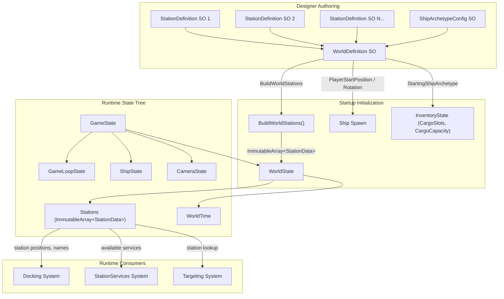

# World System

## 1. Purpose

The World system defines the complete game world configuration as a single `WorldDefinition` ScriptableObject, which references all `StationDefinition` assets and player starting conditions. At startup, `WorldDefinition.BuildWorldStations()` converts the designer-authored SO data into an `ImmutableArray<StationData>` that initializes `WorldState`, the immutable world state slice within `GameState`. This system has no runtime reducer, ECS components, or events -- it is a one-time initialization pipeline from designer data to runtime state.

## 2. Architecture Diagram



## 3. State Shape

### WorldState

```csharp
// Assets/Core/State/WorldState.cs

public sealed record WorldState(
    ImmutableArray<StationData> Stations,
    float WorldTime
);
```

### StationData

```csharp
// Assets/Core/State/WorldState.cs

public sealed record StationData(
    int Id,
    float3 Position,
    string Name,
    ImmutableArray<string> AvailableServices
);
```

### Position in GameState

```csharp
// Assets/Core/State/GameState.cs

public sealed record GameState(
    GameLoopState Loop,
    ShipState ActiveShipPhysics,
    CameraState Camera,
    WorldState World          // <-- WorldState lives here
);
```

`WorldState.Stations` is populated once at startup by `WorldDefinition.BuildWorldStations()` and is immutable thereafter. `WorldTime` is updated by the game loop as needed.

## 4. Actions

The World system defines no reducer actions. `WorldState` is constructed at startup and does not change through dispatched actions during gameplay. The `WorldTime` field, if updated, is managed by the top-level game loop reducer.

## 5. ScriptableObject Configs

### WorldDefinition

**Create menu:** `VoidHarvest/World/World Definition`
**Path:** `Assets/Features/World/Data/WorldDefinition.cs`
**Namespace:** `VoidHarvest.Features.World.Data`

| Field | Type | Default | Description |
|-------|------|---------|-------------|
| `Stations` | `StationDefinition[]` | -- | All stations in this world (each must have a unique StationId) |
| `PlayerStartPosition` | `Vector3` | `(0,0,0)` | Player ship spawn world position |
| `PlayerStartRotation` | `Quaternion` | `identity` | Player ship spawn world rotation |
| `StartingShipArchetype` | `ShipArchetypeConfig` | -- | Ship archetype the player starts with (required) |

**Validation (`OnValidate`):**
- Warns on null or empty `Stations` array
- Warns on null entries within the `Stations` array
- Warns on duplicate `StationId` values across entries
- Warns on null `StartingShipArchetype`

**Key methods:**

| Method | Returns | Description |
|--------|---------|-------------|
| `BuildWorldStations()` | `ImmutableArray<StationData>` | Converts SO station array to immutable runtime state. Skips null entries. Maps `StationId`, `WorldPosition`, `DisplayName`, and `AvailableServices`. |
| `GetStationById(int)` | `StationDefinition` | Lookup utility; returns null if not found. |

## 6. ECS Components

The World system defines no ECS components. World state is managed entirely in the immutable state store (`WorldState` record). Station GameObjects interact with ECS through the [Docking system](./docking.md) bridge.

## 7. Events

The World system publishes no events. It is a static data-to-state initialization pipeline. Runtime events related to stations are owned by downstream systems:

- Docking events: see [Docking system](./docking.md)
- Service events: see [StationServices system](./station-services.md)
- Targeting events: see [Targeting system](./targeting.md)

## 8. Assembly Dependencies

**Assembly:** `VoidHarvest.Features.World`

```
VoidHarvest.Features.World
  +-- VoidHarvest.Core.Extensions     (shared types)
  +-- VoidHarvest.Core.State          (WorldState, StationData, GameState)
  +-- VoidHarvest.Features.Station    (StationDefinition, StationType)
  +-- VoidHarvest.Features.Ship       (ShipArchetypeConfig)
  +-- Unity.Mathematics               (float3 for position conversion)
```

**Initialization consumer:** `RootLifetimeScope` (VContainer DI root) reads `WorldDefinition` to construct the initial `GameState`, including `WorldState` and `InventoryState` derived from `StartingShipArchetype.CargoSlots`.

## 9. Key Types

| Type | Location | Role |
|------|----------|------|
| `WorldDefinition` | `World/Data/WorldDefinition.cs` | SO: defines station roster and player starting conditions |
| `WorldState` | `Core/State/WorldState.cs` | Sealed record: immutable world state slice (stations + time) |
| `StationData` | `Core/State/WorldState.cs` | Sealed record: runtime station identity (ID, position, name, services) |
| `GameState` | `Core/State/GameState.cs` | Root state record; `World` field holds `WorldState` |
| `StationDefinition` | `Station/Data/StationDefinition.cs` | SO: per-station config consumed by WorldDefinition (see [Station system](./station.md)) |
| `ShipArchetypeConfig` | `Ship/Data/ShipArchetypeConfig.cs` | SO: starting ship config; `CargoSlots`/`CargoCapacity` seed `InventoryState` |

## 10. Designer Notes

**What designers can configure without code changes:**

- **Creating a new world configuration:** Right-click in the Project window and select `Create > VoidHarvest > World > World Definition`. Assign `StationDefinition` assets to the `Stations` array, set the player start position/rotation, and assign a starting ship archetype.

- **Adding stations to the world:** Create a `StationDefinition` asset (see [Station system](./station.md)) and drag it into the `WorldDefinition.Stations` array. Each station must have a unique `StationId > 0`. The `OnValidate` inspector will warn about duplicate IDs or null entries.

- **Player spawn point:** Set `PlayerStartPosition` and `PlayerStartRotation` on the `WorldDefinition` to control where the player ship appears at game start.

- **Starting ship:** Assign a `ShipArchetypeConfig` to `StartingShipArchetype`. This determines the player's initial ship stats, cargo capacity, and lock parameters. The `CargoSlots` and `CargoCapacity` fields on the archetype directly seed the `InventoryState` at startup.

- **Custom inspector:** `WorldDefinition` has a custom editor (`WorldDefinitionEditor`) that provides a richer authoring experience with validation feedback.

- **Scene config validator:** The editor window (`SceneConfigValidator`, accessible via menu) uses reflection to scan the active scene and validate that all required SO references are assigned and consistent.

- **Current world asset:** The project ships with one `WorldDefinition` asset that references two stations: SmallMiningRelay (ID 1) at position (500, 0, 0) and MediumRefineryHub (ID 2) at position (-800, 200, 600).

- **Multiple world configurations:** Different `WorldDefinition` assets can define different world layouts (e.g., tutorial, campaign, sandbox). The active world is determined by which `WorldDefinition` is injected via VContainer at scene startup.

- **Immutability guarantee:** `BuildWorldStations()` produces an `ImmutableArray<StationData>`. Once initialized, `WorldState.Stations` cannot be modified at runtime. Any future dynamic station spawning would require a new reducer action and state update pattern.
