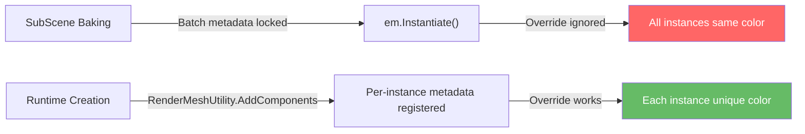
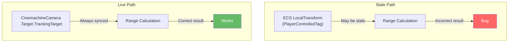
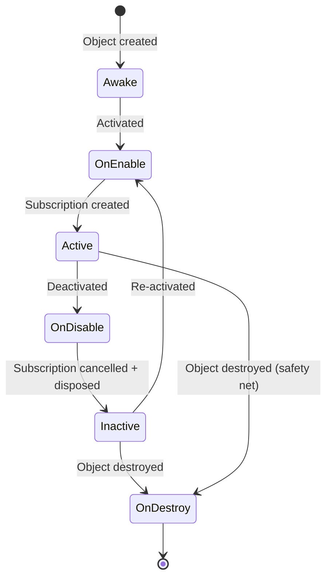
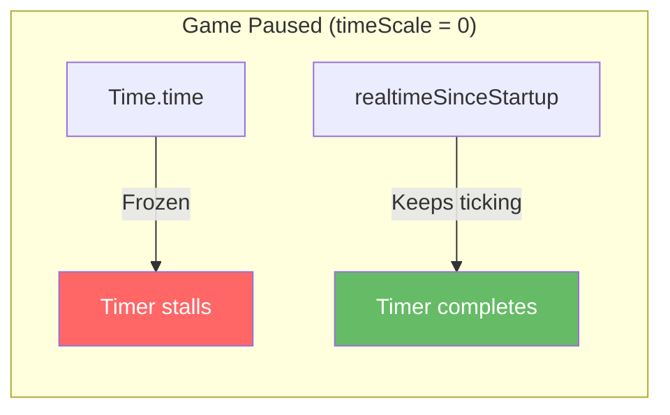

# Troubleshooting Guide

## Purpose

This document catalogs known pitfalls, their root causes, and proven solutions encountered during VoidHarvest development. Each entry follows a **Problem / Cause / Solution** format. Issues are grouped by category for quick navigation.

---

## Table of Contents

- [DOTS / ECS Issues](#dots--ecs-issues)
  - [Per-instance material property overrides fail with SubScene-baked prefabs](#per-instance-material-property-overrides-fail-with-subscene-baked-prefabs)
  - [SF_Asteroids-M2 FBX mesh scale (cm vs m)](#sf_asteroids-m2-fbx-mesh-scale-cm-vs-m)
  - [Stale ECS ship position](#stale-ecs-ship-position)
  - [ECS entity-gone race conditions in InputBridge](#ecs-entity-gone-race-conditions-in-inputbridge)
- [MonoBehaviour Lifecycle Issues](#monobehaviour-lifecycle-issues)
  - [Async subscription lifecycle (OnEnable/OnDisable convention)](#async-subscription-lifecycle-onenableondisable-convention)
  - [FindObjectOfType performance and coupling](#findobjectoftype-performance-and-coupling)
- [Timing Issues](#timing-issues)
  - [Time.time vs realtimeSinceStartup for pause-safe timers](#timetime-vs-realtimesincestartup-for-pause-safe-timers)
- [Quick Diagnostic Checklist](#quick-diagnostic-checklist)

---

## DOTS / ECS Issues

### Per-instance material property overrides fail with SubScene-baked prefabs

**Problem:** Entities instantiated via `EntityManager.Instantiate(prefab)` from SubScene-baked prefabs do not respect per-instance `[MaterialProperty]` overrides (e.g., `URPMaterialPropertyBaseColor`). All instances render with the same material properties despite having different component values.

**Cause:** When a prefab entity is baked inside a SubScene, the Entities Graphics batching system captures the material property metadata at bake time. The batch metadata from baking does not register per-instance overrides for GPU upload. At runtime, `Instantiate` clones the entity's archetype exactly as baked, and the GPU instancing pipeline does not detect that the override component should vary per instance.

**Solution:** Do not use `em.Instantiate(prefab)` for entities that need per-instance material property variation. Instead, create entities from scratch using `RenderMeshUtility.AddComponents`, which properly registers all material property components for per-instance GPU upload.

```
// WRONG: per-instance color will be ignored
var entity = em.Instantiate(bakedPrefab);
em.SetComponentData(entity, new URPMaterialPropertyBaseColor { Value = customColor });

// CORRECT: entity is built from scratch with proper metadata
var entity = em.CreateEntity();
var desc = new RenderMeshDescription(shadowCastingMode, receiveShadows);
RenderMeshUtility.AddComponents(entity, em, desc, renderMeshArray, materialMeshInfo);
em.AddComponentData(entity, new URPMaterialPropertyBaseColor { Value = customColor });
```

**Spec reference:** DOTS/ECS Gotchas in MEMORY.md. Discovered during Procedural asteroid field implementation.



---

### SF_Asteroids-M2 FBX mesh scale (cm vs m)

**Problem:** Imported SF_Asteroids-M2 asteroid meshes appear enormously oversized in the scene. Asteroids span thousands of units instead of reasonable game-scale dimensions.

**Cause:** The SF_Asteroids-M2 FBX meshes are authored in centimeters rather than meters. A single asteroid mesh may be approximately 4600 units across at native import scale, when the expected game scale is tens of units.

**Solution:** Apply two corrections:

1. Set `globalScale: 0.01` in each FBX asset's `.meta` file (or via the Inspector's Model Import Settings) to convert from centimeters to meters at import time.
2. At runtime in the `AsteroidFieldSystem`, compute a mesh normalization factor: `meshNormFactor = 1.0f / maxMeshExtent` where `maxMeshExtent` is the largest axis extent of the mesh bounds. Apply this factor to the entity's `LocalTransform.Scale` before multiplying by the desired asteroid radius.

```
// In AsteroidFieldSystem, normalize mesh scale
float maxExtent = math.max(math.max(bounds.Extents.x, bounds.Extents.y), bounds.Extents.z);
float meshNormFactor = 1.0f / maxExtent;
float finalScale = meshNormFactor * desiredRadius;
```

**Spec reference:** DOTS/ECS Gotchas in MEMORY.md. Discovered during Spec 005 (Data-Driven Ore System).

---

### Stale ECS ship position

**Problem:** Querying the `LocalTransform` component on the `PlayerControlledTag` ECS entity returns a stale or incorrect ship position. Range calculations, preview cameras, and other managed-code systems that read from ECS get wrong results.

**Cause:** The `LocalTransform` on the `PlayerControlledTag` ECS entity does not synchronize with the ship GameObject's actual Transform position during gameplay. The ECS entity stores the baked initial position from the SubScene, and although the `EcsToStoreSyncSystem` bridges some data, the live ship position in the ECS world may lag behind or not update at all for certain use cases.

**Solution:** For any managed code that needs the ship's live position (range calculations, target preview cameras, docking range checks), read from the Cinemachine tracking target Transform instead of querying the ECS entity.

```csharp
// WRONG: may return stale position
var shipPos = SystemAPI.GetComponent<LocalTransform>(shipEntity).Position;

// CORRECT: Cinemachine target is always in sync with the actual ship
Transform shipTransform = cinemachineCamera.Target.TrackingTarget;
float3 livePos = shipTransform.position;
```

**Spec reference:** DOTS/ECS Gotchas in MEMORY.md. Affects Targeting, Docking, and HUD systems.



---

### ECS entity-gone race conditions in InputBridge

**Problem:** NullReferenceException or InvalidOperationException in `InputBridge` when switching scenes, during domain reload, or when ECS entities are destroyed while managed code still references them.

**Cause:** During scene transitions or domain reloads, ECS entities may be destroyed before managed MonoBehaviour code (such as `InputBridge`) stops referencing them. The managed code attempts to query or write to entities that no longer exist in the ECS world, causing exceptions.

**Solution:** Spec 008 US3 added multiple defensive measures to `InputBridge`:

1. **Entity-gone guards:** Before any ECS entity access, check that the entity still exists via `EntityManager.Exists(entity)`.
2. **ECS init throttle:** Delay ECS system access until the world and required singletons are confirmed ready, preventing premature queries during initialization.
3. **State sync subscription:** Subscribe to state changes for cleanup signals, ensuring InputBridge stops referencing entities when notified of scene teardown.

```csharp
// Defensive guard pattern used in InputBridge
if (!EntityManager.Exists(targetEntity))
{
    Debug.LogWarning("[InputBridge] Target entity no longer exists, skipping.");
    return;
}
```

**Spec reference:** Spec 008 US3. See `Assets/Features/Input/Views/InputBridge.cs`.

---

## MonoBehaviour Lifecycle Issues

### Async subscription lifecycle (OnEnable/OnDisable convention)

**Problem:** EventBus subscriptions created in `Start()` or `Awake()` are not properly cleaned up when a MonoBehaviour is disabled or the scene is unloaded. This leads to memory leaks, stale callbacks, or exceptions from accessing destroyed objects.

**Cause:** `Start()` and `Awake()` run once per object lifetime and do not have symmetric teardown hooks tied to enable/disable cycles. If a subscription is created in `Start()` but the object is disabled and re-enabled, or if the scene unloads without a matching unsubscribe, the subscription leaks. UniTask async enumerables in particular hold references to the subscriber's `CancellationToken` and can keep objects alive.

**Solution:** VoidHarvest enforces a strict subscription lifecycle convention (established in Spec 008 US2):

1. **Subscribe in `OnEnable()`** -- create the subscription and store the `CancellationTokenSource`.
2. **Cancel/dispose/null in `OnDisable()`** -- cancel the token, dispose the source, and null the reference.
3. **`OnDestroy()` safety net** -- repeat the cancellation as a fallback in case `OnDisable()` was not called.

```csharp
private CancellationTokenSource _cts;

private void OnEnable()
{
    _cts = new CancellationTokenSource();
    ListenForEvents(_cts.Token).Forget();
}

private void OnDisable()
{
    _cts?.Cancel();
    _cts?.Dispose();
    _cts = null;
}

private void OnDestroy()
{
    // Safety net in case OnDisable was skipped
    _cts?.Cancel();
    _cts?.Dispose();
    _cts = null;
}
```

**Affected controllers (migrated in Spec 008 US2):**
- `RadialMenuController`
- `TargetingAudioController`
- `StationServicesMenuController`
- All 5 station services panel controllers (OnDestroy safety nets)

**Spec reference:** Spec 008 US2. Convention documented in `Assets/Core/SceneLifetimeScope.cs`.



---

### FindObjectOfType performance and coupling

**Problem:** `FindObjectOfType<T>()` calls in MonoBehaviours cause performance issues (full scene search every call) and create implicit, untestable coupling between components.

**Cause:** `FindObjectOfType` performs a linear search through all active GameObjects in the scene to find the first matching component. This is O(n) per call and creates a hidden dependency that is not visible in the inspector, not mockable in tests, and fragile to scene restructuring. If the target object does not exist at call time (e.g., due to initialization order), the result is silently null.

**Solution:** Spec 008 US4 replaced all 5 `FindObjectOfType` usages with VContainer dependency injection:

| Consumer | Dependency | Registration Method |
|----------|-----------|---------------------|
| `InputBridge` | `CameraView` | `RegisterComponentInHierarchy<CameraView>()` |
| `RadialMenuController` | `InputBridge` | `RegisterComponentInHierarchy<InputBridge>()` |
| `RadialMenuController` | `TargetingController` | `RegisterComponentInHierarchy<TargetingController>()` |
| `StationServicesMenuController` | `InputBridge` | `RegisterComponentInHierarchy<InputBridge>()` |
| `TargetingController` | `TargetPreviewManager` | `RegisterComponentInHierarchy<TargetPreviewManager>()` |

All injections use `[Inject]` method injection on the MonoBehaviour, with the component registered in `SceneLifetimeScope`.

```csharp
// WRONG: implicit, slow, fragile
private void Start()
{
    _cameraView = FindObjectOfType<CameraView>();
}

// CORRECT: explicit DI, testable, fail-fast
[Inject]
public void Construct(CameraView cameraView)
{
    _cameraView = cameraView;
}
```

**Spec reference:** Spec 008 US4. See `Assets/Core/SceneLifetimeScope.cs` for all registrations.

---

## Timing Issues

### Time.time vs realtimeSinceStartup for pause-safe timers

**Problem:** Refining jobs stall or report incorrect elapsed time when the game is paused (`Time.timeScale = 0`). Jobs that should complete during a pause never finish, and the UI shows frozen progress bars.

**Cause:** `Time.time` is scaled by `Time.timeScale`. When the game is paused (timeScale set to 0), `Time.time` stops advancing entirely. Any timer logic using `Time.time` (such as refining job start timestamps and elapsed time calculations) will freeze, making it impossible for jobs to complete during pause.

**Solution:** Spec 008 US5 changed all refining timer logic in `RefiningJobTicker` to use `Time.realtimeSinceStartup`, which advances at wall-clock speed regardless of `Time.timeScale`.

**Rule of thumb:** Use `Time.realtimeSinceStartup` for any process that should continue regardless of game pause state (refining, cooldowns, notifications). Use `Time.time` only for gameplay-coupled timing (animations, physics interpolation, visual effects).

```csharp
// WRONG: freezes when paused
float elapsed = Time.time - job.StartTime;

// CORRECT: advances even when Time.timeScale = 0
float elapsed = Time.realtimeSinceStartup - job.StartTimeRealtime;
```

**Spec reference:** Spec 008 US5. See `Assets/Features/StationServices/Views/RefiningJobTicker.cs`.



---

## Quick Diagnostic Checklist

When encountering an unfamiliar issue, work through this checklist:

| Symptom | First thing to check |
|---------|---------------------|
| All entity instances share the same visual property | Are you using `em.Instantiate`? Switch to `RenderMeshUtility.AddComponents` (see [per-instance overrides](#per-instance-material-property-overrides-fail-with-subscene-baked-prefabs)) |
| Asteroid meshes are gigantic | Check FBX `.meta` file for `globalScale: 0.01` (see [FBX scale](#sf_asteroids-m2-fbx-mesh-scale-cm-vs-m)) |
| Ship position/range calculations are wrong | Are you reading ECS `LocalTransform`? Use Cinemachine `TrackingTarget` instead (see [stale position](#stale-ecs-ship-position)) |
| NullReferenceException on scene transition | Add entity-existence guards before ECS access (see [entity-gone race](#ecs-entity-gone-race-conditions-in-inputbridge)) |
| Memory leak or stale event callbacks | Check subscription lifecycle: OnEnable/OnDisable/OnDestroy pattern (see [async subscriptions](#async-subscription-lifecycle-onenableondisable-convention)) |
| Component reference is null at runtime | Replace `FindObjectOfType` with VContainer DI (see [FindObjectOfType](#findobjectoftype-performance-and-coupling)) |
| Timers freeze when game is paused | Switch from `Time.time` to `Time.realtimeSinceStartup` (see [pause-safe timers](#timetime-vs-realtimesincestartup-for-pause-safe-timers)) |
| Tests fail only on specific screen resolution | Known issue: `TargetingMathTests.ClampToScreenEdge_ClampsAndReturnsAngle` is screen-resolution-dependent (pre-existing, tracked in Open TODOs) |

---

## See Also

- [Architecture Overview](architecture/overview.md) -- system-level architecture and DOTS/MonoBehaviour boundary
- [State Management](architecture/state-management.md) -- reducer pattern, StateStore, and action dispatch
- [Event System](architecture/event-system.md) -- EventBus subscription patterns and lifecycle
- [Data Pipeline](architecture/data-pipeline.md) -- SubScene baking, BlobAssets, and ScriptableObject flow
- [Dependency Injection](architecture/dependency-injection.md) -- VContainer scoping, registration, and injection patterns
- [Glossary](glossary.md) -- definitions of all project-specific terms
